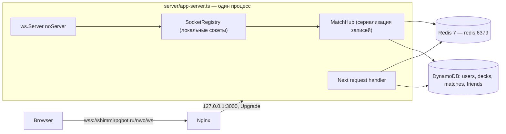
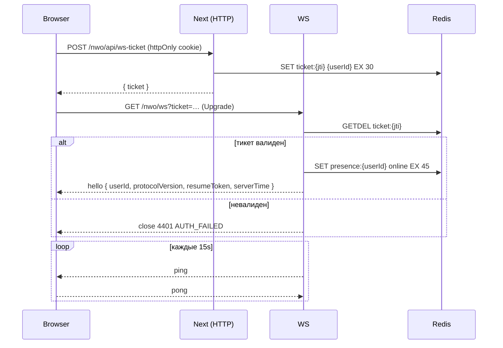
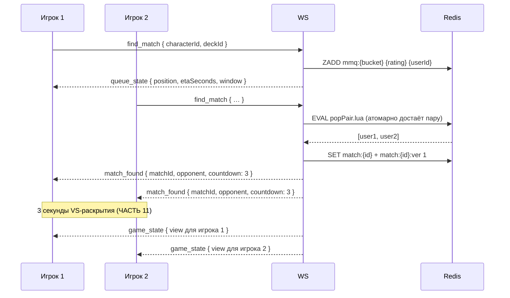
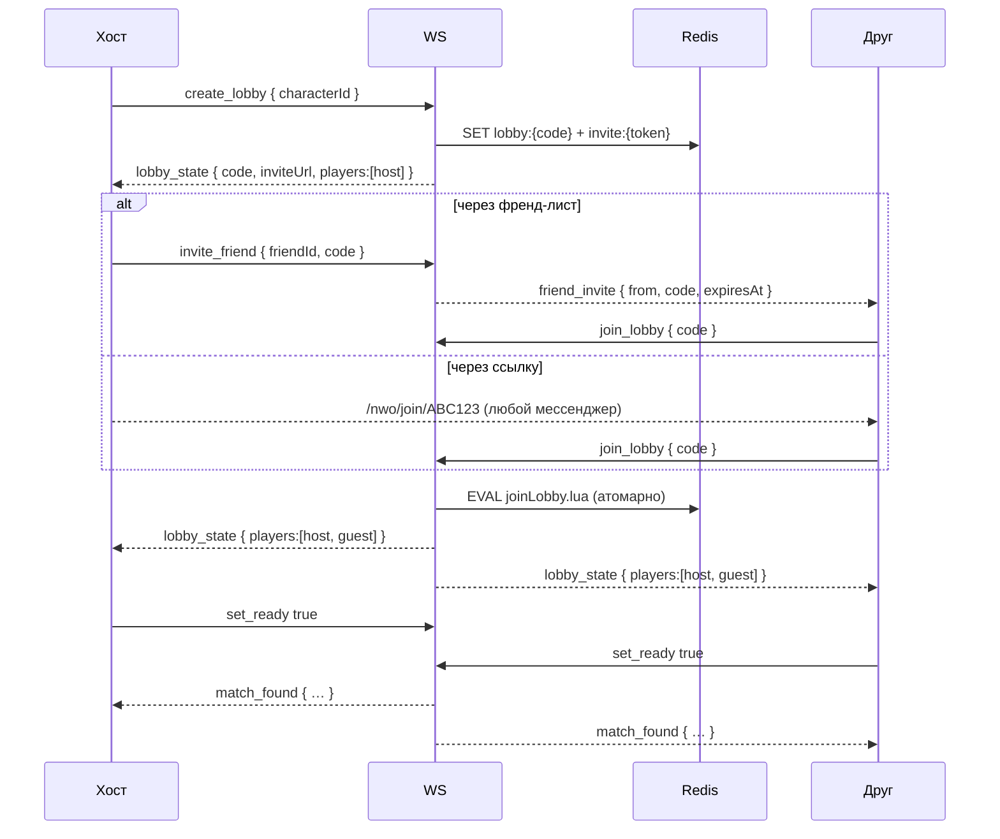
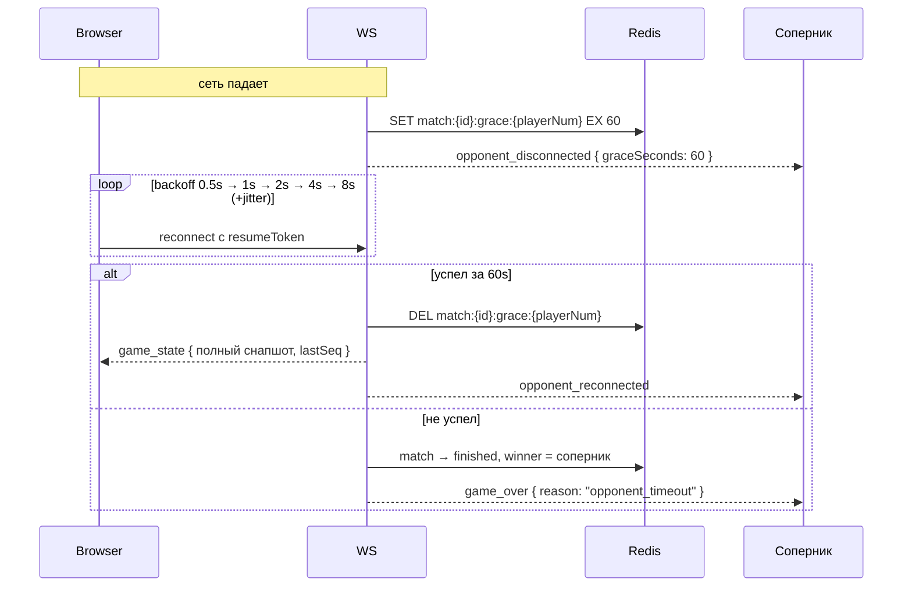
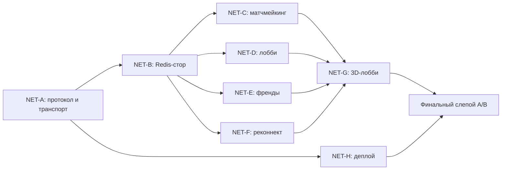
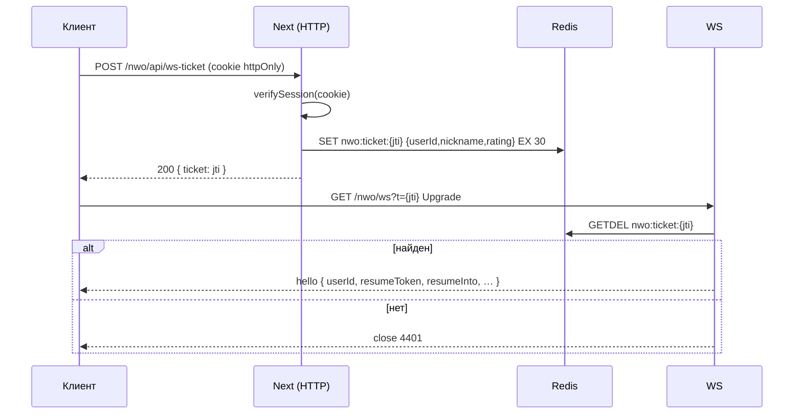
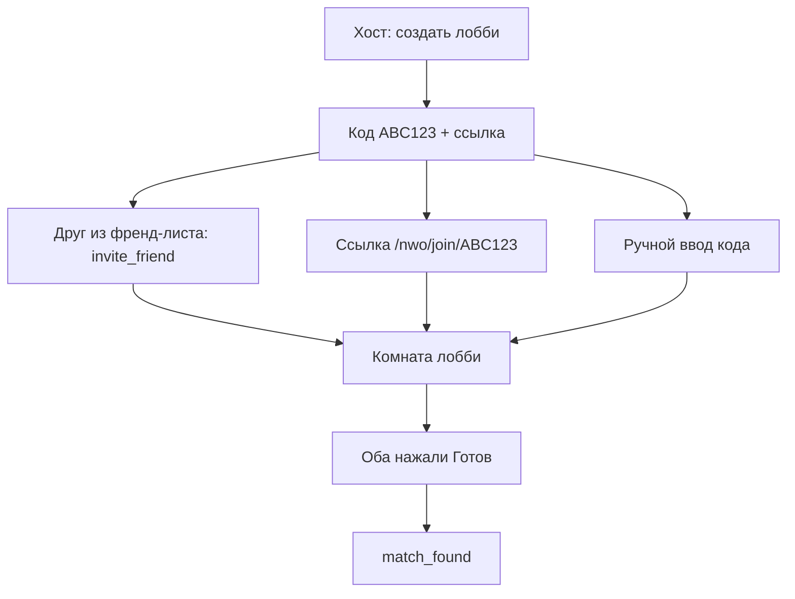
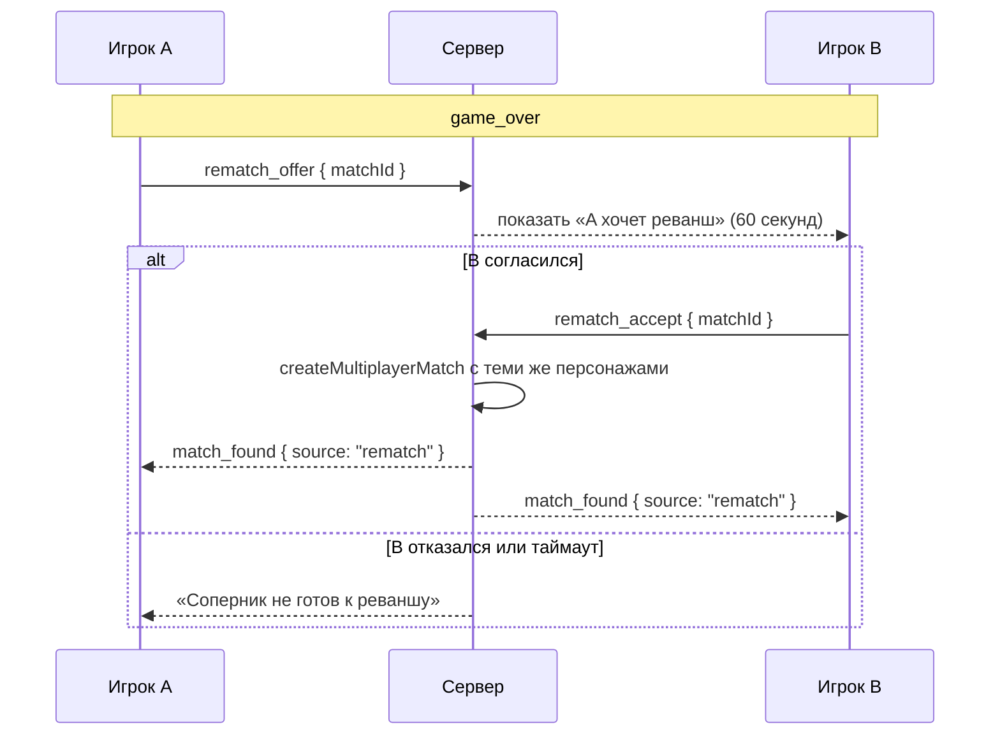

# WORLD ORDER — TZ v5.0: NETCODE
## AAA Multiplayer: Lobby, Matchmaking, Friends, Reconnect
> Стандарт: MTG Arena × Legends of Runeterra × Hearthstone
> Стек: Next.js 15 (custom server) + `ws` + Redis + DynamoDB + Three.js
> Режим Cursor: Multi-Agent Parallel с двойным Critic Loop (слепое A/B, порог 9.5+)
> Статус на входе: **мультиплеер никогда не работал в проде** (доказательства в ЧАСТИ 0)

---

## СОДЕРЖАНИЕ

- [ЧАСТЬ 0: Диагноз и референсный анализ](#часть-0-диагноз)
- [ЧАСТЬ 1: Целевая архитектура](#часть-1-целевая-архитектура)
- [ЧАСТЬ 2: Мульти-агентная система v5](#часть-2-мульти-агентная-система)
- [ЧАСТЬ 3: Протокол v2](#часть-3-протокол)
- [ЧАСТЬ 4: Redis — схема данных и атомарность](#часть-4-redis)
- [ЧАСТЬ 5: Аутентификация WebSocket](#часть-5-аутентификация)
- [ЧАСТЬ 6: Матчмейкинг](#часть-6-матчмейкинг)
- [ЧАСТЬ 7: Лобби, инвайты, реванш](#часть-7-лобби)
- [ЧАСТЬ 8: Френд-лист и presence](#часть-8-френды)
- [ЧАСТЬ 9: Устойчивость — reconnect и таймауты](#часть-9-устойчивость)
- [ЧАСТЬ 10: Fog of war](#часть-10-fog-of-war)
- [ЧАСТЬ 11: 3D-лобби на ThreeJS](#часть-11-3d-лобби)
- [ЧАСТЬ 12: Деплой и инфраструктура](#часть-12-деплой)
- [ЧАСТЬ 13: Наблюдаемость и тесты](#часть-13-наблюдаемость)
- [ЧАСТЬ 14: Cursor Prompts и Critic Loop](#часть-14-cursor-prompts)

---

## ЧАСТЬ 0: ДИАГНОЗ

### 0.1 Симптом

```
Пользователь: /nwo/game/multi → «Найти матч» / «Создать лобби»
UI:           toast «Не удалось подключиться к серверу»
Console:      WebSocket connection to 'ws://localhost:3001/' failed
              page-335cb14feb7552fe.js:1
```

### 0.2 Корневая причина: `NEXT_PUBLIC_WS_URL` не существует во время сборки

Next.js подставляет `NEXT_PUBLIC_*` в клиентский бандл **на этапе `next build`**, а не в рантайме.
Переменная указана только в `environment:` compose-сервиса — это рантайм контейнера, для кода,
который уже скомпилирован и лежит в `.next/static`, она бесполезна.

**Цепочка:**

```typescript
// lib/ws/client.ts:5
const WS_URL = process.env.NEXT_PUBLIC_WS_URL ?? "ws://localhost:3001";
```

```dockerfile
# Dockerfile:8-16 — builder stage
FROM base AS builder
ARG AUTH_SECRET            # ← единственный build arg
ENV AUTH_SECRET=${AUTH_SECRET}
RUN npm run build          # ← NEXT_PUBLIC_WS_URL здесь undefined
```

```yaml
# docker-compose.prod.yml:24-28
    environment:
      - NEXT_PUBLIC_WS_URL=wss://shimmirpgbot.ru/nwo/ws   # ← runtime, поздно
```

**Что реально приехало в браузер** (выдержка из отданного чанка):

```js
let r = null != (a = t(5704).env.NEXT_PUBLIC_WS_URL) ? a : "ws://localhost:3001";
```

Выражение даже не было заинлайнено — define-плагин Next подставляет только те `NEXT_PUBLIC_*`,
которые существуют при компиляции. Модуль `5704` — это браузерный полифилл `process`, он вернёт
`undefined`, и `?? "ws://localhost:3001"` побеждает всегда.

**Доказательства из прода:**

| Проверка | Результат |
|----------|-----------|
| `grep -o "ws://localhost:3001\|wss://shimmirpgbot.ru/nwo/ws"` по живому чанку | `1 × ws://localhost:3001`, `0 × wss://...` |
| `grep -c "/nwo" /var/log/nginx/waifu-bot-access.log` | **810** |
| `grep -c "/nwo/ws" /var/log/nginx/waifu-bot-access.log` | **0** |
| `docker logs nwo-app-ws-1` (аптайм 2 суток) | только `[WS] server running on port 3001` — ни одного `[WS] connected` |

Ни один запрос никогда не дошёл до WS-контейнера. Мультиплеер не «сломался» — он **не работал ни разу**.

Также в проде отдаётся CSP, вшитая в билд из `next.config.ts`, которая всё ещё разрешает dev-URL:

```
Content-Security-Policy: … connect-src 'self' ws://localhost:3001 wss://shimmirpgbot.ru/nwo/ws …
```

То есть даже точечная правка Dockerfile оставит вторую мину: любой новый WS-URL будет молча
заблокирован браузером без единого следа на сервере.

### 0.3 Полный аудит сетевого слоя

За симптомом стоит ещё 13 дефектов. Ни один не чинится правкой одной переменной.

| # | Дефект | Где | Последствие | Приоритет |
|---|--------|-----|-------------|-----------|
| 1 | `NEXT_PUBLIC_WS_URL` не build-arg | `Dockerfile:8-16` | WS никогда не подключается | 🔴 БЛОКЕР |
| 2 | CSP вшита в билд с dev-URL | `next.config.ts:4-16` | Новый URL молча блокируется | 🔴 БЛОКЕР |
| 3 | Split-brain состояния | `lib/game/store.ts:4` | `GET /api/game/[id]` не видит матч, созданный по WS | 🔴 БЛОКЕР |
| 4 | Утечка скрытой информации | `server/handlers.ts:15-28` | Рука и колода соперника в DevTools | 🔴 КРИТИЧНО |
| 5 | Сессионный токен в DOM | `app/game/multi/page.tsx:7-8` | httpOnly-кука обесценена, XSS = угон сессии | 🔴 КРИТИЧНО |
| 6 | `AUTH_SECRET` инлайнится в билд | `next.config.ts:11-13` | Секрет в артефакте, рассинхрон подписи между процессами | 🔴 КРИТИЧНО |
| 7 | Нет heartbeat / dead-detection | `server/index.ts` | Полу-мёртвые сокеты копятся, матч «висит» | 🔴 КРИТИЧНО |
| 8 | Нет реконнекта | `lib/ws/client.ts:11-30` | Микро-разрыв Wi-Fi = потерянный матч | 🔴 КРИТИЧНО |
| 9 | `close` не чистит очередь и лобби | `server/index.ts:27-30` | Мёртвые записи в очереди, «фантомные» соперники | 🔴 КРИТИЧНО |
| 10 | Гонка в `joinLobby` | `lib/ws/lobby.ts:51-54` | Двое входят в одно лобби одновременно | 🟡 ВЫСОКИЙ |
| 11 | Нет валидации входящих сообщений | `server/handlers.ts:42-51` | Любой JSON доходит до движка | 🟡 ВЫСОКИЙ |
| 12 | Нет rate-limit | — | Один клиент кладёт цикл событий | 🟡 ВЫСОКИЙ |
| 13 | `turnDeadline` не энфорсится | `lib/game/engine.ts:260` | AFK-игрок блокирует матч навсегда | 🟡 ВЫСОКИЙ |
| 14 | Нет френд-листа и инвайтов | — | Играть с другом можно только продиктовав код голосом | 🟡 ВЫСОКИЙ |

**Разбор дефекта 10** — гард недостижим:

```typescript
// lib/ws/lobby.ts:49-54
const lobby = lobbies.get(code.toUpperCase());
if (!lobby) return { ok: false, error: "Lobby not found" };
if (lobby.guest) return { ok: false, error: "Lobby full" };   // ← никогда не сработает

lobby.guest = guest;
lobbies.delete(code);   // ← лобби удаляется сразу, второй заход упадёт в "not found"
```

Сообщение «Lobby full» не может быть показано никогда, а два одновременных `join_lobby`
успевают оба прочитать `guest === null` до первой записи.

**Разбор дефекта 4** — что именно утекает:

```typescript
// server/handlers.ts:19-28
connectionManager.forEach((_id, info) => {
  if (info.matchId === matchId && info.playerNum && info.ws.readyState === 1) {
    info.ws.send(JSON.stringify({
      type: "game_state",
      payload: { matchId, playerNum: info.playerNum, state: match },  // ← весь Match
    }));
  }
});
```

Утекает: `player1.hand`, `player2.hand` (полные объекты карт), `player1.deck`, `player2.deck`
(в порядке после шаффла — то есть все будущие дро), `battleRound.p1Card` / `p2Card`
**до** `revealed: true`, и `submit`-события в `roundEvents` с `cardId`, `cardName`,
`category`, `totalSpeed`. UI рубашкой карту прячет, но данные уже в браузере соперника.

### 0.4 Референсный анализ

**MTG Arena** — эталон нашего netcode:

- **Реконнект незаметен.** Клиент теряет сеть — по возвращении получает полный снапшот и
  доигрывает ход. Ни один матч не теряется из-за сети.
- **Очередь честная.** Показывается реальный ETA («Estimated wait: 0:42»), отмена мгновенна.
- **Direct challenge.** Друг из списка → «Challenge» → выбор формата → бой. Два клика.
- **Таймер хода серверный.** Есть ropes (верёвка догорает), по истечении — авто-пас,
  при системном таймауте — авто-поражение. AFK не блокирует соперника.
- **Скрытая информация физически отсутствует у клиента.** Ни один датамайнер не читал руку
  соперника из трафика.

**Legends of Runeterra:**

- **Rematch в один клик** прямо с экрана результата, без возврата в меню.
- **Спектейт для друзей** из френд-листа.
- Плавная деградация: при плохом пинге показывается индикатор, а не разрыв.

**Hearthstone:**

- **Мгновенное восстановление** после закрытия приложения — матч ждёт.
- Понятные ошибки: не «ошибка подключения», а «Соединение потеряно, переподключаемся… (2/5)».

**Что берём в требования:**

| Практика | Наш эквивалент | Часть |
|----------|----------------|-------|
| Незаметный реконнект | resume-token + snapshot + grace 60s | 9 |
| Честный ETA очереди | скользящее среднее по бакету | 6 |
| Direct challenge | инвайт из френд-листа за 2 клика | 8 |
| Серверный таймер хода | энфорсмент `turnDeadline` + авто-пас | 9 |
| Нулевая утечка | `toPlayerView` на каждом исходящем кадре | 10 |
| Rematch в один клик | `rematch_offer` с экрана результата | 7 |
| Понятные ошибки | коды закрытия → человеческий текст | 3 |

### 0.5 Целевое состояние

```
До:  Два контейнера с разной памятью, клиент стучится в ws://localhost:3001,
     весь Match летит обоим игрокам, разрыв сети = потерянный матч,
     лобби только по коду, продиктованному голосом.

После: Один процесс Next.js + WS на одном порту, same-origin URL из location,
       Redis как источник правды, per-player снапшоты без чужих карт,
       реконнект за 60 секунд без потери хода, рейтинговый матчмейкинг с ETA,
       френд-лист с presence и инвайтом в два клика, 3D-лобби уровня MTG Arena.
```

---

## ЧАСТЬ 1: ЦЕЛЕВАЯ АРХИТЕКТУРА

### 1.1 Один процесс вместо двух

Сейчас `app-next` (`node server.js`) и `app-ws` (`npx tsx server/index.ts`) — разные контейнеры
с разной памятью. Модуль `lib/game/store.ts` инстанцируется в обоих, и это два независимых
`Map`. Это структурная причина дефекта 3, и никакая синхронизация её не лечит.

Сливаем в `server/app-server.ts`: один `http.Server`, который отдаёт и HTTP через Next,
и WebSocket через `noServer`-апгрейд на pathname `/nwo/ws`.

```typescript
// server/app-server.ts — скелет
import { createServer } from "http";
import next from "next";
import { WebSocketServer } from "ws";
import { readFileSync } from "fs";
import { attachSocket } from "./ws/attach";

const port = Number(process.env.PORT ?? 3000);
const dev = process.env.NODE_ENV !== "production";

// В standalone-сборке next.config недоступен как файл — берём вшитый конфиг.
const conf = dev
  ? undefined
  : JSON.parse(readFileSync(".next/required-server-files.json", "utf8")).config;

const app = next({ dev, dir: process.cwd(), conf });
const handle = app.getRequestHandler();

await app.prepare();

const server = createServer((req, res) => handle(req, res));
const wss = new WebSocketServer({ noServer: true, maxPayload: 64 * 1024 });

server.on("upgrade", (req, socket, head) => {
  const { pathname } = new URL(req.url ?? "/", `http://${req.headers.host}`);
  if (pathname !== "/nwo/ws") {
    socket.destroy();          // не отдаём апгрейд HMR-сокетам Next в dev — они на другом пути
    return;
  }
  wss.handleUpgrade(req, socket, head, (ws) => attachSocket(ws, req));
});

server.listen(port, "0.0.0.0");
```

**Критично:** `basePath: "/nwo"` живёт в `next.config.ts`, который **не копируется** в runner-стейдж
Dockerfile. Кастомный сервер, вызывающий `next({ dev: false })` без `conf`, молча откатится на
дефолты и потеряет basePath — сломаются все роуты и ассеты. Отсюда чтение
`.next/required-server-files.json` выше. Альтернатива — скопировать `next.config.ts` в образ
(ЧАСТЬ 12), но тогда он переисполнит `env: { AUTH_SECRET }`, который мы всё равно удаляем.

**Порт 3001 исчезает полностью:** сервис `app-ws`, `ports: 127.0.0.1:3001`, `EXPOSE 3001`
и `WS_PORT` удаляются.

### 1.2 Компоненты



| Слой | Ответственность | Живёт |
|------|-----------------|-------|
| `SocketRegistry` | `WebSocket`-объекты, heartbeat, rate-limit | Только в памяти процесса |
| `MatchHub` | Чтение-модификация-запись матча под версией | Память + Redis |
| Redis | Матчи, лобби, очередь, presence, тикеты, инвайты | `redis:6379` |
| DynamoDB | Пользователи, колоды, дружба, история матчей | Yandex Document API |

**Правило:** живые `WebSocket` в Redis не кладутся никогда. В Redis — только метаданные
(`userId → instanceId`), сокеты остаются локальными. Это то, что позволит позже добавить
второй инстанс, докинув pub/sub, не переписывая логику.

### 1.3 Файловая структура

```
server/
  app-server.ts          [NEW]  единая точка входа: HTTP + WS upgrade
  ws/
    attach.ts            [NEW]  handshake, ticket-auth, регистрация сокета
    registry.ts          [NEW]  SocketRegistry: heartbeat, rate-limit, broadcast
    router.ts            [NEW]  диспетчер сообщений по zod-схемам
    handlers/
      match.ts           [NEW]  submit/pass/ability/surrender
      lobby.ts           [NEW]  create/join/leave/ready/rematch
      queue.ts           [NEW]  find/cancel
      social.ts          [NEW]  friend invite/accept/presence
  index.ts               [DEL]  заменён app-server.ts
  handlers.ts            [DEL]  разрезан на ws/handlers/*

lib/net/                 [NEW]  общий для клиента и сервера
  protocol.ts                   zod-схемы, конверт, версия протокола
  close-codes.ts                коды закрытия + человеческие сообщения
  errors.ts                     таксономия ошибок

lib/redis/               [NEW]
  client.ts                     ioredis singleton + graceful degradation
  keys.ts                       все ключи в одном месте
  scripts.ts                    Lua: joinLobby, popPair, casMatch
  match-store.ts                чтение/запись Match с версией
  lobby-store.ts
  queue-store.ts
  presence-store.ts

lib/game/
  view.ts                [NEW]  toPlayerView — fog of war
  store.ts               [MOD]  фасад над redis/match-store с in-memory fallback

lib/ws/
  client.ts              [MOD]  полная переработка: same-origin, reconnect, ack
  types.ts               [DEL]  переезжает в lib/net/protocol.ts
  connection.ts          [DEL]  → server/ws/registry.ts
  lobby.ts               [DEL]  → lib/redis/lobby-store.ts
  matchmaking.ts         [DEL]  → lib/redis/queue-store.ts

hooks/
  useGameSocket.ts       [NEW]  React-обёртка: статус, реконнект, подписки
  usePresence.ts         [NEW]  онлайн-статусы друзей

app/api/
  ws-ticket/route.ts     [NEW]  одноразовый тикет для WS-хендшейка
  friends/route.ts       [NEW]  список, поиск, заявка
  friends/[id]/route.ts  [NEW]  принять, отклонить, удалить, заблокировать
app/join/[code]/page.tsx [NEW]  deep-link на лобби

components/lobby/        [NEW]  3D-лобби (ЧАСТЬ 11)
```

### 1.4 Поток: подключение



Тикет одноразовый и живёт 30 секунд. Куку в DOM больше не отдаём (дефект 5).

### 1.5 Поток: матчмейкинг



Каждые 5 секунд, пока пара не найдена, окно поиска расширяется, а клиенту прилетает
обновлённый `queue_state` с новым ETA.

### 1.6 Поток: инвайт друга



### 1.7 Поток: реконнект



### 1.8 Правила владения состоянием

Эти пять правил — инвариант, который проверяет NET-CRITIC:

1. **Единственный писатель матча — `MatchHub`.** Ни один хендлер и ни один API-роут не пишет
   `match:{id}` напрямую. Все записи идут через compare-and-set по версии.
2. **Каждый исходящий кадр с состоянием проходит через `toPlayerView`.** Исключений нет,
   включая логи и дев-эндпоинты.
3. **Сокеты не покидают процесс.** В Redis только `userId → instanceId` с TTL.
4. **Redis-недоступность не роняет процесс.** `lib/redis/client.ts` при отсутствии соединения
   деградирует на in-memory-реализацию с тем же интерфейсом и пишет WARN. Одиночный инстанс
   в dev должен работать вообще без Redis.
5. **Движок остаётся чистым от транспорта.** `lib/game/engine.ts` не импортирует ничего из
   `lib/redis` и `server/`. Побочный `saveMatch` внутри движка убирается — сохраняет вызывающий.

---

## ЧАСТЬ 2: МУЛЬТИ-АГЕНТНАЯ СИСТЕМА

### 2.1 Структура агентов

```
┌────────────────────────────────────────────────────────────────────────────┐
│                        CURSOR ORCHESTRATOR v5                              │
├────────┬────────┬────────┬────────┬────────┬────────┬────────┬────────────┤
│ NET-A  │ NET-B  │ NET-C  │ NET-D  │ NET-E  │ NET-F  │ NET-G  │   NET-H    │
│Транс-  │ Redis  │ Матч-  │ Лобби  │Френды  │Реконн- │  3D    │  Деплой    │
│порт и  │ store  │мейкинг │инвайты │presence│ект и   │ лобби  │  и наблю-  │
│протокол│ и Lua  │ и ETA  │ реванш │        │таймеры │ThreeJS │  даемость  │
├────────┴────────┴────────┴────────┴────────┴────────┴────────┴────────────┤
│  NET-CRITIC          — протокол, гонки, безопасность. Порог 9.5/10.        │
│  VISUAL-CRITIC       — только визуал. Слепое A/B. Порог 9.5/10.            │
└────────────────────────────────────────────────────────────────────────────┘
```

Критики **не пишут код**. Они только выносят вердикт и формулируют конкретный issue.
Агент, получивший REJECT, исправляет и идёт на повторный ревью. Цикл повторяется, пока
все критерии не станут ≥ 9.5.

### 2.2 Границы файлов

Чтобы агенты не конфликтовали, каждый файл принадлежит ровно одному агенту.

| Агент | Владеет файлами | Может читать |
|-------|-----------------|--------------|
| NET-A | `lib/net/*`, `server/app-server.ts`, `server/ws/attach.ts`, `server/ws/registry.ts`, `server/ws/router.ts`, `lib/ws/client.ts`, `hooks/useGameSocket.ts`, `app/api/ws-ticket/route.ts` | всё |
| NET-B | `lib/redis/*`, `lib/game/store.ts`, `lib/game/view.ts` | `lib/game/*` |
| NET-C | `server/ws/handlers/queue.ts`, `lib/redis/queue-store.ts` | `lib/net/*`, `lib/redis/*` |
| NET-D | `server/ws/handlers/lobby.ts`, `lib/redis/lobby-store.ts`, `app/join/[code]/page.tsx` | `lib/net/*`, `lib/redis/*` |
| NET-E | `server/ws/handlers/social.ts`, `lib/redis/presence-store.ts`, `app/api/friends/*`, `lib/models.ts` (только friends-функции), `hooks/usePresence.ts` | `lib/schema.ts` |
| NET-F | `server/ws/handlers/match.ts`, реконнект в `lib/ws/client.ts` (по согласованию с NET-A), `lib/game/engine.ts` (только энфорсмент `turnDeadline`) | всё |
| NET-G | `components/lobby/*`, `components/game-multi-lobby.tsx`, `app/game/multi/page.tsx` | `lib/design/*`, `components/game/three/*` |
| NET-H | `Dockerfile`, `docker-compose*.yml`, `infra/*`, `next.config.ts`, `package.json`, `scripts/*` | всё |

Конфликтные точки, требующие согласования до начала работы:

- `lib/net/protocol.ts` — пишет только NET-A, но схемы сообщений заказывают C, D, E, F.
  **Правило:** протокол фиксируется первым, до старта остальных.
- `lib/ws/client.ts` — NET-A делает транспорт и реконнект-каркас, NET-F добавляет resume-логику.
  Работают последовательно, не параллельно.

### 2.3 Порядок и зависимости



**Волна 1 (последовательно):** NET-A фиксирует `lib/net/protocol.ts` и поднимает единый процесс.
Пока не пройден NET-CRITIC по протоколу, остальные не стартуют — иначе шесть агентов будут
писать под шесть разных представлений о формате кадра.

**Волна 2 (параллельно):** NET-B и NET-H.

**Волна 3 (параллельно):** NET-C, NET-D, NET-E, NET-F.

**Волна 4:** NET-G поверх готового API.

### 2.4 Системный промпт NET-CRITIC

```
Ты — Principal Network Engineer, проектировавший netcode MTG Arena и
Legends of Runeterra. Ты видел, как теряются матчи на плохом Wi-Fi в метро,
и как датамайнеры читают руку соперника из трафика. Ты параноик.

ЭТАЛОН: MTG Arena. Сравнивай буквально: открой матч, выключи Wi-Fi на 20 секунд,
включи обратно. Если игрок потерял ход — это провал.

КРИТЕРИИ (каждый 1-10, принимать только 9.5+):

  1. CONNECT SPEED — от клика «Играть» до первого кадра состояния < 300ms
     на локальной сети. Замерить performance.now(), не «на глаз».

  2. RECONNECT — выключить сеть на 20 секунд посреди хода, включить.
     Матч должен продолжиться с того же места, без потери отправленной карты.
     Принять только «игрок ничего не заметил».

  3. QUEUE FEEL — ETA показан и близок к правде (±30%). Отмена поиска
     срабатывает мгновенно и не оставляет запись в очереди.
     Проверить: отменить и сразу встать снова — не должно быть дублей.

  4. INVITE FLOW — от «хочу позвать друга» до боя ≤ 2 клика.
     Ссылка, открытая в другом браузере, ведёт прямо в лобби.

  5. FRIEND FLOW — вызов друга из списка ≤ 2 клика. Онлайн-статус
     обновляется в течение 5 секунд после входа/выхода друга.

  6. HIDDEN INFO — открыть DevTools → Network → WS → просмотреть ВСЕ кадры
     за полный матч. Не должно быть НИ ОДНОГО id карты из руки соперника,
     ни одной карты из его колоды, ни одной неоткрытой карты раунда.
     Это бинарный критерий: одна утечка = 0 баллов.

  7. RACE SAFETY — два клиента одновременно: join в одно лобби, submit
     в один слот, два find_match от одного userId, join+leave в одном тике.
     Ни один сценарий не должен оставить рассогласованное состояние.
     Прогнать каждый минимум 20 раз.

  8. ERROR UX — ни в одном сценарии пользователь не видит
     «Не удалось подключиться к серверу». Всегда: что случилось,
     что делает клиент сейчас, что может сделать пользователь.
     Проверить: остановить Redis, остановить сервер, испортить тикет,
     войти с истёкшей сессией, открыть несуществующий код лобби.

  9. STATE OWNERSHIP — прочитать код: есть ли путь записи матча в обход
     MatchHub? Есть ли исходящий кадр в обход toPlayerView?
     Импортирует ли engine.ts что-то из lib/redis или server/?
     Любое «да» = REJECT.

  10. PRODUCTION PARITY — работает и в `npm run dev`, и за nginx с TLS.
      Проверить, что клиент нигде не содержит захардкоженного хоста или порта.
      Grep по бандлу на "localhost" и "3001" должен вернуть 0.

ЕСЛИ ЛЮБОЙ < 9.5:
  Сформулируй issue как: файл + функция + конкретный сценарий воспроизведения
  + что должно быть вместо. Не «улучшить обработку ошибок», а
  «server/ws/handlers/lobby.ts:joinLobby — при одновременном заходе двух
  гостей оба получают lobby_state; нужен Lua-скрипт с проверкой поля guest».
  REJECT → агент исправляет → повторный ревью.

ПРИНЯТЬ только: "APPROVED — Netcode готов к продакшену".
```

### 2.5 Системный промпт VISUAL-CRITIC

```
Ты — Art Director, отвечавший за UI мультиплеерных экранов MTG Arena.
Ты не смотришь в код. Ты смотришь только на скриншоты и видео.
Ты жёсткий: «нормально» — это провал, принимается только «вау».

ЭТАЛОН: экраны Play Queue и Direct Challenge в MTG Arena.

КРИТЕРИИ (каждый 1-10, принимать только 9.5+):

  1. FIRST IMPRESSION — 3 секунды на скриншот. Это экран AAA-игры
     или админка? Принять только «AAA-игра».

  2. DEPTH — есть ли ощущение объёма и пространства, или это плоские
     карточки на тёмном фоне? 3D-сцена должна читаться как сцена,
     а не как картинка на фоне.

  3. FOCUS — за 1 секунду понятно, куда нажать, чтобы начать бой?
     Главное действие должно доминировать визуально.

  4. WAITING STATE — экран поиска соперника должен быть интересным
     сам по себе. Спиннер = 0 баллов. Нужно движение, дыхание, жизнь.

  5. TYPOGRAPHY — используются Cinzel Decorative для заголовков
     и Rajdhani для UI, из lib/design/tokens.ts. Никаких системных
     шрифтов и никакого text-lg font-bold.

  6. PALETTE — void #08080F, gold #D4AF37/#FFD700, акценты стран.
     Никаких zinc-950/zinc-800 из дефолтной темы shadcn.

  7. TRANSITIONS — переход «нашёлся соперник → бой» должен быть
     кинематографичным. Резкий router.push = 0 баллов.

  8. FRIEND PANEL — список друзей выглядит как часть игры,
     а не как виджет мессенджера.

  9. FEEDBACK — каждое действие имеет визуальный отклик за < 100ms.
     Нажал «Найти матч» — что-то произошло немедленно.

  10. CONSISTENCY — экран лобби и экран боя выглядят как одна игра.
      Сравнить со скриншотом battle-scene и character-select.

ПРОЦЕДУРА СЛЕПОГО A/B: см. 2.6.

ЕСЛИ ЛЮБОЙ < 9.5: конкретный issue (компонент + что именно не так +
как в эталоне) → REJECT → повторный цикл.

ПРИНЯТЬ только: "APPROVED — визуал на уровне эталона".
```

### 2.6 Протокол слепого A/B

Слепое сравнение — обязательная часть цикла, а не финальная формальность.

**Правила:**

1. Агент NET-G готовит **две** реализации экрана: `Вариант A` и `Вариант B`. Они должны
   отличаться содержательно (например, композиция камеры и подача состояния поиска),
   а не цветом одной кнопки.
2. Скриншоты и видео складываются в `/tmp/nwo-ab/{a,b}/` с именами `01-idle.png`,
   `02-searching.png`, `03-found.png`, `04-friends.png`, `05-lobby.png`.
3. VISUAL-CRITIC получает **только** пути к файлам. Ему **не сообщается**, какой вариант
   новый, какой старый, какой чей. Порядок предъявления рандомизируется на каждом цикле.
4. Критик обязан назвать победителя по каждому из 10 критериев отдельно и общего победителя,
   и объяснить, что именно в проигравшем варианте слабее.
5. Победивший вариант становится базой. Проигравший разбирается на предмет удачных деталей —
   их переносят.
6. Если победитель набрал < 9.5 хотя бы по одному критерию — оба варианта отклоняются,
   NET-G готовит новую пару. Цикл повторяется.
7. **Обязательный контроль:** в каждый цикл третьим, тоже без метки, подкладывается
   скриншот текущего `game-multi-lobby.tsx`. Если критик не поставил его на последнее место
   с явным отрывом — критик калиброван неверно, его вердикт за этот цикл аннулируется.

**Минимум циклов:** три. Даже если первый вариант получил 9.5+, проводится ещё два цикла —
опыт показывает, что третья итерация всегда лучше первой.

---

## ЧАСТЬ 3: ПРОТОКОЛ

### 3.1 Принципы

1. **Один конверт для всех сообщений.** Тип, версия, порядковый номер, время — всегда на месте.
2. **Валидация обеих сторон.** Сервер не доверяет клиенту, клиент не доверяет серверу
   (защита от рассинхрона версий после деплоя).
3. **Версия протокола в handshake.** Несовместимость — явное закрытие с понятным кодом,
   а не таинственные ошибки парсинга.
4. **Каждое действие подтверждается.** Клиент знает, что его карта дошла, — и может
   переотправить, если нет.
5. **Ни одного `unknown` в клиентском коде.** Сейчас `client.on("game_state", (payload) => …)`
   отдаёт `unknown` и требует ручного каста в каждом месте. Это уходит.

### 3.2 Конверт

```typescript
// lib/net/protocol.ts
import { z } from "zod";

export const PROTOCOL_VERSION = 2;

export const envelopeSchema = z.object({
  v: z.literal(PROTOCOL_VERSION),
  /** Уникальный id кадра. Клиент → сервер: для ack. Сервер → клиент: для дедупликации. */
  id: z.string().max(36),
  /** Монотонный счётчик отправителя. Разрыв в последовательности = запросить снапшот. */
  seq: z.number().int().nonnegative(),
  type: z.string().max(48),
  ts: z.number().int(),
  payload: z.unknown(),
});

export type Envelope<T = unknown> = Omit<z.infer<typeof envelopeSchema>, "payload"> & {
  payload: T;
};
```

`seq` решает конкретную проблему: сейчас `game-board.tsx` отслеживает прогресс анимаций через
`lastRoundEventsLenRef` и `lastResolutionTurnRef`, предполагая монотонность серверного состояния.
Разрыв в `seq` — это сигнал «ты пропустил кадр, запроси снапшот», а не молчаливый рассинхрон
анимаций.

### 3.3 Сообщения клиент → сервер

```typescript
// lib/net/protocol.ts (продолжение)

export const clientMessages = {
  // --- сессия ---
  resume: z.object({ resumeToken: z.string(), lastSeq: z.number().int() }),
  pong: z.object({ echo: z.number().int() }),
  request_snapshot: z.object({ matchId: z.string() }),

  // --- очередь ---
  find_match: z.object({
    characterId: z.string().min(1).max(64),
    deckId: z.string().max(64).optional(),
  }),
  cancel_matchmaking: z.object({}),

  // --- лобби ---
  create_lobby: z.object({
    characterId: z.string().min(1).max(64),
    visibility: z.enum(["code", "friends"]).default("code"),
  }),
  join_lobby: z.object({ code: z.string().length(6) }),
  leave_lobby: z.object({}),
  set_ready: z.object({ ready: z.boolean() }),
  set_character: z.object({ characterId: z.string().min(1).max(64) }),
  rematch_offer: z.object({ matchId: z.string() }),
  rematch_accept: z.object({ matchId: z.string() }),

  // --- социальное ---
  invite_friend: z.object({ friendId: z.string().max(64) }),
  invite_respond: z.object({ inviteId: z.string(), accept: z.boolean() }),
  subscribe_presence: z.object({}),

  // --- матч ---
  submit_card: z.object({ matchId: z.string(), cardId: z.string() }),
  pass_turn: z.object({ matchId: z.string() }),
  use_ability: z.object({ matchId: z.string(), abilityId: z.string() }),
  pass_ability: z.object({ matchId: z.string() }),
  surrender: z.object({ matchId: z.string() }),
} as const;

export type ClientMessageType = keyof typeof clientMessages;
```

**Убрано из старого протокола:** `auth` (заменён тикетом в хендшейке — ЧАСТЬ 5),
`play_card` / `play_cards` / `skip_turn` (дубли `submit_card` / `pass_turn`, в
`server/handlers.ts:159-207` они склеены в общие ветки и только запутывают).
`nickname` и `characterId` больше не приходят от клиента при `find_match` в качестве
идентичности — ник берётся из сессии на сервере. Сейчас клиент присылает произвольный
`nickname`, и сервер ему верит.

### 3.4 Сообщения сервер → клиент

```typescript
export const serverMessages = {
  // --- сессия ---
  hello: z.object({
    userId: z.string(),
    nickname: z.string(),
    rating: z.number(),
    protocolVersion: z.literal(PROTOCOL_VERSION),
    resumeToken: z.string(),
    serverTime: z.number().int(),
    /** Куда вернуть игрока, если он был в матче или лобби */
    resumeInto: z.discriminatedUnion("kind", [
      z.object({ kind: z.literal("none") }),
      z.object({ kind: z.literal("match"), matchId: z.string() }),
      z.object({ kind: z.literal("lobby"), code: z.string() }),
      z.object({ kind: z.literal("queue") }),
    ]),
  }),
  ping: z.object({ echo: z.number().int() }),
  ack: z.object({ id: z.string(), ok: z.boolean(), error: errorSchema.optional() }),

  // --- очередь ---
  queue_state: z.object({
    position: z.number().int(),
    etaSeconds: z.number().int().nullable(),
    searchWindow: z.number().int(),
    elapsedSeconds: z.number().int(),
    playersSearching: z.number().int(),
  }),
  queue_left: z.object({ reason: z.enum(["cancelled", "matched", "timeout", "error"]) }),

  // --- лобби ---
  lobby_state: lobbyStateSchema,
  lobby_closed: z.object({ reason: z.enum(["host_left", "expired", "started"]) }),

  // --- социальное ---
  friend_invite: z.object({
    inviteId: z.string(),
    from: playerBriefSchema,
    code: z.string().length(6),
    expiresAt: z.number().int(),
  }),
  presence_update: z.array(z.object({
    userId: z.string(),
    status: z.enum(["online", "in_lobby", "in_match", "offline"]),
  })),

  // --- матч ---
  match_found: z.object({
    matchId: z.string(),
    playerNum: z.union([z.literal(1), z.literal(2)]),
    opponent: playerBriefSchema,
    countdownMs: z.number().int(),
    source: z.enum(["queue", "lobby", "rematch"]),
  }),
  game_state: z.object({
    matchId: z.string(),
    playerNum: z.union([z.literal(1), z.literal(2)]),
    version: z.number().int(),
    /** Отфильтрованный Match — см. ЧАСТЬ 10 */
    view: playerViewSchema,
  }),
  game_over: z.object({
    matchId: z.string(),
    winner: z.union([z.literal(1), z.literal(2)]),
    reason: z.enum(["hp", "surrender", "disconnect_timeout", "turn_timeout"]),
    ratingDelta: z.number().int(),
    newRating: z.number().int(),
  }),
  opponent_disconnected: z.object({ graceSeconds: z.number().int() }),
  opponent_reconnected: z.object({}),
  turn_deadline: z.object({ matchId: z.string(), deadlineMs: z.number().int() }),

  // --- ошибки ---
  error: errorSchema,
} as const;
```

### 3.5 Таксономия ошибок

Дефект 8 из аудита — «Не удалось подключиться к серверу» как единственное сообщение на всё.
Заменяем структурированной ошибкой, из которой UI строит осмысленный текст.

```typescript
// lib/net/errors.ts
export const errorSchema = z.object({
  code: z.enum([
    "AUTH_REQUIRED",      // сессия истекла
    "AUTH_INVALID",       // тикет невалиден или уже использован
    "PROTOCOL_VERSION",   // клиент старше сервера — нужна перезагрузка
    "RATE_LIMITED",       // слишком много сообщений
    "NOT_IN_MATCH",       // действие матча без матча
    "NOT_YOUR_TURN",      // ход соперника
    "ILLEGAL_ACTION",     // движок отверг действие
    "LOBBY_NOT_FOUND",
    "LOBBY_FULL",
    "LOBBY_EXPIRED",
    "ALREADY_QUEUED",
    "ALREADY_IN_MATCH",
    "FRIEND_OFFLINE",
    "STORAGE_UNAVAILABLE", // Redis лёг
    "INTERNAL",
  ]),
  /** Готовый русский текст для пользователя */
  message: z.string(),
  /** Что клиент сделает дальше — UI показывает это как подсказку */
  recovery: z.enum(["retry", "reconnect", "reload", "relogin", "none"]),
  retryAfterMs: z.number().int().optional(),
});
```

**Таблица сообщений** — единый источник для UI, никаких строк в компонентах:

| Код | Текст пользователю | recovery |
|-----|--------------------|----------|
| `AUTH_REQUIRED` | «Сессия истекла. Войдите заново.» | `relogin` |
| `AUTH_INVALID` | «Не удалось подтвердить вход. Обновите страницу.» | `reload` |
| `PROTOCOL_VERSION` | «Вышло обновление игры. Обновите страницу.» | `reload` |
| `RATE_LIMITED` | «Слишком быстро. Подождите секунду.» | `retry` |
| `LOBBY_NOT_FOUND` | «Лобби с кодом {code} не найдено. Проверьте код.» | `none` |
| `LOBBY_FULL` | «В этом лобби уже двое игроков.» | `none` |
| `LOBBY_EXPIRED` | «Лобби закрылось — прошло больше 10 минут.» | `none` |
| `ALREADY_IN_MATCH` | «Вы уже в бою. Вернуться к матчу?» | `none` |
| `FRIEND_OFFLINE` | «{nickname} сейчас не в сети.» | `none` |
| `STORAGE_UNAVAILABLE` | «Технические работы. Пробуем восстановить связь…» | `reconnect` |
| `INTERNAL` | «Что-то пошло не так. Переподключаемся…» | `reconnect` |

### 3.6 Коды закрытия

```typescript
// lib/net/close-codes.ts
export const CLOSE = {
  NORMAL:            1000,
  GOING_AWAY:        1001,
  AUTH_FAILED:       4401,  // тикет невалиден
  AUTH_EXPIRED:      4402,  // сессия истекла во время игры
  PROTOCOL_MISMATCH: 4410,  // версия протокола не совпала
  RATE_LIMITED:      4429,  // превышен лимит, бан на 30s
  REPLACED:          4409,  // тот же userId вошёл с другой вкладки
  SERVER_SHUTDOWN:   4503,  // деплой — клиент должен переподключиться
} as const;
```

`REPLACED` закрывает важный кейс: сейчас `connectionManager.findByUserId` возвращает
**первое** совпадение, то есть при двух вкладках сообщения уходят случайной. Новое правило:
одна активная сессия на пользователя, старая закрывается с `4409` и показывает
«Игра открыта в другой вкладке».

`SERVER_SHUTDOWN` при `SIGTERM`: перед выходом процесс рассылает всем `4503`, клиенты
переподключаются с backoff и попадают на новый инстанс, матчи переживают деплой благодаря Redis.

### 3.7 Heartbeat

```typescript
// server/ws/registry.ts — фрагмент
const HEARTBEAT_INTERVAL = 15_000;
const HEARTBEAT_TIMEOUT   = 45_000;   // три пропущенных пинга

setInterval(() => {
  const now = Date.now();
  for (const conn of this.connections.values()) {
    if (now - conn.lastPongAt > HEARTBEAT_TIMEOUT) {
      conn.ws.terminate();            // не close() — сокет уже мёртв
      this.handleDisconnect(conn);    // grace-таймер, уборка очереди и лобби
      continue;
    }
    conn.send("ping", { echo: now });
  }
}, HEARTBEAT_INTERVAL);
```

Клиент отвечает `pong` с тем же `echo` — из разницы считается RTT, который показывается
в углу экрана боя (индикатор пинга, как в Arena).

**Обязательно:** `handleDisconnect` делает то, чего сейчас нет вообще
(`server/index.ts:27-30` только удаляет запись из Map):

1. Удалить из очереди матчмейкинга.
2. Если хост лобби — закрыть лобби и уведомить гостя `lobby_closed`.
3. Если гость — вернуть лобби в состояние ожидания.
4. Если в матче — запустить grace-таймер и отправить сопернику `opponent_disconnected`.
5. Снять presence-ключ, уведомить друзей.

### 3.8 Ack и переотправка

```typescript
// lib/ws/client.ts — фрагмент
private pending = new Map<string, { msg: Envelope; timer: NodeJS.Timeout; tries: number }>();

send<T extends ClientMessageType>(type: T, payload: z.infer<typeof clientMessages[T]>) {
  const env = { v: PROTOCOL_VERSION, id: crypto.randomUUID(), seq: this.seq++, type, ts: Date.now(), payload };
  this.raw(env);
  // Действия матча требуют подтверждения — их потеря стоит игроку хода.
  if (MATCH_ACTIONS.has(type)) this.trackAck(env);
}
```

Таймаут ack — 3 секунды, до 3 попыток, затем `error` с `recovery: "reconnect"`.
Сервер обязан быть идемпотентным по `id`: повторный `submit_card` с тем же `id`
возвращает тот же `ack`, а не играет карту дважды. Для этого — `SETNX seen:{connId}:{id} EX 120`.

### 3.9 Rate-limit

```typescript
// server/ws/registry.ts
const LIMITS = {
  bucketSize: 20,        // burst
  refillPerSec: 10,
  maxFrameBytes: 64 * 1024,
  banMs: 30_000,
};
```

Превышение → `error` с `RATE_LIMITED` и `retryAfterMs`. Повторное превышение в течение
минуты → закрытие с `4429`. Отдельный, более строгий лимит на `find_match` и `create_lobby`
(не чаще 1 раза в 2 секунды) — эти операции пишут в Redis.

### 3.10 Клиент: типизированный API

```typescript
// hooks/useGameSocket.ts — публичный интерфейс
export interface GameSocket {
  status: "idle" | "connecting" | "open" | "reconnecting" | "closed";
  rttMs: number | null;
  reconnectAttempt: number;
  lastError: ProtocolError | null;
  send<T extends ClientMessageType>(type: T, payload: ClientPayload<T>): Promise<void>;
  on<T extends ServerMessageType>(type: T, handler: (p: ServerPayload<T>) => void): () => void;
}
```

`send` возвращает промис, который резолвится по `ack` и реджектится по таймауту или ошибке —
компоненты пишут `await send("submit_card", …)` и получают понятную ошибку вместо тишины.

### 3.11 Same-origin URL

```typescript
// lib/ws/client.ts
function resolveWsUrl(): string {
  // Dev-override — единственный случай, когда переменная вообще нужна.
  const override = process.env.NEXT_PUBLIC_WS_URL;
  if (override) return override;

  const { protocol, host } = window.location;
  const scheme = protocol === "https:" ? "wss:" : "ws:";
  const basePath = process.env.NEXT_PUBLIC_BASE_PATH ?? "/nwo";
  return `${scheme}//${host}${basePath}/ws`;
}
```

Это устраняет корневую причину навсегда: URL больше не зависит от того, что было в окружении
на момент сборки. Проверка NET-CRITIC (критерий 10): `grep -r "localhost\|3001" .next/static`
должен вернуть пусто.

---

## ЧАСТЬ 4: REDIS

### 4.1 Почему отдельный контейнер, а не хостовый Redis

На сервере есть Redis 7.0.15 под systemd, но использовать его нельзя:

| Препятствие | Факт |
|-------------|------|
| Сетевая доступность | `bind 127.0.0.1 -::1` — контейнеры в `nwo_default` (172.19.0.0/16) не достучатся |
| Занятое пространство | db0 занят waifu-bot: 52 ключа, включая `dramatiq:__heartbeats__`, `_kombu.binding.celery` |
| Риск для соседа | `maxmemory 0` + `maxmemory-policy noeviction` — рост нашего кейспейса уронит очередь задач waifu-bot |
| Безопасность | `requirepass` не задан |

Решение: сервис `redis:7-alpine` внутри `docker-compose.prod.yml`, без публикации порта наружу,
со своим томом. Изменения хостового конфига и рестарт чужого сервиса не требуются.

### 4.2 Клиент

```typescript
// lib/redis/client.ts
import Redis from "ioredis";

let client: Redis | null = null;
let degraded = false;

export function redis(): Redis | null {
  if (degraded) return null;
  if (client) return client;

  const url = process.env.REDIS_URL;
  if (!url) { degraded = true; return null; }   // dev без Redis — работаем на памяти

  client = new Redis(url, {
    maxRetriesPerRequest: 2,
    enableReadyCheck: true,
    retryStrategy: (times) => Math.min(times * 200, 3000),
    lazyConnect: false,
  });
  client.on("error", (e) => console.warn("[redis]", e.message));
  return client;
}

export function isDegraded(): boolean { return degraded || client?.status !== "ready"; }
```

**Требование:** каждый store (`match-store`, `lobby-store`, `queue-store`, `presence-store`)
имеет in-memory-реализацию с идентичным интерфейсом и переключается автоматически при
`isDegraded()`. `npm run dev` без Redis обязан работать полностью — иначе локальная разработка
станет невозможной, и агенты начнут тестировать «на глаз».

Зависимость: `ioredis` в `dependencies`. Выбран вместо `redis` v4 из-за `.duplicate()` для
pub/sub и `defineCommand` для Lua-скриптов — обе фичи нужны ниже.

### 4.3 Схема ключей

```typescript
// lib/redis/keys.ts
export const K = {
  match:      (id: string) => `nwo:match:${id}`,            // JSON, TTL 6h
  matchVer:   (id: string) => `nwo:match:${id}:ver`,        // INT, для CAS
  matchLock:  (id: string) => `nwo:match:${id}:lock`,       // SET NX PX 5000
  matchGrace: (id: string, p: 1 | 2) => `nwo:match:${id}:grace:${p}`, // TTL 60s
  matchSnap:  (id: string) => `nwo:match:${id}:snap`,       // battleSnapshots для cancel_last

  userMatch:  (u: string) => `nwo:user:${u}:match`,         // куда вернуть при reconnect
  userLobby:  (u: string) => `nwo:user:${u}:lobby`,

  lobby:      (code: string) => `nwo:lobby:${code}`,        // HASH, TTL 10m
  invite:     (token: string) => `nwo:invite:${token}`,     // TTL 10m

  queue:      (bucket: number) => `nwo:mmq:${bucket}`,      // ZSET score=rating
  queueMeta:  (u: string) => `nwo:mmq:meta:${u}`,           // HASH: joinedAt, characterId
  queueStats: () => `nwo:mmq:stats`,                        // LIST последних времён ожидания

  presence:   (u: string) => `nwo:presence:${u}`,           // TTL 45s, значение = статус
  socket:     (u: string) => `nwo:sock:${u}`,               // instanceId, TTL 45s
  ticket:     (jti: string) => `nwo:ticket:${jti}`,         // TTL 30s, одноразовый
  resume:     (token: string) => `nwo:resume:${token}`,     // TTL 5m
  seen:       (c: string, id: string) => `nwo:seen:${c}:${id}`, // идемпотентность, TTL 120s

  room:       (matchId: string) => `nwo:room:${matchId}`,   // pub/sub канал
} as const;
```

Префикс `nwo:` обязателен для всех ключей — на случай, если позже кто-то всё же решит
использовать общий инстанс.

### 4.4 Матч: compare-and-set вместо гонок

Сейчас два одновременных `submit_card` оба читают состояние, оба пишут, и одна карта
теряется бесследно. Лечим версионированием.

```typescript
// lib/redis/match-store.ts
export interface VersionedMatch { match: Match; version: number }

export async function readMatch(id: string): Promise<VersionedMatch | null>;

/** Возвращает false, если версия устарела — вызывающий перечитывает и повторяет. */
export async function casMatch(id: string, expected: number, next: Match): Promise<boolean>;
```

```lua
-- lib/redis/scripts.ts → CAS_MATCH
-- KEYS[1]=match, KEYS[2]=ver   ARGV[1]=expectedVer, ARGV[2]=json, ARGV[3]=ttl
local cur = tonumber(redis.call('GET', KEYS[2]) or '0')
if cur ~= tonumber(ARGV[1]) then return 0 end
redis.call('SET', KEYS[1], ARGV[2], 'EX', ARGV[3])
redis.call('SET', KEYS[2], cur + 1, 'EX', ARGV[3])
return 1
```

Над этим — `MatchHub.apply`, единственная точка записи:

```typescript
// server/ws/match-hub.ts
export async function apply(
  matchId: string,
  playerNum: 1 | 2,
  mutate: (m: Match) => Match,
): Promise<{ match: Match; version: number }> {
  for (let attempt = 0; attempt < 5; attempt++) {
    const cur = await readMatch(matchId);
    if (!cur) throw new ProtocolError("NOT_IN_MATCH");
    const next = mutate(cur.match);
    if (await casMatch(matchId, cur.version, next)) {
      return { match: next, version: cur.version + 1 };
    }
  }
  throw new ProtocolError("INTERNAL");   // 5 конфликтов подряд — что-то не так
}
```

**Дополнительно** — сериализация на уровне процесса. Так как процесс один, дешевле и надёжнее
держать per-match очередь промисов: действия одного матча выполняются строго последовательно,
и CAS почти никогда не конфликтует. CAS остаётся как страховка на будущее многоинстансное
развёртывание.

**`battleSnapshots` переезжает в Redis.** Сейчас это модульный `Map` в `lib/game/engine.ts:45`,
из которого эффект `cancel_last` (`engine.ts:611-628`) восстанавливает состояние. При
перезапуске процесса снапшот теряется, и карта отмены сработает некорректно. Ключ
`nwo:match:{id}:snap`, пишется при входе в battle-фазу, TTL как у матча.

### 4.5 Лобби: атомарный вход

Дефект 10 из аудита — гонка и недостижимый гард. Лечим Lua-скриптом, который делает
проверку и запись в одной атомарной операции.

```lua
-- JOIN_LOBBY
-- KEYS[1]=lobby hash   ARGV[1]=userId ARGV[2]=nickname ARGV[3]=characterId ARGV[4]=connId
if redis.call('EXISTS', KEYS[1]) == 0 then return {-1} end          -- LOBBY_NOT_FOUND
local host = redis.call('HGET', KEYS[1], 'hostId')
if host == ARGV[1] then return {-3} end                             -- сам себе гость
if redis.call('HGET', KEYS[1], 'guestId') then return {-2} end      -- LOBBY_FULL
redis.call('HSET', KEYS[1],
  'guestId', ARGV[1], 'guestNick', ARGV[2],
  'guestChar', ARGV[3], 'guestConn', ARGV[4], 'guestReady', '0')
return {1, host}
```

Ключевое отличие от текущего кода: лобби **не удаляется** при входе гостя. Оно живёт до старта
матча, потому что теперь есть фаза готовности, смена персонажа и превью соперника. Удаление
происходит по `lobby_closed` или по TTL.

### 4.6 Очередь: атомарное извлечение пары

```lua
-- POP_PAIR
-- KEYS[1]=ZSET очереди   ARGV[1]=minRating ARGV[2]=maxRating
local ids = redis.call('ZRANGEBYSCORE', KEYS[1], ARGV[1], ARGV[2], 'LIMIT', 0, 2)
if #ids < 2 then return {} end
redis.call('ZREM', KEYS[1], ids[1], ids[2])
return ids
```

Текущая реализация (`lib/ws/matchmaking.ts:29-33`) читает `[...queue.values()].slice(0, 2)`
и потом удаляет — между чтением и удалением помещается что угодно. Здесь всё в одном `EVAL`.

### 4.7 Presence

```typescript
// lib/redis/presence-store.ts
const PRESENCE_TTL = 45;   // совпадает с HEARTBEAT_TIMEOUT

export async function touch(userId: string, status: PresenceStatus): Promise<void>;
export async function drop(userId: string): Promise<void>;
export async function readMany(userIds: string[]): Promise<Map<string, PresenceStatus>>;
```

Ключ продлевается на каждом `pong` — это бесплатно, пинг и так идёт каждые 15 секунд.
Если процесс умер жёстко, ключи истекут сами за 45 секунд, и друзья увидят «не в сети»
без ручной уборки. `readMany` — один `MGET`, не N запросов.

### 4.8 Pub/sub — задел на масштабирование

Сейчас инстанс один, и рассылка идёт напрямую через `SocketRegistry`. Но структура сразу
закладывается под несколько:

```typescript
// server/ws/registry.ts
async function broadcastToMatch(matchId: string, type: string, payloadFor: (p: 1 | 2) => unknown) {
  // Локальные сокеты — напрямую.
  for (const conn of localConnectionsInMatch(matchId)) {
    conn.send(type, payloadFor(conn.playerNum));
  }
  // Если появится второй инстанс — расcкоментировать одну строку:
  // await pub.publish(K.room(matchId), JSON.stringify({ type, matchId }));
}
```

Стоимость сейчас — ноль. Стоимость переписывания потом, если не заложить, — вся ЧАСТЬ 3.

### 4.9 TTL и уборка

| Ключ | TTL | Продление |
|------|-----|-----------|
| `match:*` | 6 часов | при каждой записи |
| `match:*:grace:*` | 60 секунд | нет |
| `match:*:lock` | 5 секунд | нет |
| `lobby:*` | 10 минут | при любом действии в лобби |
| `invite:*` | 10 минут | нет |
| `mmq:*` | нет TTL (ZSET) | фоновая уборка записей старше 5 минут |
| `presence:*` | 45 секунд | на каждом `pong` |
| `ticket:*` | 30 секунд | нет, одноразовый |
| `resume:*` | 5 минут | при реконнекте |

Фоновая задача раз в 30 секунд: удалить из очереди `userId`, у которых нет живого
`presence`-ключа. Это страховка от записей, переживших падение процесса.

---

## ЧАСТЬ 5: АУТЕНТИФИКАЦИЯ

### 5.1 Что не так сейчас

```typescript
// app/game/multi/page.tsx:6-8
const cookieStore = await cookies();
const sessionToken = cookieStore.get(SESSION_COOKIE)?.value ?? "";
return <GameMultiLobby sessionToken={sessionToken} />;
```

Кука объявлена `httpOnly: true` (`lib/auth.ts:72`) специально, чтобы JavaScript до неё не
добрался. Затем её значение вручную сериализуется в HTML как проп клиентского компонента.
Любой XSS — и сессия на 7 дней в руках атакующего. То же самое в `app/game/[id]/page.tsx:14`.

Вторая проблема: токен летит в первом WS-сообщении (`type: "auth"`), то есть попадает в
`Network → WS → Messages` в DevTools, в логи прокси при отладке, в скриншоты багрепортов.

Третья: `next.config.ts:11-13` вшивает сам секрет подписи в билд —

```javascript
// .next/standalone/server.js:12
const nextConfig = {"env":{"AUTH_SECRET":"dev-secret-change-in-production-32bytes!!"}, …}
```

Next применяет `config.env` **поверх** `process.env` при старте, поэтому build-time значение
перебивает рантайм из `env_file`. Сейчас процессы согласованы только потому, что `deploy.sh`
подставляет один и тот же файл. Любая пересборка с другим build-arg молча рассинхронизирует
подпись сессий.

### 5.2 Тикет-хендшейк



Свойства:

- Кука не покидает HTTP-слой. В DOM ничего не попадает.
- Тикет живёт 30 секунд и сгорает при использовании (`GETDEL` атомарен).
- Перехваченный тикет бесполезен: он уже использован либо истёк.
- В логах и DevTools виден только одноразовый идентификатор.

```typescript
// app/api/ws-ticket/route.ts
export async function POST() {
  const session = await getSessionPayload();
  if (!session) return NextResponse.json({ error: "AUTH_REQUIRED" }, { status: 401 });

  const user = await findUserByIdSafe(session.userId);
  const jti = randomBytes(24).toString("base64url");

  await redis()?.set(
    K.ticket(jti),
    JSON.stringify({
      userId: session.userId,
      nickname: user?.nickname ?? session.nickname,
      rating: user?.rating ?? 1000,
    }),
    "EX", 30,
  );

  return NextResponse.json({ ticket: jti });
}
```

**Ник и рейтинг кладутся в тикет сервером.** Сейчас клиент присылает `nickname` в
`find_match` и `create_lobby`, и сервер ему верит — можно представиться кем угодно.

### 5.3 Деградация без Redis

В dev без Redis тикеты хранятся в `Map` того же процесса. Так как процесс теперь один,
это корректно. Интерфейс `ticket-store` одинаков в обоих режимах.

### 5.4 Обязательные правки безопасности

1. **Удалить `env: { AUTH_SECRET }` из `next.config.ts`.** Секрет читается только из
   `process.env` в рантайме. После правки проверить: `grep AUTH_SECRET .next/standalone/server.js`
   и `grep -r "<значение секрета>" .next/static` — оба должны вернуть пусто.
2. **Убрать проп `sessionToken`** из `app/game/multi/page.tsx`, `app/game/[id]/page.tsx`,
   `components/game-multi-lobby.tsx`, `components/game-board.tsx`.
3. **Проверять `Origin`** при апгрейде: если `req.headers.origin` не совпадает с ожидаемым
   хостом — `socket.destroy()`. WebSocket не защищён Same-Origin Policy, и без этой проверки
   любой сайт может открыть сокет с кукой пользователя.
4. **`.env.docker.prod` добавить в `.dockerignore`** — сейчас он попадает в builder-слой
   через `COPY . .` и остаётся в кеше сборки.
5. **`sameSite`** для сессионной куки поднять до `strict`, если не ломает вход по ссылке-инвайту;
   иначе оставить `lax` и добавить CSRF-токен в `/api/ws-ticket`.

### 5.5 Реавторизация на лету

Сессия живёт 7 дней, матч может начаться за минуту до истечения. Сервер проверяет
`exp` при каждом действии матча; за 5 минут до истечения отправляет
`error { code: "AUTH_REQUIRED", recovery: "relogin" }` **без** разрыва — игрок дописывает матч,
но новый поиск не начнёт. По истечении — закрытие с `4402`.

---

## ЧАСТЬ 6: МАТЧМЕЙКИНГ

### 6.1 Что есть сейчас

```typescript
// lib/ws/matchmaking.ts:29-33
function tryMatchPlayers(): void {
  if (queue.size < 2) return;
  const entries = [...queue.values()].slice(0, 2);   // первые двое, кто угодно
  for (const e of entries) queue.delete(e.userId);
```

Рейтинг игнорируется, хотя `UserRecord.rating` существует (`lib/schema.ts:9`). Очередь —
`Map` в памяти. `queue_joined` отправляет `position: queue.size` — то есть размер очереди,
а не позицию игрока, и это число не значит ничего. Записи не удаляются при разрыве связи.

### 6.2 Целевая модель

Требование пользователя: сейчас — любой соперник в режиме «поиск матча», с учётом рейтинга
в дальнейшем. Поэтому строим рейтинговую систему, но **с расширяющимся окном, которое
за минуту доходит до «кто угодно»**. При малом онлайне это ведёт себя ровно как «любой
соперник», а при росте базы автоматически начинает подбирать по силе — без переписывания.

```typescript
// lib/game/matchmaking-rules.ts
export const MM = {
  /** Ширина рейтингового бакета. Игрок ищет в своём и соседних. */
  BUCKET_SIZE: 200,

  /** Окно поиска расширяется по расписанию (секунды → ±рейтинг) */
  WINDOW_SCHEDULE: [
    { afterSec: 0,  window: 50 },
    { afterSec: 10, window: 100 },
    { afterSec: 25, window: 200 },
    { afterSec: 45, window: 500 },
    { afterSec: 60, window: Infinity },   // кто угодно
  ],

  /** Не сводить тех же соперников подряд, если есть альтернатива */
  REMATCH_COOLDOWN_SEC: 180,

  /** Максимум в очереди — потом предложить бой с ИИ */
  MAX_QUEUE_SEC: 180,

  /** Обновление queue_state клиенту */
  TICK_MS: 1000,
} as const;
```

### 6.3 Алгоритм

```typescript
// lib/redis/queue-store.ts
export async function enqueue(entry: QueueEntry): Promise<void> {
  // Идемпотентность: повторный find_match от того же игрока обновляет запись, не дублирует.
  const r = redis();
  await r?.zadd(K.queue(bucketOf(entry.rating)), entry.rating, entry.userId);
  await r?.hset(K.queueMeta(entry.userId), {
    joinedAt: Date.now(),
    characterId: entry.characterId,
    bucket: bucketOf(entry.rating),
    lastOpponent: entry.lastOpponent ?? "",
  });
}
```

Тик матчмейкера раз в секунду:

```typescript
async function tick() {
  const now = Date.now();
  for (const bucket of activeBuckets()) {
    // Соседние бакеты подключаются, когда окно шире BUCKET_SIZE.
    const candidates = await scanBuckets(bucket, currentWindow(bucket));
    for (const pair of pairUp(candidates)) {
      if (violatesRematchCooldown(pair)) continue;
      const ids = await popPair(pair);       // Lua, атомарно
      if (ids.length === 2) await startMatch(ids[0], ids[1], "queue");
    }
  }
  await broadcastQueueStates();
}
```

`currentWindow` берётся из `WINDOW_SCHEDULE` по времени ожидания **старшего** из двух
кандидатов — так игрок, ждущий дольше, «тянет» пару к себе, а не наоборот.

### 6.4 Честный ETA

Спиннер без числа — это то, что VISUAL-CRITIC оценит в ноль (критерий 4). Но и врущий ETA
хуже, чем никакой. Считаем по фактическим данным.

```typescript
// Скользящее окно последних 20 успешных подборов в бакете
async function estimateEta(bucket: number, waitedSec: number): Promise<number | null> {
  const samples = await redis()?.lrange(K.queueStats(), 0, 19);
  if (!samples || samples.length < 3) return null;   // мало данных — честно не показываем

  const values = samples.map(Number).sort((a, b) => a - b);
  const median = values[Math.floor(values.length / 2)];

  // Уже прождал больше медианы — показываем остаток по 75-му перцентилю.
  const p75 = values[Math.floor(values.length * 0.75)];
  return Math.max(5, Math.ceil((waitedSec > median ? p75 : median) - waitedSec));
}
```

Правила отображения:

| Ситуация | Что показывает UI |
|----------|-------------------|
| Меньше 3 замеров | «Ищем соперника…» без числа |
| Есть оценка | «Примерно 0:42» + прогресс-кольцо |
| Прождал > 2× ETA | «Расширяем поиск…» + видимое расширение окна |
| Прождал > 180 сек | Кнопка «Сыграть с ИИ» + «Продолжить поиск» |

Расширение окна показывается визуально — это ключевой момент для ощущения «система работает,
а не зависла».

### 6.5 Отмена без гонок

Критерий 3 NET-CRITIC: отменить и сразу встать снова, не получив дубль.

```typescript
export async function dequeue(userId: string): Promise<boolean> {
  const meta = await redis()?.hgetall(K.queueMeta(userId));
  if (!meta?.bucket) return false;
  // Порядок важен: сначала ZREM, потом DEL меты.
  const removed = await redis()?.zrem(K.queue(Number(meta.bucket)), userId);
  await redis()?.del(K.queueMeta(userId));
  return removed === 1;
}
```

Если `popPair` уже забрал игрока (`removed === 0`), отмена опоздала: клиенту уходит
`queue_left { reason: "matched" }`, и следом `match_found`. Игрок не увидит ошибки —
он увидит, что соперник нашёлся в последний момент. Это правильное поведение: матч уже создан,
отменять его нельзя.

### 6.6 Защита от повторных заявок

| Сценарий | Поведение |
|----------|-----------|
| `find_match` дважды подряд | Второй обновляет запись, не создаёт дубль. Ack на оба. |
| `find_match`, будучи в матче | `error ALREADY_IN_MATCH` + предложение вернуться в матч |
| `find_match`, будучи в лобби | Автоматический выход из лобби, затем постановка в очередь |
| `find_match` с двух вкладок | Вторая вкладка получает `4409 REPLACED` (ЧАСТЬ 3.6) |
| Разрыв связи в очереди | Запись удаляется в `handleDisconnect`, плюс фоновая уборка по presence |

### 6.7 Рейтинг

Матч завершается — рейтинг пересчитывается по Elo и пишется в DynamoDB через существующий
`updateUserStats` (`lib/models.ts:42`).

```typescript
// lib/game/rating.ts
const K_FACTOR = 32;             // новички
const K_FACTOR_ESTABLISHED = 16; // после 30 матчей

export function eloDelta(myRating: number, oppRating: number, won: boolean, games: number) {
  const expected = 1 / (1 + 10 ** ((oppRating - myRating) / 400));
  const k = games < 30 ? K_FACTOR : K_FACTOR_ESTABLISHED;
  return Math.round(k * ((won ? 1 : 0) - expected));
}
```

`game_over` несёт `ratingDelta` и `newRating` — экран результата показывает «+18 → 1042»
с анимацией счётчика. Стартовый рейтинг 1000 (уже есть в `UserRecord`).

**Не в этой итерации, но структура закладывается:** сезоны, лиги, декей за неактивность.
Достаточно того, что `rating` уже персистится и бакеты считаются от него.

### 6.8 Фолбэк на ИИ

После `MAX_QUEUE_SEC` (180 секунд) клиенту приходит `queue_state` с флагом, по которому UI
предлагает бой с ИИ. Игрок остаётся в очереди, пока не выберет. Если он соглашается —
`dequeue` + редирект в существующий AI-флоу (`components/game-ai-lobby.tsx`). Это лучше,
чем бесконечный спиннер, и это ровно то, что делает Arena при пустых очередях в неходовых
форматах.

---

## ЧАСТЬ 7: ЛОББИ

### 7.1 Три пути в лобби



### 7.2 Состояние лобби

Ключевое изменение против текущей реализации: лобби — это **комната с состоянием**,
а не мгновенный триггер матча. Сейчас `joinLobby` создаёт матч прямо в момент входа гостя
(`lib/ws/lobby.ts:56-64`), из-за чего невозможны ни готовность, ни смена персонажа,
ни превью соперника.

```typescript
// lib/net/protocol.ts
export const lobbyStateSchema = z.object({
  code: z.string().length(6),
  inviteUrl: z.string(),
  hostId: z.string(),
  players: z.array(z.object({
    userId: z.string(),
    nickname: z.string(),
    rating: z.number(),
    characterId: z.string(),
    ready: z.boolean(),
    isHost: z.boolean(),
    connected: z.boolean(),
  })).min(1).max(2),
  createdAt: z.number().int(),
  expiresAt: z.number().int(),
  /** Отсчёт до старта после того, как оба готовы */
  startingInMs: z.number().int().nullable(),
});
```

Переходы:

| Событие | Результат |
|---------|-----------|
| `create_lobby` | Комната с одним игроком, код, инвайт-ссылка |
| `join_lobby` (успех) | Оба получают `lobby_state` с двумя игроками |
| `set_character` | Обновлённый `lobby_state` обоим, `ready` сбрасывается у сменившего |
| `set_ready true` обоими | `startingInMs: 3000`, затем `match_found` |
| `set_ready false` | Отсчёт отменяется |
| Хост вышел | `lobby_closed { reason: "host_left" }` гостю, лобби удаляется |
| Гость вышел | Хост получает `lobby_state` с одним игроком, комната живёт |
| TTL истёк | `lobby_closed { reason: "expired" }` |

Смена персонажа сбрасывает готовность — иначе можно нажать «готов», а потом молча
переобуться в другого бойца.

### 7.3 Код и ссылка

Генерация кода остаётся как есть (`lib/ws/lobby.ts:22-27`) — алфавит `ABCDEFGHJKLMNPQRSTUVWXYZ23456789`
без визуально похожих символов, это уже сделано правильно. Добавляется проверка коллизий
через `SET NX` вместо `while (lobbies.has(code))`.

```typescript
const inviteUrl = `${origin}/nwo/join/${code}`;
```

`origin` берётся из заголовков запроса (`x-forwarded-proto` + `host`), не из константы —
иначе ссылки сломаются на другом домене или в dev.

### 7.4 Deep-link `/nwo/join/[code]`

```typescript
// app/join/[code]/page.tsx
export default async function JoinPage({ params }: { params: Promise<{ code: string }> }) {
  const { code } = await params;
  const session = await getSessionPayload();

  // Не авторизован — на вход, с возвратом ровно сюда.
  if (!session) redirect(`/auth?next=${encodeURIComponent(`/join/${code}`)}`);

  // Дальше клиентский компонент: подключается по WS и шлёт join_lobby.
  return <JoinLobbyFlow code={code.toUpperCase()} />;
}
```

Требования к этому экрану (проверяет NET-CRITIC, критерий 4):

- Ссылка, открытая в браузере, где пользователь **не залогинен**, ведёт на вход и после
  входа возвращает в лобби, а не на главную. `middleware.ts` сейчас редиректит на `/auth`
  без сохранения назначения — это надо починить.
- Ссылка на **истёкшее** лобби показывает понятный экран «Лобби закрылось» с кнопкой
  «Найти матч», а не пустоту.
- Ссылка, открытая **хостом** этого же лобби, возвращает его в его лобби, а не выдаёт ошибку.
- Ссылка в **полном** лобби — «В этом лобби уже двое игроков» + предложение поиска.

### 7.5 Инвайт-токены

Для приглашения из френд-листа кода мало: нужно адресное приглашение, которое видно
конкретному другу и живёт ограниченное время.

```typescript
interface Invite {
  inviteId: string;
  code: string;
  fromUserId: string;
  toUserId: string;
  createdAt: number;
  expiresAt: number;   // +2 минуты
}
```

`invite_friend` → друг получает `friend_invite` пушем по WS и видит тост-приглашение
с кнопками «Принять» / «Отклонить» и таймером. Принятие эквивалентно `join_lobby`.
Если друг оффлайн — `error FRIEND_OFFLINE` с предложением скопировать ссылку.

### 7.6 Реванш

Сейчас после матча единственный путь — обратно в меню и заново диктовать код. В Arena и LoR
реванш — одна кнопка на экране результата, и это ощутимо влияет на удержание.



Детали:

- Стороны меняются местами (`playerNum` инвертируется) — кто был вторым, ходит первым
  в ability-фазе. Иначе преимущество первого хода закрепляется.
- Персонажи сохраняются, но есть кнопка «Сменить бойца» — она возвращает в лобби.
- Реванш не считается за `REMATCH_COOLDOWN_SEC` — это явное желание игроков.
- Если один из игроков закрыл вкладку, предложение реванша не отправляется вовсе,
  вместо кнопки — «Соперник вышел».

### 7.7 Возврат в лобби после матча

После `game_over` оба игрока, пришедшие из лобби, автоматически возвращаются в ту же комнату
(если она ещё жива) со сброшенной готовностью. Это делает серию боёв с другом бесшовной:
бой → результат → лобби → готов → бой.

---

## ЧАСТЬ 8: ФРЕНДЫ

### 8.1 Модель данных

Новая таблица DynamoDB `nwo-friends`. Пара дружбы хранится **двумя записями** (по одной
на каждого) — так список друзей читается одним `Query` без сканов.

```typescript
// lib/schema.ts — дополнение
export interface FriendRecord {
  /** PK — владелец записи */
  userId: string;
  /** SK — вторая сторона */
  friendId: string;
  status: "pending_out" | "pending_in" | "accepted" | "blocked";
  /** Денормализация: чтобы не делать N запросов к users при отрисовке списка */
  friendNickname: string;
  createdAt: string;
  updatedAt: string;
}
```

| Действие | Запись A→B | Запись B→A |
|----------|-----------|-----------|
| A отправил заявку | `pending_out` | `pending_in` |
| B принял | `accepted` | `accepted` |
| B отклонил | удаляется | удаляется |
| A удалил друга | удаляется | удаляется |
| A заблокировал B | `blocked` | удаляется |

Обе записи пишутся одним `TransactWriteItems` — иначе возможна половинчатая дружба.

**Миграция:** `scripts/migrate.ts` дополняется созданием таблицы. PK `userId`, SK `friendId`,
плюс GSI `nickname-index` на таблице `users` для поиска по нику (сейчас есть только
`email-index`, `lib/models.ts:26`).

### 8.2 REST API

| Метод | Путь | Назначение |
|-------|------|-----------|
| `GET` | `/api/friends` | Список: друзья, входящие заявки, исходящие. С presence. |
| `GET` | `/api/friends/search?q=` | Поиск по нику, минимум 2 символа, максимум 20 результатов |
| `POST` | `/api/friends` | Отправить заявку `{ friendId }` |
| `POST` | `/api/friends/[id]/accept` | Принять входящую |
| `DELETE` | `/api/friends/[id]` | Отклонить / удалить / отменить исходящую |
| `POST` | `/api/friends/[id]/block` | Заблокировать |

Ответ `GET /api/friends` сразу склеен с presence из Redis — один запрос, всё нужное для
отрисовки панели:

```typescript
{
  friends: [{ userId, nickname, rating, status: "in_match", canInvite: false }],
  incoming: [{ userId, nickname, rating, createdAt }],
  outgoing: [{ userId, nickname }],
}
```

Правила:

- Нельзя добавить себя.
- Нельзя отправить заявку заблокированному или заблокировавшему.
- Повторная заявка тому же человеку — идемпотентна, не создаёт дубль.
- Лимит: 100 друзей, 50 исходящих заявок. Больше — `error` с понятным текстом.
- Гостевые аккаунты (`isGuest: true`) не могут отправлять заявки — только принимать по ссылке.

### 8.3 Presence

Статусы: `online`, `in_lobby`, `in_match`, `offline`.

```typescript
// lib/redis/presence-store.ts
export type PresenceStatus = "online" | "in_lobby" | "in_match" | "offline";
```

Обновляется при: подключении WS, входе в лобби, старте матча, конце матча, дисконнекте,
и продлевается на каждом `pong`. Отсутствие ключа = `offline` (TTL 45 секунд отработает
сам, даже если процесс упал).

**Рассылка:** после `subscribe_presence` клиент получает `presence_update` при каждом
изменении статуса любого из своих друзей. Пуш, а не поллинг — критерий 5 NET-CRITIC требует
обновления за 5 секунд.

```typescript
// server/ws/handlers/social.ts
async function onPresenceChange(userId: string, status: PresenceStatus) {
  const friends = await listAcceptedFriendIds(userId);   // кешируется на 60 секунд
  for (const friendId of friends) {
    registry.sendToUser(friendId, "presence_update", [{ userId, status }]);
  }
}
```

Список друзей кешируется в памяти процесса на 60 секунд — иначе каждый вход-выход
превращается в запрос к DynamoDB.

### 8.4 Вызов друга в бой

Требование: два клика. Считаем:

```
Клик 1: «Пригласить» в строке друга во френд-панели
        → сервер создаёт лобби, кладёт инвайт, шлёт другу friend_invite
Клик 2: друг жмёт «Принять» в тосте
        → оба в лобби, готовность выставляется автоматически, старт
```

То есть хост делает **один** клик, гость — **один**. Лобби создаётся неявно: игроку не нужно
сначала «создать лобби», потом «пригласить». Если у хоста уже есть открытое лобби,
приглашение уходит в него.

Ограничения:

- Друг `offline` → кнопка «Пригласить» неактивна, вместо неё «Скопировать ссылку».
- Друг `in_match` → кнопка неактивна с подсказкой «В бою».
- Не больше одного активного приглашения одному и тому же другу.
- Отклонённое приглашение блокирует повторное на 60 секунд — чтобы нельзя было спамить.

### 8.5 UI френд-панели

Детальные визуальные требования — в ЧАСТИ 11.4. Функционально:

- Секции: «В сети» (сверху, отсортированы по статусу), «Не в сети», «Заявки» (с бейджем).
- В строке друга: аватар-инициал, ник, рейтинг, статус-точка, кнопка действия.
- Поиск по нику с debounce 250 мс, результат — карточка с кнопкой «Добавить».
- Входящая заявка — заметный бейдж на иконке панели, не только внутри.
- Пустое состояние: не «Список пуст», а «Добавьте друзей, чтобы вызывать их на бой»
  с активным полем поиска.

---

## ЧАСТЬ 9: УСТОЙЧИВОСТЬ

### 9.1 Что есть сейчас

```typescript
// lib/ws/client.ts:11-30
connect(token: string): Promise<void> {
  return new Promise((resolve, reject) => {
    this.ws = new WebSocket(WS_URL);
    …
    this.ws.onerror = () => reject(new Error("WebSocket error"));
  });
}
```

Нет `onclose`, нет реконнекта, нет очереди неотправленного. Любой разрыв — конец матча.
На сервере `ws.on("close")` (`server/index.ts:27-30`) только удаляет запись из `Map`:
соперник не узнаёт ничего, матч висит вечно, `opponent_left` из типов не отправляется никогда.

### 9.2 Реконнект на клиенте

```typescript
// lib/ws/client.ts
const BACKOFF = [500, 1000, 2000, 4000, 8000, 8000, 8000];   // мс
const JITTER = 0.3;                                          // ±30%

private scheduleReconnect() {
  if (this.intentionalClose) return;

  const base = BACKOFF[Math.min(this.attempt, BACKOFF.length - 1)];
  const delay = base * (1 + (Math.random() * 2 - 1) * JITTER);
  this.attempt++;
  this.setStatus("reconnecting");

  this.timer = setTimeout(async () => {
    try {
      const { ticket } = await fetch(apiPath("/api/ws-ticket"), {
        method: "POST", credentials: "include",
      }).then((r) => r.json());
      await this.open(ticket, this.resumeToken);
    } catch {
      this.scheduleReconnect();
    }
  }, delay);
}
```

Джиттер обязателен: без него после перезапуска сервера все клиенты придут одной волной.

**Дополнительно:**

- `navigator.onLine` и событие `online` — при возврате сети реконнект запускается немедленно,
  не дожидаясь таймера.
- `document.visibilitychange` — при возврате на вкладку проверяется живость сокета
  и, если он мёртв, запускается реконнект сразу.
- Очередь неотправленного: сообщения, не получившие `ack`, переотправляются после
  восстановления связи, в исходном порядке, с теми же `id` (сервер идемпотентен по `id`).

### 9.3 Resume-token и снапшот

При `hello` сервер выдаёт `resumeToken` (случайные 32 байта, ключ `nwo:resume:{token}`
с TTL 5 минут, значение — `userId`). При реконнекте клиент шлёт его, сервер восстанавливает
контекст и — главное — сообщает, **куда вернуть** игрока:

```typescript
resumeInto:
  | { kind: "none" }
  | { kind: "match"; matchId: string }
  | { kind: "lobby"; code: string }
  | { kind: "queue" }
```

Клиент по этому полю сам переходит на нужный экран. Игрок, у которого сеть отвалилась в бою
и который случайно перезагрузил страницу, попадает обратно в бой автоматически. Это то, что
критерий 2 NET-CRITIC называет «игрок ничего не заметил».

Следом — `game_state` с полным `view` и текущей `version`. Клиент **не** проигрывает
пропущенные анимации: он применяет снапшот, сбрасывает курсоры анимаций
(`lastRoundEventsLenRef`, `lastResolutionTurnRef` в `components/game-board.tsx:64-65`)
и показывает короткий тост «Вы вернулись в бой». Попытка доиграть пропущенное — источник
рассинхрона и визуального мусора.

### 9.4 Grace-период

```typescript
export const DISCONNECT_GRACE_SEC = 60;
```

При разрыве связи игрока в матче:

1. `SET nwo:match:{id}:grace:{playerNum} 1 EX 60`.
2. Сопернику — `opponent_disconnected { graceSeconds: 60 }`.
3. UI соперника: полупрозрачный оверлей «Соперник переподключается… 0:47» с обратным
   отсчётом и кнопкой «Ждать» / «Засчитать победу» (кнопка активна после 30 секунд —
   вежливость к тому, у кого моргнул Wi-Fi, но и уважение ко времени ждущего).
4. Таймер хода на это время **приостанавливается** — нечестно засчитывать таймаут тому,
   у кого нет соединения.
5. Вернулся — `opponent_reconnected`, оверлей снимается, таймер продолжается.
6. Не вернулся — матч завершается: `game_over { reason: "disconnect_timeout" }`,
   рейтинг пересчитывается как за обычное поражение.

Grace-таймер живёт в Redis с TTL, а не в `setTimeout` процесса — иначе перезапуск во время
grace оставит матч подвешенным навсегда.

### 9.5 Серверный таймаут хода

`turnDeadline` уже пишется движком (`lib/game/engine.ts:260, 972, 1015`) из
`BALANCE.TURN_TIMER = 90` секунд, а `components/game/turn-timer.tsx` рисует красивое
кольцо обратного отсчёта. Но по истечении не происходит **ничего** — таймер чисто
косметический, и AFK-игрок блокирует соперника бесконечно.

```typescript
// server/ws/match-hub.ts
function scheduleDeadline(matchId: string, deadlineMs: number) {
  clearTimeout(timers.get(matchId));
  timers.set(matchId, setTimeout(() => onDeadline(matchId), deadlineMs - Date.now()));
}

async function onDeadline(matchId: string) {
  const { match } = await readMatch(matchId) ?? {};
  if (!match || match.status !== "in_progress") return;
  if (await isInGrace(matchId)) return;         // соперник переподключается — не наказываем

  const late = playersWhoHaventActed(match);
  await apply(matchId, late[0], (m) => autoPass(m, late));

  const strikes = await bumpTimeoutStrikes(matchId, late);
  if (strikes >= 3) await finishByTimeout(matchId, late[0]);  // третий подряд — поражение
}
```

Правила:

| Ситуация | Действие |
|----------|----------|
| Не отправил карту в battle-фазе | Авто-пас (`passTurn`) |
| Не походил в ability-фазе | Авто-пас (`passAbilityPhase`) |
| Оба молчат | Авто-пас обоим, ход закрывается |
| Три таймаута подряд у одного | Техническое поражение, `reason: "turn_timeout"` |
| Идёт grace-период соперника | Таймер приостановлен |

Клиенту при каждом изменении дедлайна уходит `turn_deadline { deadlineMs }` — и кольцо
таймера синхронизируется с сервером, а не живёт своей жизнью. Разница часов компенсируется
через `serverTime` из `hello`.

**Предупреждение об авто-пасе:** за 10 секунд до дедлайна — заметный визуальный сигнал
(пульсация кольца, звук). Игрок должен понимать, что сейчас произойдёт.

### 9.6 Сдача

Сейчас выйти из матча можно только закрыв вкладку — и это даёт сопернику минуту ожидания
вместо мгновенной победы.

```typescript
surrender: z.object({ matchId: z.string() })
```

Подтверждение в UI («Сдаться? Это засчитается как поражение»), затем `game_over`
с `reason: "surrender"` обоим. Рейтинг считается как за обычное поражение —
иначе сдача станет способом уходить от невыгодного Elo.

### 9.7 Матрица отказов

Каждая строка — обязательный тестовый сценарий для NET-CRITIC (критерий 8).

| Отказ | Что видит игрок | Восстановление |
|-------|-----------------|----------------|
| Wi-Fi пропал на 20 сек в бою | «Соединение потеряно. Переподключаемся… (2/7)» | Автоматически, ход не потерян |
| Wi-Fi пропал на 2 минуты | «Матч завершён: превышено время переподключения» | Возврат в меню, рейтинг списан |
| Сервер перезапущен (деплой) | «Обновление сервера. Переподключаемся…» | Автоматически, матч жив (Redis) |
| Redis недоступен | «Технические работы» | Новые матчи не создаются, текущие доигрываются на памяти |
| Сессия истекла в бою | «Сессия истекает. Войдите заново после матча.» | Матч дописывается, новый поиск заблокирован |
| Открыта вторая вкладка | «Игра открыта в другой вкладке» | Кнопка «Играть здесь» переносит сессию |
| Клиент старой версии после деплоя | «Вышло обновление. Обновите страницу.» | Кнопка перезагрузки |
| Соперник закрыл вкладку | «Соперник отключился. 0:59» + «Засчитать победу» | Победа по таймауту или его возврат |

**Ни в одном сценарии не должно появляться «Не удалось подключиться к серверу».**
Эта строка удаляется из кодовой базы полностью — она заменяется таблицей из ЧАСТИ 3.5.

### 9.8 Graceful shutdown

```typescript
process.on("SIGTERM", async () => {
  server.close();                                    // новые соединения не принимаем
  registry.broadcastAll(CLOSE.SERVER_SHUTDOWN);      // всем 4503
  await matchHub.flushAll();                         // дописать матчи в Redis
  await redis()?.quit();
  process.exit(0);
});
```

Компоуз должен давать на это время: `stop_grace_period: 30s`.

---

## ЧАСТЬ 10: FOG OF WAR

### 10.1 Что утекает сейчас

`server/handlers.ts:19-28` отправляет обоим игрокам весь объект `Match`. Разбор по полям:

| Поле | Утечка | Тяжесть |
|------|--------|---------|
| `player1.hand` / `player2.hand` | Полные объекты карт соперника | 🔴 Игра сломана |
| `player1.deck` / `player2.deck` | Порядок колоды после шаффла = все будущие дро | 🔴 Игра сломана |
| `battleRound.p1Card` / `p2Card` | Записывается в `engine.ts:694-697` сразу при `submit`, до `revealed` | 🔴 Игра сломана |
| `roundEvents` с `kind: "submit"` | `cardId`, `cardName`, `category`, `totalSpeed` (`engine.ts:702-712`) | 🔴 Игра сломана |
| `turnHistory` | Может содержать неоткрытые действия текущего хода | 🟡 Проверить |
| `pendingActions` | Всегда `{1: null, 2: null}`, но типизировано под скрытые намерения | 🟢 Легаси |

Механика игры — **одновременная скрытая подача карт** (`bothCardsSubmitted`,
`engine.ts:536-546`) с раскрытием и разрешением по скорости. Если соперник видит твою карту
до раскрытия, вся механика перестаёт существовать. Это не «уязвимость» — это отсутствие игры.

### 10.2 `toPlayerView`

```typescript
// lib/game/view.ts
export interface PlayerView {
  id: string;
  currentTurn: number;
  phase: GamePhase;
  abilityOrder: 1 | 2;
  abilityPhasePassed: Record<1 | 2, boolean>;
  status: MatchStatus;
  winner: 1 | 2 | null;
  turnDeadline: string;
  createdAt: string;

  /** Мой игрок — полностью */
  me: MatchPlayer & { playerNum: 1 | 2 };

  /** Соперник — без скрытого */
  opponent: Omit<MatchPlayer, "hand" | "deck"> & {
    playerNum: 1 | 2;
    handCount: number;
    deckCount: number;
  };

  battleRound: {
    myCard: AbilityCard | null;
    /** null до revealed, затем карта */
    opponentCard: AbilityCard | null;
    /** true если соперник подал, но ещё не раскрыто — рисуем рубашку */
    opponentSubmitted: boolean;
    revealed: boolean;
    resolving: boolean;
  };

  roundEvents: RoundEvent[];        // отфильтрованные
  combatLog: CombatEvent[];
  turnPassed: Record<1 | 2, boolean>;
  abilityPhaseCards: PlayedCard[];  // уже сыграны — публичны
  lastResolution?: TurnResolution;
}

export function toPlayerView(match: Match, playerNum: 1 | 2): PlayerView;
```

Правила фильтрации:

1. Рука и колода соперника → **только счётчики**. Не «замаскированные карты с id», а числа.
   Замаскированный массив соблазняет положить туда «на всякий случай» настоящие id.
2. `battleRound.opponentCard` → `null`, пока `revealed === false`. Флаг `opponentSubmitted`
   даёт UI всё нужное, чтобы нарисовать рубашку (`components/game/battlefield-zone.tsx:46-55`
   сейчас делает это по `revealed`, переключается на новый флаг).
3. `roundEvents` с `kind: "submit"` и чужим `playerNum` — **вырезаются целиком**.
   Анимация их всё равно пропускает (`animation-provider.tsx:137`), но данные уходят.
4. `discardPile` соперника — остаётся: карты уже были сыграны, это публичная информация
   и важный элемент скилла (счёт карт).
5. `activeEffects`, `hp`, `energy`, `armor`, `charges`, `currentForm` соперника — публичны.
6. Форма ответа перестраивается из `player1/player2` в `me/opponent` — так невозможно
   случайно отрендерить чужие данные, перепутав индекс. Это не косметика: сейчас в
   `game-board.tsx` игрок вычисляется через `myPlayerNum`, и одна ошибка в сравнении
   показывает чужую руку.

### 10.3 Единая точка выхода

Правило из ЧАСТИ 1.8: **ни один кадр с состоянием не покидает сервер в обход `toPlayerView`.**

```typescript
// server/ws/registry.ts — единственный способ отправить состояние
function sendGameState(conn: Connection, match: Match, version: number) {
  conn.send("game_state", {
    matchId: match.id,
    playerNum: conn.playerNum!,
    version,
    view: toPlayerView(match, conn.playerNum!),
  });
}
```

То же для HTTP: `GET /api/game/[id]` определяет игрока по сессии и отдаёт `view`,
а не `match`. Сейчас роут отдаёт полный матч вообще без проверки, кто спрашивает
(`app/api/game/[id]/route.ts:14-22`) — то есть скрытую информацию можно получить простым
`curl` по id матча, зная только его идентификатор.

Для зрителей (если появятся) — отдельный `toSpectatorView` с задержкой, но не в этой итерации.

### 10.4 Обязательный тест

```typescript
// tests/fog-of-war.test.ts
it("не содержит ни одной карты соперника ни на одном шаге матча", async () => {
  const match = createMultiplayerMatch("u1", "A", "trump", "u2", "B", "putin");
  const secretIds = new Set([
    ...match.player2.hand.map((c) => c.id),
    ...match.player2.deck.map((c) => c.id),
  ]);

  for (const step of fullMatchScript(match)) {
    const json = JSON.stringify(toPlayerView(step, 1));
    for (const id of secretIds) {
      expect(json).not.toContain(id);
    }
    // Карта, поданная соперником, не видна до раскрытия
    if (step.battleRound.p2Card && !step.battleRound.revealed) {
      expect(json).not.toContain(step.battleRound.p2Card.id);
      expect(json).not.toContain(step.battleRound.p2Card.name);
    }
  }
});
```

`fullMatchScript` прогоняет полный матч от создания до `finished`, включая все фазы,
несколько battle-раундов, смену формы и `cancel_last`. Тест обязателен к прохождению
до слияния — это критерий 6 NET-CRITIC, и он бинарный.

**Ручная проверка критика:** DevTools → Network → WS → Messages, отыграть полный матч,
глазами просмотреть все кадры. Одна найденная чужая карта = REJECT всей работы NET-B.

### 10.5 Детерминизм и RNG

Движок использует `Math.random()` в разрешении боя — крит (`lib/game/effects.ts:222`),
случайные сбросы (`effects.ts:149, 163, 187, 497, 509, 572`), шаффл (`engine.ts:50`).
Пока сервер один и авторитетный, это не ломает игру. Но два требования есть:

1. **Разрешение выполняется ровно один раз на сервере.** Клиент никогда не пересчитывает
   бой локально — он получает результат. Никаких «предсказаний» на клиенте.
2. **Сид логируется.** В `combatLog` записи о крите пишутся с флагом, чтобы жалобу
   «мне не выпал крит» можно было проверить по логу. Полный replay-детерминизм — задача
   отдельной итерации, но лог бросков нужен уже сейчас.

---

## ЧАСТЬ 11: 3D-ЛОББИ

### 11.1 Отправная точка

`components/game-multi-lobby.tsx` (387 строк) — это форма на сайте, а не экран игры:

```typescript
// components/game-multi-lobby.tsx:213
<div className="min-h-screen bg-zinc-950 text-zinc-100">
// :222
<h1 className="text-lg font-bold">Мультиплеер</h1>
// :263-264
<p className="font-medium">{character.name}</p>
<p className="text-xs text-zinc-500">{character.country}</p>
```

Ноль Three.js. Ноль токенов из `lib/design/tokens.ts`. Дефолтная zinc-палитра shadcn вместо
`bg_void #08080F` и `gold #D4AF37`. Системный `font-bold` вместо Cinzel Decorative. Персонажи —
текстовые кнопки без портретов, хотя портреты есть и используются в `character-select.tsx`.
Состояние поиска — `<Loader2 className="animate-spin" />`.

Для сравнения, соседний экран `game-ai-lobby.tsx` уже использует `COLORS.bg_void`,
`font-display` и полноэкранные `CharacterSelect` / `RelicSelect` с портретами и золотым
свечением. Мультиплеерный экран — визуально на уровень ниже всего остального в игре.

### 11.2 Что переиспользуем

Строить с нуля не нужно — почти всё есть.

| Готовый блок | Файл | Как применяем в лобби |
|--------------|------|----------------------|
| `ArenaEnvironment` | `components/game/three/arena-environment.tsx` | Фон staging-арены; `arenaId` из `getArenaIdForCharacter(selectedId)` |
| `CharacterMesh` | `components/game/three/character-mesh.tsx` | Превью выбранного бойца и соперника в лобби |
| `ParticleSystem` | `components/game/three/particle-system.tsx` | Всплески при выборе персонажа и нахождении матча |
| `burstAt`, `floatDamageAt` | `lib/three/effect-store.ts` | Триггеры эффектов из UI-событий |
| Токены | `lib/design/tokens.ts` | `COLORS`, `TYPOGRAPHY` — обязательны, хардкод цветов запрещён |
| `BattleIntro` | `components/game/battle-intro.tsx` | Переход «нашёлся соперник → бой» |
| `audioSystem` | `lib/audio/AbilityAudioSystem.ts` | Стинги; для лобби добавить `playMatchFoundSting()` |

**Canvas настраивается по образцу боевой сцены** (`components/game/battle-scene.tsx:112-122`),
чтобы лобби и бой выглядели как одна игра — критерий 10 VISUAL-CRITIC:

```tsx
<Canvas
  shadows
  dpr={[1, 2]}
  camera={{ position: [0, 1.6, 7.5], fov: 50 }}
  gl={{ antialias: true, alpha: false }}
>
  <color attach="background" args={[COLORS.bg_void]} />
  <Suspense fallback={null}>
    <LobbyWorld … />
  </Suspense>
</Canvas>
```

Постпроцессинг тот же стек, что в бою: `Bloom` (intensity 1.2, threshold 0.4),
`ChromaticAberration` (0.001), `Vignette` (offset 0.4, darkness 0.7). Значения не выдумываем —
берём ровно те, что в `battle-scene.tsx`, иначе экраны будут «из разных игр».

Компонент грузится через `dynamic(() => …, { ssr: false })`, как `battle-arena.tsx:25-29`.

### 11.3 Экраны

#### 11.3.1 Staging (idle)

```
┌────────────────────────────────────────────────────────────────────────┐
│  ← НАЗАД                    МУЛЬТИПЛЕЕР                   [аватар] ▾   │  56px
├────────────────────────────────────────────────────────────────────────┤
│                                                                        │
│                    ╔══════════════════════════╗                        │
│      ДРУЗЬЯ  ▸     ║                          ║      РЕЙТИНГ 1042      │
│      ● 3 в сети    ║    3D: боец на арене     ║      12 побед / 8      │
│                    ║    idle-анимация, дыхание║                        │
│                    ║                          ║                        │
│                    ╚══════════════════════════╝                        │
│                                                                        │
│                  ◂  ТРАМП    ПУТИН    СИ    ЗЕЛЕНСКИЙ  ▸                │
│                     (портреты, выбранный подсвечен)                    │
│                                                                        │
│        ┌──────────────────────────┐  ┌──────────┐  ┌──────────┐        │
│        │      НАЙТИ МАТЧ          │  │ СОЗДАТЬ  │  │  ВОЙТИ   │        │
│        │   золотой градиент       │  │  ЛОББИ   │  │ ПО КОДУ  │        │
│        └──────────────────────────┘  └──────────┘  └──────────┘        │
└────────────────────────────────────────────────────────────────────────┘
```

Требования:

- **3D-боец в центре**, не иконка. `CharacterMesh` с idle-дыханием, разворачивается к камере
  при смене выбора. Арена меняется под персонажа.
- **«НАЙТИ МАТЧ» доминирует.** Ширина вдвое больше соседних, золотой градиент
  `linear-gradient(135deg, ${COLORS.gold}, #B8860B)` с тёмным текстом `#1A0000`.
  Критерий 3 VISUAL-CRITIC: за секунду понятно, куда жать.
- **Заголовок** — Cinzel Decorative, `tracking-[0.3em]`, `textShadow: 0 0 40px ${COLORS.gold_glow}`.
- **Смена персонажа** — камера делает короткий доворот, вспышка частиц у ног, звук.
  Не мгновенная подмена текстуры.
- **Рейтинг и статистика** видны сразу, не в подменю.

#### 11.3.2 Поиск соперника

Критерий 4 VISUAL-CRITIC: спиннер — ноль баллов. Экран ожидания должен быть интересным сам
по себе, потому что игрок смотрит на него дольше всего.

```
                    ╔════════════════════════════════╗
                    ║                                ║
                    ║      ◜ ⬢ ◝  вращающееся       ║
                    ║     ◟  ⬡  ◞  кольцо портала    ║
                    ║                                ║
                    ║        ПОИСК СОПЕРНИКА         ║
                    ║          ~ 0:42                ║
                    ║                                ║
                    ║   ▓▓▓▓▓▓▓░░░░░░  окно ±200     ║
                    ║   1 247 игроков ищут бой       ║
                    ║                                ║
                    ║          [ ОТМЕНА ]            ║
                    ╚════════════════════════════════╝
```

Требования:

- **Портал**: два встречно вращающихся тора вокруг бойца, скорость нарастает с расширением
  окна поиска. Материал — эмиссивный `COLORS.gold_glow`, ловится Bloom.
- **Расширение окна видно**: при каждом расширении — импульс частиц наружу и рост радиуса
  портала. Игрок физически видит, что система работает.
- **ETA-кольцо** с плавным движением, число обновляется раз в секунду без дёрганья.
- **Счётчик ищущих** — реальное число из `queue_state.playersSearching`.
- **Отмена** мгновенная: клик → визуальный отклик за < 100 мс, не дожидаясь ответа сервера
  (оптимистично), с откатом при `queue_left { reason: "matched" }`.
- **После 180 секунд** — мягко всплывает «Сыграть с ИИ», не перекрывая портал.

#### 11.3.3 Соперник найден

Самый важный момент экрана — его нельзя делать через `router.push`, как сейчас
(`game-multi-lobby.tsx:116-119`).

Последовательность, 3 секунды:

| Время | Что происходит |
|-------|----------------|
| 0 мс | Портал схлопывается в точку, вспышка, `audioSystem.playMatchFoundSting()` |
| 200 мс | Камера отъезжает, из тьмы выдвигается боец соперника |
| 600 мс | Ники обоих влетают с боков, между ними «VS» с золотым свечением |
| 1000 мс | Рейтинги проявляются под никами, счётчик бежит от 0 до значения |
| 1800 мс | Обратный отсчёт 3-2-1 |
| 3000 мс | Кроссфейд в `BattleIntro`, затем боевая сцена |

Переход в бой должен быть **непрерывным**: та же арена, та же камера продолжает движение.
Сейчас мультиплеер вообще пропускает `BattleIntro` (в отличие от AI-режима) — исправляется.

#### 11.3.4 Комната лобби

```
┌────────────────────────────────────────────────────────────────────────┐
│                          ЛОББИ  ·  A B C 1 2 3  [копировать] [ссылка]  │
├───────────────────────────────┬────────────────────────────────────────┤
│                               │                                        │
│      3D: мой боец             │        3D: боец соперника              │
│      слева, лицом вправо      │        справа, лицом влево             │
│                               │        (силуэт, если слот пуст)        │
│                               │                                        │
│      ТРАМП                    │        ЖДЁМ СОПЕРНИКА…                 │
│      Вы · 1042                │        поделитесь кодом или ссылкой    │
│                               │                                        │
│      [ СМЕНИТЬ БОЙЦА ]        │                                        │
│      [ ✓ ГОТОВ ]              │        [ ○ не готов ]                  │
├───────────────────────────────┴────────────────────────────────────────┤
│                   Ссылка скопирована в буфер обмена ✓                  │
└────────────────────────────────────────────────────────────────────────┘
```

Требования:

- **Код крупно**: минимум 32px, Rajdhani 700, `tracking-[0.4em]`, посимвольные ячейки.
  Его будут диктовать голосом — читаемость критична.
- **Две кнопки шеринга**: «Копировать код» и «Копировать ссылку». Обе дают зелёный
  отклик «✓ Скопировано» на 2 секунды.
- **Пустой слот соперника** — не пустота, а тёмный силуэт с медленной пульсацией.
- **Появление соперника** — материализация из частиц, не резкая подстановка меша.
- **Готовность** — золотое кольцо вокруг бойца загорается. Оба готовы → отсчёт 3-2-1
  с нарастающим звуком.
- **Смена персонажа** сбрасывает готовность видимо: кольцо гаснет с явной анимацией,
  чтобы соперник заметил.

### 11.4 Френд-панель

Выдвижная панель слева, поверх 3D-сцены, не отдельная страница.

Требования (критерий 8 VISUAL-CRITIC — «часть игры, а не виджет мессенджера»):

- Стекло: `background: COLORS.bg_glass`, `backdrop-filter: blur(12px)`,
  `border: 1px solid rgba(255,255,255,0.08)` — как панели в `character-select.tsx:119-125`.
- Выезд — framer-motion spring, не CSS-transition.
- Статус-точка с настоящим свечением (`box-shadow: 0 0 8px currentColor`):
  зелёный `online`, золотой `in_lobby`, красный `in_match`, серый `offline`.
- Строка друга: инициал в шестиугольнике (не круге — круг это мессенджер), ник Rajdhani 600,
  рейтинг мелким моно-шрифтом, кнопка «Вызвать» появляется на hover и для онлайн-друзей.
- Смена статуса друга анимируется: точка перекрашивается с пульсом, строка переезжает
  между секциями через framer-motion `layout`.
- Входящая заявка — золотой бейдж на кнопке панели, заметный на 3D-фоне.
- Приглашение приходит **не через `sonner`**, а через собственный игровой тост:
  портрет пригласившего, его ник и рейтинг, таймер, кнопки «В БОЙ» / «Отклонить».

### 11.5 Индикатор соединения

Постоянный элемент в углу на всех экранах, включая бой:

| Состояние | Вид |
|-----------|-----|
| `open`, RTT < 80 мс | Три зелёных деления, без текста |
| `open`, RTT 80-200 мс | Два жёлтых деления |
| `open`, RTT > 200 мс | Одно красное деление + «{rtt} мс» |
| `reconnecting` | Пульсирующие деления + «Переподключение… (2/7)» |
| `closed` | Красный + «Нет связи» + кнопка «Переподключиться» |

Это то, что отличает игру от веб-страницы: игрок всегда знает состояние соединения
и никогда не гадает, завис клиент или сервер.

### 11.6 Производительность

Лобби не должно жечь батарею, пока игрок читает чат в другой вкладке.

| Мера | Реализация |
|------|-----------|
| Пауза вне вкладки | `document.hidden` → `<Canvas frameloop="never">` |
| Пауза в idle | Нет ввода 30 секунд → `frameloop="demand"`, кадр по событию |
| Слабые устройства | `useDetectGPU` из drei (пакет `detect-gpu` уже приходит транзитивно) → tier ≤ 1 отключает постпроцессинг |
| Prefers-reduced-motion | Статичная сцена, переходы без движения камеры |
| Бюджет | 60 FPS на 1440p / GTX 1050; на слабом железе не ниже 30 FPS |
| Единственный Canvas | Один Canvas на весь экран лобби, не по одному на превью |

### 11.7 Компоненты

```
components/lobby/
  LobbyScene.tsx          Canvas + постпроцессинг + переключение состояний
  LobbyWorld.tsx          ArenaEnvironment + бойцы + освещение
  FighterPodium.tsx       CharacterMesh на подиуме + idle + реакции
  SearchPortal.tsx        вращающиеся торы, реагируют на searchWindow
  VersusReveal.tsx        3-секундная последовательность match_found
  LobbyOverlay.tsx        HUD поверх Canvas: заголовок, кнопки, код
  CharacterCarousel.tsx   выбор бойца портретами
  FriendsPanel.tsx        выдвижная панель
  FriendInviteToast.tsx   игровой тост приглашения
  ConnectionIndicator.tsx индикатор связи (используется и в бою)
  QueueStatus.tsx         ETA, окно поиска, счётчик ищущих
```

`components/game-multi-lobby.tsx` удаляется целиком. `app/game/multi/page.tsx` становится
тонкой обёрткой без `sessionToken` (ЧАСТЬ 5.4).

### 11.8 Аудио

`lib/audio/AbilityAudioSystem.ts` умеет только `playEpicSting` и `playLegendarySting` —
процедурный Web Audio без файлов. Расширяем тем же способом:

| Событие | Звук |
|---------|------|
| Смена персонажа | Короткий тональный свип на базовой частоте бойца |
| Начало поиска | Нарастающий гул портала, зацикленный |
| Расширение окна | Низкий импульс |
| Соперник найден | Мажорный аккорд + суб-бас (по образцу `playLegendarySting`) |
| Оба готовы | Три восходящих тона отсчёта |
| Приглашение от друга | Мягкий двойной колокольчик |
| Потеря связи | Затухающий нисходящий тон |

Всё процедурно, без ассетов — консистентно с существующей системой. Обязателен глобальный
mute и уважение к `prefers-reduced-motion` для сопутствующей анимации.

---

## ЧАСТЬ 12: ДЕПЛОЙ

### 12.1 Dockerfile

```dockerfile
FROM node:20-alpine AS base

FROM base AS deps
WORKDIR /app
COPY package.json package-lock.json ./
RUN npm ci

FROM base AS builder
WORKDIR /app
ARG AUTH_SECRET
ENV AUTH_SECRET=${AUTH_SECRET}
COPY --from=deps /app/node_modules ./node_modules
COPY . .
ENV NEXT_TELEMETRY_DISABLED=1
RUN test -n "$AUTH_SECRET" || (echo "AUTH_SECRET build arg is required" && exit 1)
RUN npm run build

FROM base AS runner
WORKDIR /app
ENV NODE_ENV=production
ENV NEXT_TELEMETRY_DISABLED=1

RUN addgroup --system --gid 1001 nodejs && adduser --system --uid 1001 nextjs

COPY --from=builder /app/public ./public
COPY --from=builder /app/server ./server
COPY --from=builder /app/lib ./lib
COPY --from=builder /app/hooks ./hooks
COPY --from=builder /app/scripts ./scripts
COPY --from=builder /app/package.json ./package.json
COPY --from=builder /app/tsconfig.json ./tsconfig.json
COPY --from=builder /app/next.config.ts ./next.config.ts       # ← НОВОЕ: basePath
COPY --from=builder /app/node_modules ./node_modules
COPY --from=builder --chown=nextjs:nodejs /app/.next/standalone ./
COPY --from=builder --chown=nextjs:nodejs /app/.next/static ./.next/static

USER nextjs
EXPOSE 3000                                                     # ← 3001 убран
CMD ["npx", "tsx", "server/app-server.ts"]
```

Изменения и почему:

| Изменение | Причина |
|-----------|---------|
| `COPY next.config.ts` | Без него кастомный сервер потеряет `basePath: "/nwo"` и сломает все URL |
| `EXPOSE 3000` вместо `3000 3001` | Второй порт больше не существует |
| `CMD` вместо двух команд в compose | Один процесс, одна точка входа |
| **Нет** `ARG NEXT_PUBLIC_WS_URL` | Не нужен: URL вычисляется из `location` (ЧАСТЬ 3.11) |

`output: "standalone"` остаётся — генерируемый `server.js` просто не используется, а
трассированный `node_modules` продолжает уменьшать образ. Полный `node_modules` копируется
и дальше, потому что рантайму нужен `tsx`.

**Проверка после сборки:**

```bash
docker run --rm nwo-app grep -rl "localhost:3001" .next/static || echo "OK: нет хардкода"
```

### 12.2 `.dockerignore`

```
.env.docker.prod
.env.docker.prod.example
.env.local
.next
node_modules
```

Сейчас `.env.docker.prod` попадает в builder-слой через `COPY . .` и остаётся в кеше сборки
вместе с продовым `AUTH_SECRET`.

### 12.3 `next.config.ts`

```typescript
const cspHeader = `
  default-src 'self';
  script-src 'self' 'unsafe-eval' 'unsafe-inline';
  style-src 'self' 'unsafe-inline';
  img-src 'self' data: blob:;
  font-src 'self' data:;
  worker-src 'self' blob:;
  connect-src 'self' ws: wss:;
`.replace(/\n/g, " ").trim();

const nextConfig: NextConfig = {
  basePath: "/nwo",
  assetPrefix: "/nwo",
  output: "standalone",
  transpilePackages: ["three", "@react-three/fiber", "@react-three/drei"],
  // env: { AUTH_SECRET } — УДАЛЕНО, см. ЧАСТЬ 5.4
  async headers() { … },
};
```

Два изменения:

1. **`env: { AUTH_SECRET }` удаляется.** Сейчас секрет вшивается в `.next/standalone/server.js`
   и перебивает рантайм-значение при старте.
2. **CSP `connect-src 'self' ws: wss:`.** Хардкод `ws://localhost:3001` и
   `wss://shimmirpgbot.ru/nwo/ws` уходит. Поскольку WS теперь same-origin, схемы `ws:`/`wss:`
   без хоста достаточно, а вшитый в билд домен больше не может рассинхронизироваться
   с реальным. Проверить в браузере: соединение открывается без ошибок CSP в консоли.

### 12.4 `docker-compose.prod.yml`

```yaml
services:
  redis:
    image: redis:7-alpine
    command: >
      redis-server
      --appendonly yes
      --maxmemory 256mb
      --maxmemory-policy allkeys-lru
    volumes:
      - nwo-redis-data:/data
    healthcheck:
      test: ["CMD", "redis-cli", "ping"]
      interval: 10s
      timeout: 3s
      retries: 5
    deploy:
      resources:
        limits:
          memory: 320M
    # Порт наружу НЕ публикуется — доступ только внутри сети nwo_default.

  dynamodb-local:
    image: amazon/dynamodb-local:latest
    user: "0:0"
    ports:
      - "127.0.0.1:8020:8000"
    command: "-jar DynamoDBLocal.jar -sharedDb -dbPath /data"
    volumes:
      - nwo-dynamodb-data:/data

  app:
    build:
      context: .
      target: runner
      args:
        AUTH_SECRET: ${AUTH_SECRET}
    command: npx tsx server/app-server.ts
    working_dir: /app
    ports:
      - "127.0.0.1:3000:3000"
    environment:
      - NODE_ENV=production
      - PORT=3000
      - HOSTNAME=0.0.0.0
      - REDIS_URL=redis://redis:6379
    env_file: .env.docker.prod
    depends_on:
      redis:
        condition: service_healthy
      dynamodb-local:
        condition: service_started
    healthcheck:
      test: ["CMD", "wget", "-qO-", "http://127.0.0.1:3000/nwo/api/health"]
      interval: 30s
      timeout: 5s
      retries: 3
      start_period: 40s
    stop_grace_period: 30s
    deploy:
      resources:
        limits:
          memory: 768M

volumes:
  nwo-dynamodb-data:
  nwo-redis-data:
```

Ключевое:

- Сервисы `app-next` и `app-ws` схлопнуты в один `app`. Публикация `127.0.0.1:3001` удалена.
- `maxmemory 256mb` + `allkeys-lru` — наш Redis не может съесть весь сервер, в отличие от
  хостового с `noeviction`.
- Healthcheck появляется впервые: сейчас ни один контейнер его не имеет, и «Up» означает
  только «процесс не упал».
- Лимит памяти поднят с 512M до 768M — теперь один процесс делает работу двух.
- `stop_grace_period: 30s` для graceful shutdown из ЧАСТИ 9.8.

Аналогичные правки в `docker-compose.yml` (dev-стек).

### 12.5 nginx

```nginx
# На уровне http {} — в /etc/nginx/nginx.conf или conf.d/upgrade-map.conf
map $http_upgrade $connection_upgrade {
    default upgrade;
    ''      close;
}
```

```nginx
# В server { listen 443 ssl http2; } файла /etc/nginx/sites-available/waifu-bot

location /nwo/ws {
    proxy_pass http://127.0.0.1:3000;      # ← было 3001
    proxy_http_version 1.1;
    proxy_set_header Upgrade $http_upgrade;
    proxy_set_header Connection $connection_upgrade;
    proxy_set_header Host $host;
    proxy_set_header X-Real-IP $remote_addr;
    proxy_set_header X-Forwarded-For $proxy_add_x_forwarded_for;
    proxy_set_header X-Forwarded-Proto $scheme;
    proxy_read_timeout 86400;
    proxy_send_timeout 86400;
}

location /nwo/ {
    proxy_pass http://127.0.0.1:3000/nwo/;
    proxy_http_version 1.1;
    proxy_set_header Host $host;
    proxy_set_header X-Real-IP $remote_addr;
    proxy_set_header X-Forwarded-For $proxy_add_x_forwarded_for;
    proxy_set_header X-Forwarded-Proto $scheme;
}
```

Замечания:

- `map` на уровне `http` инертен, пока на переменную никто не ссылается, — добавление
  безопасно для соседних вхостов (`waifu-bot`, `aerocalc`, `waifu-bot-stage`).
- nginx **не срезает** префикс: до сервера доедет полный путь `/nwo/ws`. Именно с ним
  сверяется upgrade-хендлер в `server/app-server.ts`.
- Порядок обязателен: `location /nwo/ws` должен идти до `location /nwo/`. При префиксном
  матчинге побеждает более длинный, но явный порядок читается лучше.
- Файл общий с другими проектами: `sudo nginx -t && sudo systemctl reload nginx`, никогда
  не `restart`.
- Обновить и `infra/nginx/nwo-snippet.conf` в репозитории — сейчас он совпадает с живым
  конфигом байт в байт, и это надо сохранить.

### 12.6 Переменные окружения

```bash
# .env.docker.prod
NODE_ENV=production
AUTH_SECRET=<openssl rand -hex 32>
PORT=3000
REDIS_URL=redis://redis:6379
AWS_ACCESS_KEY_ID=…
AWS_SECRET_ACCESS_KEY=…
AWS_REGION=ru-central1
COOKIE_SECURE=true
# NEXT_PUBLIC_WS_URL — УДАЛЕНА. URL вычисляется из location.
# WS_PORT — УДАЛЕНА. Отдельного WS-процесса нет.
```

Обновить: `.env.example`, `.env.docker`, `.env.docker.prod.example`, `.env.local`.

### 12.7 Порядок выката

Матчей в проде нет (их никогда не было), поэтому простой допустим, но порядок важен:

```bash
# 1. Проверить конфиг компоуза до сборки
cd /opt/NWO
set -a && . ./.env.docker.prod && set +a
docker compose -p nwo -f docker-compose.prod.yml config >/dev/null

# 2. Собрать и поднять
docker compose -p nwo -f docker-compose.prod.yml up -d --build

# 3. Дождаться healthy
docker compose -p nwo -f docker-compose.prod.yml ps

# 4. Миграции (создаётся таблица friends)
docker compose -p nwo -f docker-compose.prod.yml exec -T app npx tsx scripts/migrate.ts

# 5. Только теперь — nginx
sudo nginx -t && sudo systemctl reload nginx

# 6. Дымовой тест
curl -s https://shimmirpgbot.ru/nwo/api/health
docker compose -p nwo -f docker-compose.prod.yml logs --tail 50 app | grep "\[ws\]"
```

nginx переключается **после** того, как новый контейнер здоров, — иначе будет окно,
когда `/nwo/ws` ведёт в никуда.

**Откат:** `git revert` (см. ниже) + пересборка + возврат nginx-снippet. Держать предыдущий
образ до подтверждения работоспособности: `docker image tag nwo-app nwo-app:prev` перед сборкой.

### 12.8 Долги инфраструктуры, всплывшие при аудите

Не блокируют работу, но чинятся в рамках NET-H:

| Проблема | Где | Исправление |
|----------|-----|-------------|
| `/opt/NWO` не git-репозиторий | — | `git init` + первый коммит; сейчас `deploy.sh` молча пропускает `git pull`, деплой собирает что попало на диске |
| Битая проверка в `deploy.sh:52` | `scripts/deploy.sh` | `[ -d /opt/NWO/.env.docker.prod ]` — `-d` (каталог) вместо `-f` (файл), условие всегда ложно |
| `systemd` стартует без `--build` | `infra/systemd/nwo-docker.service` | Оставить как есть (это правильно), но задокументировать: после правок кода нужен ручной `--build` |
| AWS SDK требует Node ≥ 22 с 2027 | `package.json` | Запланировать переход на `node:22-alpine` |
| Нет healthcheck | compose | Добавлено в 12.4 |

### 12.9 Проверка деплоя

Чек-лист NET-H, каждый пункт — команда с ожидаемым выводом:

```bash
# WS-эндпоинт отвечает апгрейдом, а не 404
curl -i -N -H "Connection: Upgrade" -H "Upgrade: websocket" \
     -H "Sec-WebSocket-Version: 13" -H "Sec-WebSocket-Key: dGhlIHNhbXBsZSBub25jZQ==" \
     https://shimmirpgbot.ru/nwo/ws
# → HTTP/1.1 101 Switching Protocols  (или 4401 без тикета, но НЕ 404 и НЕ 502)

# Порт 3001 больше не слушается
ss -ltnp | grep 3001 || echo "OK: 3001 свободен"

# В клиентском бандле нет хардкода
curl -s https://shimmirpgbot.ru/nwo/game/multi | grep -o 'chunks/[^"]*\.js' | \
  head -20 | while read c; do curl -s "https://shimmirpgbot.ru/nwo/_next/static/$c"; done | \
  grep -c "localhost:3001"
# → 0

# Redis жив и изолирован
docker compose -p nwo -f docker-compose.prod.yml exec redis redis-cli ping   # → PONG
docker compose -p nwo -f docker-compose.prod.yml exec redis redis-cli dbsize # → только наши ключи
redis-cli -h 127.0.0.1 keys 'nwo:*'                                          # → пусто (хостовый не тронут)

# CSP не блокирует
# DevTools → Console после захода в /nwo/game/multi → нет "Refused to connect"

# nginx видит трафик
grep -c "/nwo/ws" /var/log/nginx/waifu-bot-access.log    # → > 0 после первого захода
```

Последняя проверка — прямая противоположность тому, что было в ЧАСТИ 0.2, где счётчик
показывал ноль.

---

## ЧАСТЬ 13: НАБЛЮДАЕМОСТЬ

### 13.1 Почему это не опционально

Мультиплеер не работал два дня, и никто не узнал бы об этом без ручного чтения nginx-логов.
Единственный лог WS-сервера — `console.log("[WS] connected: …")` (`server/index.ts:11`).
Ни счётчиков, ни алертов, ни здоровья.

### 13.2 Структурные логи

```typescript
// lib/net/log.ts
type LogEvent =
  | { evt: "ws.connect"; userId: string; connId: string; rtt?: number }
  | { evt: "ws.close"; connId: string; code: number; durationMs: number }
  | { evt: "ws.reject"; reason: "auth" | "origin" | "protocol" | "rate" }
  | { evt: "queue.join"; userId: string; rating: number; bucket: number }
  | { evt: "queue.match"; waitMs: number; ratingDelta: number; window: number }
  | { evt: "queue.cancel"; userId: string; waitMs: number }
  | { evt: "lobby.create"; code: string; userId: string }
  | { evt: "lobby.join"; code: string; userId: string; ok: boolean }
  | { evt: "match.start"; matchId: string; source: "queue" | "lobby" | "rematch" }
  | { evt: "match.action"; matchId: string; type: string; latencyMs: number }
  | { evt: "match.end"; matchId: string; reason: string; turns: number; durationMs: number }
  | { evt: "match.cas_conflict"; matchId: string; attempt: number }
  | { evt: "reconnect.ok"; userId: string; downtimeMs: number }
  | { evt: "reconnect.fail"; userId: string; downtimeMs: number }
  | { evt: "redis.degraded"; error: string };

export function log(e: LogEvent): void {
  console.log(JSON.stringify({ ts: Date.now(), ...e }));
}
```

Одна строка JSON на событие — читается и глазами, и `jq`, и любым коллектором позже.
Никаких персональных данных и никаких карт в логах.

### 13.3 Метрики

```typescript
// GET /api/metrics — только для локальных запросов
{
  connections: { current: 42, peak24h: 180, totalToday: 1204 },
  queue: { searching: 7, avgWaitMs: 24800, p95WaitMs: 71000, matchesToday: 340 },
  lobbies: { active: 3, createdToday: 88, joinRate: 0.72 },
  matches: { inProgress: 19, finishedToday: 331,
             byReason: { hp: 290, surrender: 24, disconnect_timeout: 13, turn_timeout: 4 } },
  reliability: { reconnectSuccessRate: 0.94, avgRttMs: 48, casConflicts: 2 },
  redis: { status: "ready", keys: 812 },
}
```

Дополнить `/api/health`, чтобы он проверял не только «процесс жив»:

```typescript
{
  status: "ok" | "degraded",
  ts: 1785314867684,
  checks: { redis: "ok", dynamodb: "ok", ws: "ok" },
  connections: 42,
  uptimeSec: 88231,
}
```

`degraded` при недоступном Redis — тогда healthcheck компоуза видит проблему, а не зелёный
статус при частично сломанном сервисе.

### 13.4 Пороги внимания

| Сигнал | Порог | Что означает |
|--------|-------|--------------|
| `ws.connect` за час | 0 при живом трафике на `/nwo` | Повторение бага из ЧАСТИ 0 |
| `reconnectSuccessRate` | < 0.85 | Реконнект работает плохо |
| `p95WaitMs` | > 120 000 | Онлайна не хватает, нужен более агрессивный график расширения |
| `disconnect_timeout` доля | > 10% матчей | Проблемы со стабильностью соединения |
| `casConflicts` за час | > 50 | Сериализация действий сломана |
| `ws.reject` с `rate` | всплеск | Возможная атака или баг переотправки на клиенте |

### 13.5 Интеграционные тесты

```typescript
// tests/integration/multiplayer.test.ts
async function client(nickname: string): Promise<TestClient>;   // ws-клиент с тикетом

it("два игрока проходят полный матч через очередь", async () => {
  const [a, b] = await Promise.all([client("A"), client("B")]);
  await a.send("find_match", { characterId: "trump" });
  await b.send("find_match", { characterId: "putin" });

  const [fa, fb] = await Promise.all([a.wait("match_found"), b.wait("match_found")]);
  expect(fa.matchId).toBe(fb.matchId);
  expect(fa.playerNum).not.toBe(fb.playerNum);

  await playFullMatch(a, b);
  const over = await a.wait("game_over");
  expect(over.reason).toBe("hp");
  expect(typeof over.ratingDelta).toBe("number");
});
```

Обязательные сценарии:

| # | Сценарий | Проверяем |
|---|----------|-----------|
| 1 | Полный матч через очередь | Базовый путь работает end-to-end |
| 2 | Полный матч через лобби по коду | Второй путь работает |
| 3 | Вход по инвайт-ссылке | Deep-link ведёт в лобби |
| 4 | Двое одновременно в одно лобби ×20 | Ровно один получает `LOBBY_FULL` |
| 5 | Два `submit_card` в один слот ×20 | Второй отвергнут, состояние целое |
| 6 | Разрыв на 20 сек в бою | Матч продолжается, ход не потерян |
| 7 | Разрыв на 70 сек | `game_over` с `disconnect_timeout` |
| 8 | Отмена поиска и мгновенная новая заявка ×20 | Нет дублей в очереди |
| 9 | Fog of war на полном матче | Ни одной чужой карты в кадрах |
| 10 | Таймаут хода | Авто-пас, после трёх — поражение |
| 11 | Реванш | Стороны меняются, персонажи те же |
| 12 | Redis остановлен на 10 сек | Деградация без падения процесса |
| 13 | `SIGTERM` во время матча | Все получили `4503`, матч в Redis цел |
| 14 | Клиент с `v: 1` | Закрытие `4410`, понятное сообщение |

Сценарии 4, 5 и 8 — по 20 прогонов, потому что гонки не воспроизводятся с первого раза.
Это ровно критерий 7 NET-CRITIC.

### 13.6 Нагрузочная проверка

Минимальная, но обязательная:

```bash
# 100 одновременных соединений, каждое встаёт в очередь и играет матч
npx tsx scripts/load-test.ts --clients 100 --duration 120
```

Целевые показатели на текущем железе (512M→768M, один инстанс):

| Показатель | Цель |
|-----------|------|
| 100 одновременных сокетов | Память процесса < 600 МБ |
| Задержка обработки действия | p95 < 50 мс |
| Подбор пары | p95 < 2 сек при 20 в очереди |
| Утечка памяти | RSS стабилен после 10 минут |

### 13.7 Чек-лист ручной приёмки

Выполняется на проде после выката, двумя браузерами (обычный и приватный).

**Подключение**
- [ ] `/nwo/game/multi` открывается, индикатор связи зелёный
- [ ] В консоли нет ошибок CSP и нет упоминаний `localhost:3001`
- [ ] DevTools → Network → WS показывает соединение с `wss://shimmirpgbot.ru/nwo/ws`
- [ ] В HTML страницы нет значения сессионной куки (Ctrl+U, поиск по значению)

**Матчмейкинг**
- [ ] «Найти матч» в двух браузерах сводит игроков
- [ ] Показывается ETA или честное «Ищем соперника…»
- [ ] Видно расширение окна поиска
- [ ] Отмена мгновенна, повторная постановка не даёт дублей

**Лобби и инвайты**
- [ ] Код создаётся, копируется, работает
- [ ] Ссылка, открытая в приватном окне, ведёт на вход и после входа — в лобби
- [ ] Ссылка на истёкшее лобби показывает понятный экран
- [ ] Готовность обоих запускает отсчёт, снятие готовности отменяет

**Френды**
- [ ] Поиск по нику находит игрока
- [ ] Заявка приходит, принимается, друг появляется в списке
- [ ] Онлайн-статус меняется в течение 5 секунд
- [ ] «Вызвать» → тост у друга → «В БОЙ» → оба в лобби

**Бой**
- [ ] Ни одной чужой карты в WS-кадрах за весь матч
- [ ] Таймер хода синхронен с сервером
- [ ] По истечении таймера — авто-пас
- [ ] Сдача завершает матч мгновенно
- [ ] Рейтинг меняется и показывается на экране результата

**Устойчивость**
- [ ] Отключить Wi-Fi на 20 сек в бою → матч продолжается
- [ ] Отключить на 70 сек → поражение по таймауту, соперник видел отсчёт
- [ ] Перезагрузить страницу в бою → возврат в бой
- [ ] Открыть вторую вкладку → первая показывает «Игра в другой вкладке»
- [ ] `docker restart nwo-app` во время матча → клиенты переподключились, матч цел

**Визуал**
- [ ] 3D-сцена в лобби, 60 FPS
- [ ] Ни одного `zinc-*` цвета на экранах лобби
- [ ] Заголовки — Cinzel Decorative, UI — Rajdhani
- [ ] Переход «найден соперник → бой» кинематографичен, без резкого редиректа
- [ ] Свернуть вкладку → рендер останавливается (проверить в Performance)

---

## ЧАСТЬ 14: CURSOR PROMPTS

### 14.1 Мастер-промпт v5

```
Ты переписываешь сетевой код игры "World Order" — AAA TCG-файтинг.

ИСХОДНОЕ СОСТОЯНИЕ: мультиплеер НИКОГДА не работал в проде.
Клиент стучится в ws://localhost:3001, потому что NEXT_PUBLIC_WS_URL
инлайнится на этапе build, а в Dockerfile передаётся только AUTH_SECRET.
nginx видел 810 запросов к /nwo и 0 к /nwo/ws за всё время.

ЭТАЛОН: netcode MTG Arena. Legends of Runeterra для реванша и спектейта.
СТЕК: Next.js 15 (кастомный сервер) + ws + ioredis + DynamoDB + Three.js + zod

ЦЕЛЕВАЯ АРХИТЕКТУРА:
  Один процесс: server/app-server.ts обслуживает HTTP и WS на порту 3000.
  Апгрейд только на pathname /nwo/ws. Порт 3001 удаляется полностью.
  Redis (сервис redis:7-alpine в compose) — источник правды для матчей,
  лобби, очереди, presence. DynamoDB — пользователи, дружба, история.

ПЯТЬ ИНВАРИАНТОВ (нарушение любого = REJECT):
  1. Единственный писатель матча — MatchHub, через compare-and-set по версии.
  2. Каждый исходящий кадр с состоянием проходит через toPlayerView.
  3. WebSocket-объекты не покидают процесс. В Redis только метаданные.
  4. Недоступность Redis деградирует на память, а не роняет процесс.
     npm run dev без Redis обязан работать полностью.
  5. lib/game/engine.ts не импортирует ничего из lib/redis и server/.

ПРИНЦИПЫ UX (из MTG Arena):
  1. Игрок никогда не теряет матч из-за сети. Grace 60 секунд, resume-token.
  2. Строка "Не удалось подключиться к серверу" удаляется из кодовой базы.
     Каждая ошибка = код + человеческий текст + действие (ЧАСТЬ 3.5).
  3. ETA очереди честный или отсутствует. Врать нельзя.
  4. Вызов друга в бой — один клик у хоста, один у гостя.
  5. Экран ожидания интересен сам по себе. Спиннер запрещён.
  6. Таймер хода серверный. AFK не блокирует соперника.
  7. Ни одной чужой карты в трафике. Это бинарное требование.

ПОРЯДОК: NET-A (протокол, один процесс) → затем NET-B и NET-H параллельно →
затем NET-C, NET-D, NET-E, NET-F параллельно → затем NET-G.
После каждого агента — NET-CRITIC. Визуал — VISUAL-CRITIC со слепым A/B.
Принять только 9.5+/10 по каждому критерию.

ПОЛНОЕ ТЗ: info/world-order-netcode-tz-v5.md — читать перед началом.
```

### 14.2 Промпты агентов

**NET-A: Транспорт и протокол**

```
ЗАДАЧА: единый процесс HTTP+WS, протокол v2, тикет-аутентификация,
типизированный клиент с реконнект-каркасом.

Файлы: server/app-server.ts, server/ws/attach.ts, server/ws/registry.ts,
       server/ws/router.ts, lib/net/protocol.ts, lib/net/errors.ts,
       lib/net/close-codes.ts, lib/net/log.ts, lib/ws/client.ts,
       hooks/useGameSocket.ts, app/api/ws-ticket/route.ts
Удалить: server/index.ts, server/handlers.ts, lib/ws/types.ts, lib/ws/connection.ts

Требования:
  □ Апгрейд только на /nwo/ws, остальное — socket.destroy()
  □ basePath не теряется: conf из .next/required-server-files.json
  □ Origin проверяется при апгрейде, чужой origin отбрасывается
  □ Тикет одноразовый, GETDEL, TTL 30 секунд
  □ Проп sessionToken удалён из всех страниц и компонентов
  □ Heartbeat 15s, dead-detection 45s, terminate() а не close()
  □ handleDisconnect чистит очередь, лобби, presence и шлёт opponent_disconnected
  □ Rate-limit: bucket 20, refill 10/сек, maxPayload 64 КБ
  □ Ack на действия матча, идемпотентность по id через SETNX seen:
  □ URL клиента из window.location, NEXT_PUBLIC_WS_URL только dev-override
  □ Ни одного unknown в публичном API клиента
  □ REPLACED (4409) при втором подключении того же userId

CRITIC: "Останови сервер посреди матча. Клиент должен показать
'Обновление сервера, переподключаемся' и вернуться в матч.
grep -r 'localhost\|3001' .next/static должен вернуть 0.
Открой HTML страницы и найди значение сессионной куки — не должно быть.
Принять только если все три проверки чистые."
```

**NET-B: Redis-стор и fog of war**

```
ЗАДАЧА: ioredis-клиент с деградацией, все сторы, Lua-скрипты,
MatchHub с CAS, toPlayerView.

Файлы: lib/redis/client.ts, keys.ts, scripts.ts, match-store.ts,
       lobby-store.ts, queue-store.ts, presence-store.ts,
       server/ws/match-hub.ts, lib/game/view.ts, lib/game/store.ts
Зависимость: добавить ioredis в package.json

Требования:
  □ Все ключи с префиксом nwo:, все — в keys.ts, ни одного строкового литерала вне его
  □ Без REDIS_URL — полноценная работа на in-memory реализации
  □ CAS_MATCH, JOIN_LOBBY, POP_PAIR — Lua через defineCommand
  □ MatchHub.apply — единственная точка записи матча, до 5 ретраев
  □ Per-match очередь промисов: действия одного матча строго последовательны
  □ battleSnapshots переезжают из модульного Map в Redis
  □ toPlayerView отдаёт me/opponent, а не player1/player2
  □ Рука и колода соперника → только handCount/deckCount, без id
  □ opponentCard = null до revealed, есть флаг opponentSubmitted
  □ Чужие submit-события вырезаны из roundEvents
  □ GET /api/game/[id] отдаёт view по сессии, а не весь match
  □ Тест tests/fog-of-war.test.ts зелёный

CRITIC: "Отыграй полный матч. Открой DevTools → Network → WS → Messages.
Просмотри ВСЕ кадры. Найди хоть один id карты из руки соперника.
Одна находка = 0 баллов и REJECT.
Затем: два submit_card одновременно, 20 раз — состояние должно остаться целым."
```

**NET-C: Матчмейкинг**

```
ЗАДАЧА: рейтинговая очередь с расширяющимся окном, честный ETA, Elo.

Файлы: server/ws/handlers/queue.ts, lib/redis/queue-store.ts,
       lib/game/matchmaking-rules.ts, lib/game/rating.ts

Требования:
  □ Бакеты по 200 рейтинга, окно расширяется 50→100→200→500→∞ за 60 секунд
  □ Окно считается по времени ожидания СТАРШЕГО из пары
  □ popPair атомарен (Lua), между чтением и удалением ничего не помещается
  □ ETA из медианы/p75 последних 20 подборов; меньше 3 замеров — не показывать
  □ queue_state раз в секунду: position, eta, window, elapsed, playersSearching
  □ Отмена и мгновенная новая заявка не создают дубль (20 прогонов)
  □ find_match в матче → ALREADY_IN_MATCH, в лобби → авто-выход из лобби
  □ Elo: K=32 до 30 матчей, дальше 16; ratingDelta в game_over
  □ После 180 секунд — предложение боя с ИИ, игрок остаётся в очереди
  □ Фоновая уборка: записи без живого presence удаляются раз в 30 секунд

CRITIC: "Встань в очередь и засеки. Показанный ETA должен отличаться
от фактического не более чем на 30%. Расширение окна должно быть видно.
Отмени и сразу встань снова 20 раз — в ZSET ровно одна запись.
Принять только если ETA не врёт."
```

**NET-D: Лобби, инвайты, реванш**

```
ЗАДАЧА: лобби как комната с состоянием, deep-link, инвайт-токены, реванш.

Файлы: server/ws/handlers/lobby.ts, lib/redis/lobby-store.ts,
       app/join/[code]/page.tsx, middleware.ts (сохранение next)

Требования:
  □ Лобби НЕ удаляется при входе гостя — живёт до старта матча
  □ JOIN_LOBBY через Lua: проверка и запись атомарны
  □ Гонка двух гостей: ровно один получает LOBBY_FULL (20 прогонов)
  □ Фаза готовности; смена персонажа сбрасывает готовность
  □ Оба готовы → отсчёт 3 секунды → match_found
  □ Хост вышел → lobby_closed гостю; гость вышел → лобби живёт
  □ inviteUrl из заголовков запроса, не из константы
  □ /nwo/join/CODE без входа → /auth?next=… → обратно в лобби
  □ Истёкшее/полное лобби → понятный экран, не пустота
  □ Инвайт-токен 2 минуты, отклонённый блокирует повтор на 60 секунд
  □ Реванш: стороны меняются местами, персонажи те же, 60 секунд на ответ
  □ После матча оба возвращаются в то же лобби со сброшенной готовностью

CRITIC: "Создай лобби, скопируй ссылку, открой в приватном окне,
залогинься другим аккаунтом. Ты должен оказаться в лобби, а не на главной.
Посчитай клики от 'хочу позвать' до боя — должно быть не больше 2.
Принять только если оба сценария чистые."
```

**NET-E: Френды и presence**

```
ЗАДАЧА: таблица дружбы, API, presence, приглашение в бой.

Файлы: server/ws/handlers/social.ts, lib/redis/presence-store.ts,
       app/api/friends/route.ts, app/api/friends/search/route.ts,
       app/api/friends/[id]/route.ts, lib/models.ts (friends), lib/schema.ts,
       hooks/usePresence.ts, scripts/migrate.ts (таблица + GSI)

Требования:
  □ Две записи на дружбу, пишутся одним TransactWriteItems
  □ GSI nickname-index на users для поиска по нику
  □ GET /api/friends возвращает список уже склеенный с presence, один запрос
  □ Presence TTL 45 секунд, продлевается на каждом pong
  □ presence_update пушится друзьям, задержка не больше 5 секунд
  □ Список друзей кешируется в памяти на 60 секунд
  □ Нельзя добавить себя, заблокированного, дубль заявки идемпотентен
  □ Лимиты: 100 друзей, 50 исходящих
  □ Гости не могут отправлять заявки
  □ invite_friend создаёт лобби неявно, если его нет
  □ Друг offline → кнопка неактивна + предложение скопировать ссылку

CRITIC: "Зайди вторым аккаунтом. Друг должен стать зелёным за 5 секунд.
Закрой вкладку — серым за 45 секунд. Вызови друга: один клик у тебя,
один у него, и вы в лобби. Принять только если оба таймингa выдержаны."
```

**NET-F: Реконнект и таймауты**

```
ЗАДАЧА: реконнект с backoff, resume, grace, серверный таймер хода, сдача.

Файлы: server/ws/handlers/match.ts, реконнект в lib/ws/client.ts
       (по согласованию с NET-A), lib/game/engine.ts (только энфорсмент дедлайна)

Требования:
  □ Backoff 0.5/1/2/4/8с с джиттером ±30%
  □ navigator.onLine и visibilitychange запускают реконнект немедленно
  □ Неотправленные сообщения переотправляются в исходном порядке с теми же id
  □ resumeInto возвращает игрока в матч / лобби / очередь автоматически
  □ После реконнекта — снапшот, курсоры анимаций сброшены, пропущенное НЕ доигрывается
  □ Grace 60 секунд живёт в Redis с TTL, не в setTimeout
  □ Соперник видит отсчёт; кнопка "Засчитать победу" активна после 30 секунд
  □ Таймер хода на время grace приостановлен
  □ turnDeadline энфорсится: авто-пас, три подряд — техническое поражение
  □ turn_deadline синхронизирует клиентское кольцо с сервером
  □ Предупреждение за 10 секунд до авто-паса
  □ surrender с подтверждением, рейтинг как за обычное поражение
  □ SIGTERM: всем 4503, матчи дописаны в Redis

CRITIC: "Начни матч. Подай карту. Выключи Wi-Fi на 20 секунд. Включи.
Карта должна остаться поданной, ход не потерян, соперник видел отсчёт.
Затем выключи на 70 секунд — соперник получает победу.
Принять только если в первом случае игрок ничего не заметил."
```

**NET-G: 3D-лобби**

```
ЗАДАЧА: заменить components/game-multi-lobby.tsx на 3D-экран уровня MTG Arena.

Файлы: components/lobby/* (11 компонентов из ЧАСТИ 11.7),
       app/game/multi/page.tsx
Удалить: components/game-multi-lobby.tsx

Требования:
  □ Canvas по образцу battle-scene.tsx:112-122, тот же постпроцессинг
  □ Переиспользовать ArenaEnvironment и CharacterMesh, не писать заново
  □ Только COLORS и TYPOGRAPHY из lib/design/tokens.ts. Ни одного zinc-*
  □ Заголовки Cinzel Decorative, UI Rajdhani. Ни одного font-bold
  □ "НАЙТИ МАТЧ" вдвое шире соседей, золотой градиент
  □ Экран поиска: вращающийся портал, реагирует на расширение окна. Спиннер запрещён
  □ match_found: 3-секундная VS-последовательность, затем BattleIntro. Не router.push
  □ Лобби: код минимум 32px посимвольно, две кнопки шеринга, силуэт пустого слота
  □ Френд-панель: стекло + blur, шестиугольные аватары, статус-точки со свечением
  □ Приглашение — игровой тост с портретом, не sonner
  □ ConnectionIndicator на всех экранах, включая бой
  □ document.hidden → frameloop="never"; idle 30 сек → "demand"
  □ useDetectGPU tier ≤ 1 → без постпроцессинга
  □ prefers-reduced-motion уважается
  □ Один Canvas на экран, не по одному на превью
  □ Подготовить ДВА варианта для слепого A/B (см. 14.3)

VISUAL-CRITIC: слепое A/B по процедуре 14.3. Минимум три цикла.
```

**NET-H: Деплой и наблюдаемость**

```
ЗАДАЧА: один контейнер, Redis-сервис, nginx, CSP, healthcheck, метрики.

Файлы: Dockerfile, .dockerignore, docker-compose.yml, docker-compose.prod.yml,
       next.config.ts, infra/nginx/nwo-snippet.conf, scripts/deploy.sh,
       app/api/health/route.ts, app/api/metrics/route.ts, lib/net/log.ts,
       .env.example, .env.docker, .env.docker.prod.example

Требования:
  □ COPY next.config.ts в runner — иначе basePath потеряется
  □ EXPOSE 3000, порт 3001 и WS_PORT удалены отовсюду
  □ env: { AUTH_SECRET } удалён из next.config.ts
  □ CSP connect-src 'self' ws: wss:, без хардкода домена
  □ .env.docker.prod в .dockerignore
  □ Сервис redis:7-alpine, maxmemory 256mb, allkeys-lru, без публикации порта
  □ Хостовый Redis НЕ трогать: он на 127.0.0.1 и занят waifu-bot
  □ app-next и app-ws схлопнуты в один сервис app
  □ Healthcheck на /nwo/api/health, start_period 40s
  □ stop_grace_period 30s
  □ nginx: map $connection_upgrade на уровне http, /nwo/ws → :3000
  □ /api/health проверяет redis и dynamodb, отдаёт degraded
  □ /api/metrics по ЧАСТИ 13.3, доступен только локально
  □ Структурные логи одной строкой JSON
  □ Починить deploy.sh:52 (-d вместо -f), git init для /opt/NWO

CRITIC: "Прогони все команды из ЧАСТИ 12.9. Каждая должна дать ожидаемый вывод.
Особенно: grep по бандлу на localhost:3001 = 0, и
grep -c '/nwo/ws' в nginx-логе > 0 после первого захода.
Принять только если все проверки зелёные."
```

### 14.3 Слепой A/B для визуала

```
ПРОЦЕДУРА (выполняет оркестратор, не сам NET-G):

ПОДГОТОВКА:
  1. NET-G делает два содержательно разных варианта экрана.
     Разная композиция камеры и разная подача состояния поиска.
     Не «та же сцена с другой кнопкой».
  2. Скриншоты и 5-секундные видео в /tmp/nwo-ab/{a,b}/:
       01-idle.png       — стартовый экран
       02-searching.png  — поиск соперника
       02-searching.mp4  — он же в движении
       03-found.png      — момент нахождения соперника
       03-found.mp4      — вся 3-секундная последовательность
       04-friends.png    — френд-панель открыта
       05-lobby.png      — лобби с двумя игроками
  3. Третьим, тоже без метки, кладётся текущий game-multi-lobby.tsx
     в /tmp/nwo-ab/c/ — это калибровочный контроль.

ПРЕДЪЯВЛЕНИЕ:
  4. VISUAL-CRITIC получает ТОЛЬКО пути к файлам.
     Ему НЕ сообщается, какой вариант чей и какой новее.
     Порядок предъявления рандомизируется на каждом цикле.

ВЕРДИКТ:
  5. Критик по КАЖДОМУ из 10 критериев (2.5) называет победителя
     и ставит оценку каждому варианту.
  6. Называет общего победителя и объясняет, что именно
     в проигравших вариантах слабее. Конкретно: «в варианте B
     кнопка поиска не доминирует — она одного размера с соседними».

КАЛИБРОВКА:
  7. Если контрольный вариант C не оказался последним с явным отрывом —
     критик откалиброван неверно. Вердикт цикла аннулируется,
     критик перезапускается с уточнённым промптом.

ИТЕРАЦИЯ:
  8. Победитель < 9.5 хотя бы по одному критерию → оба отклонены,
     NET-G готовит новую пару с учётом замечаний.
  9. Победитель ≥ 9.5 по всем → он становится базой,
     удачные детали проигравшего переносятся.
 10. МИНИМУМ ТРИ ПОЛНЫХ ЦИКЛА, даже если первый прошёл порог.

ЗАПИСЬ: после каждого цикла — краткий протокол:
  какие варианты, кто победил по каким критериям, что переносим,
  что исправляем в следующем цикле.
```

### 14.4 Финальный Critic Loop

```
ФИНАЛЬНЫЙ РЕВЬЮ — NETCODE v5.

Сценарий выполняется целиком, двумя браузерами, на проде:

  1. Открыть /nwo/game/multi в двух браузерах разными аккаунтами
  2. Добавить друг друга в друзья, проверить онлайн-статусы
  3. Игрок A вызывает B из френд-листа → B принимает → лобби
  4. Оба выбирают персонажей, готовятся, начинают бой
  5. В середине боя игрок A выключает сеть на 20 секунд
  6. A возвращается, доигрывает матч
  7. С экрана результата A предлагает реванш, B принимает
  8. В реванше B сдаётся
  9. Оба встают в «Найти матч», сводятся через очередь
 10. A закрывает вкладку насовсем, B получает победу по таймауту

НА ПРОТЯЖЕНИИ ВСЕГО СЦЕНАРИЯ открыт DevTools → Network → WS.

NET-CRITIC — 10 критериев (2.4), каждый 1-10, порог 9.5:
  1. CONNECT SPEED       — первый кадр < 300 мс
  2. RECONNECT           — шаг 5-6 прошёл незаметно
  3. QUEUE FEEL          — ETA честный, отмена мгновенна
  4. INVITE FLOW         — ссылка → бой ≤ 2 клика
  5. FRIEND FLOW         — вызов друга ≤ 2 клика
  6. HIDDEN INFO         — ноль чужих карт во всех кадрах (бинарно)
  7. RACE SAFETY         — 20 прогонов каждой гонки чисты
  8. ERROR UX            — ни одного «Не удалось подключиться к серверу»
  9. STATE OWNERSHIP     — пять инвариантов ЧАСТИ 1.8 соблюдены
 10. PRODUCTION PARITY   — работает в dev и за nginx/TLS

VISUAL-CRITIC — 10 критериев (2.5) по процедуре слепого A/B (14.3).

IF ANY < 9.5 → REJECT с конкретным issue (файл + функция + сценарий
воспроизведения + ожидаемое поведение) → агент правит → повторный ревью.

APPROVED только когда ОБА критика поставили ≥ 9.5 по ВСЕМ двадцати критериям.

Финальная запись: "NETCODE v5 — PRODUCTION READY"
```

### 14.5 Порядок работ

| Волна | Агенты | Гейт перехода |
|-------|--------|---------------|
| 1 | NET-A | Протокол зафиксирован, единый процесс поднят, NET-CRITIC ≥ 9.5 по критериям 1, 9, 10 |
| 2 | NET-B, NET-H | Fog-of-war тест зелёный; все проверки ЧАСТИ 12.9 проходят |
| 3 | NET-C, NET-D, NET-E, NET-F | Каждый прошёл свой CRITIC; интеграционные сценарии 1-14 зелёные |
| 4 | NET-G | Три цикла слепого A/B, победитель ≥ 9.5 по всем визуальным критериям |
| 5 | Финал | Финальный Critic Loop 14.4 |

Волна 1 — строго последовательная. Пока протокол не зафиксирован, остальные агенты
не стартуют: иначе шесть реализаций будут писать под шесть разных представлений о формате кадра.

---

*World Order — TZ v5.0: Netcode*
*Стандарт: MTG Arena × Legends of Runeterra × Hearthstone*
*Архитектура: один процесс Next.js + ws / Redis как источник правды / same-origin WSS*
*8 агентов + два независимых критика / слепое A/B / принять только 9.5+*
