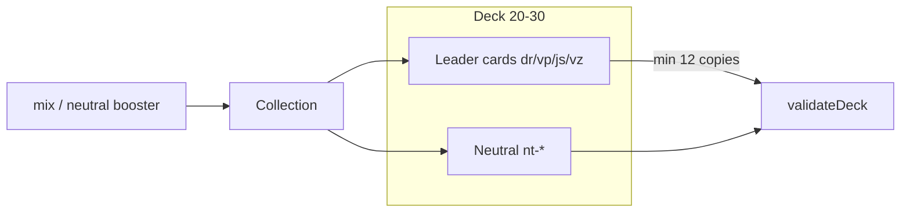

# WORLD ORDER — TZ v7.0: NEUTRAL CARDS
## Глобальные решения — универсальный пул нейтральных карт
> Стандарт: MTG colorless / Hearthstone Neutrals × политическая карикатура
> Движок: Next.js 15 + Three.js + существующий effect DSL (`lib/game/effects.ts`)
> Режим Cursor: Multi-Agent Parallel + двойной Critic Loop (BALANCE + VISUAL слепое A/B, порог **9.5+/10**)
>
> **Связь с другими TZ:**
> - Продуктовое [`tz_political_card_game.md`](./tz_political_card_game.md) §1.2 / §4.1 — «страна + нейтралы (Глобалисты)»
> - Deck rules / UI: [`world-order-deck-builder-tz-v4.md`](./world-order-deck-builder-tz-v4.md)
> - Shop / packs / craft: [`world-order-tcg-shop-tz-v6.md`](./world-order-tcg-shop-tz-v6.md)
> - Battle / ThreeJS: [`world-order-ui-gameplay-tz-v2.md`](./world-order-ui-gameplay-tz-v2.md)
>
> **Этот документ — executable spec.** Код пишется по нему; ростер §3 — источник истины.

---

## СОДЕРЖАНИЕ

- [ЧАСТЬ 0: Диагноз и целевое состояние](#часть-0-диагноз)
- [ЧАСТЬ 1: Мульти-агентная система v7](#часть-1-мульти-агентная-система)
- [ЧАСТЬ 2: Правила и TypeScript-контракты](#часть-2-контракты)
- [ЧАСТЬ 3: Полный ростер 24 нейтральных карт](#часть-3-ростер)
- [ЧАСТЬ 4: Баланс-матрица (MTG-дисциплина)](#часть-4-баланс)
- [ЧАСТЬ 5: Юмор, тон, legal](#часть-5-юмор)
- [ЧАСТЬ 6: Арт и ThreeJS](#часть-6-арт-threejs)
- [ЧАСТЬ 7: Инженерный гайд Cursor (пошагово)](#часть-7-гайд)
- [ЧАСТЬ 8: Cursor Prompts & Critic Loop](#часть-8-prompts)
- [ЧАСТЬ 9: Acceptance checklist](#часть-9-acceptance)

---

## ЧАСТЬ 0: ДИАГНОЗ

### 0.1 Что сейчас не так

| Проблема | Симптом | Приоритет |
|----------|---------|-----------|
| Нет нейтралов | 80 карт = 4×20, каждая карта привязана к одному лидеру | 🔴 КРИТИЧНО |
| Префикс-лок колоды | `validateDeck` отклоняет любой ID без `dr-`/`vp-`/`js-`/`vz-` | 🔴 КРИТИЧНО |
| Mix бесполезен для билдов | Mix-пак даёт чужие карты в коллекцию, но в колоду чужого лидера их не положить | 🟡 ВЫСОКИЙ |
| Нет «глобальных решений» | Продуктовое ТЗ обещает Глобалистов; в коде пула нет | 🟡 ВЫСОКИЙ |
| Крафт фракционный | `mixed_character` ломается, если появится owner `"neutral"` без правил | 🟡 ВЫСОКИЙ |
| Нет shared identity | Нет акцента/палитры/пак-тинта для нейтралов | 🟢 СРЕДНИЙ |

### 0.2 Целевое состояние

```
До:  4 герметичные колоды; «универсальные» политические решения не существуют
После: Пул «Глобальные решения» (24 карты, префикс nt-) —
       любой лидер может splash'ить нейтралы (мин. 12 карт своей фракции),
       mix/neutral-паки дропают nt-*, крафт нейтралов только из нейтрального dust,
       3D-превью и сатира на уровне фракционных карт, баланс чуть слабее
       лучших on-faction карт того же cost (плата за универсальность)
```

### 0.3 Зафиксированные решения (без развилок)

| Решение | Значение |
|---------|----------|
| Идентичность пула | **Не** 5-й играбельный лидер. Общий пул «Глобальные решения» / нейтралы |
| Owner ID | `"neutral"` (строка в `CARD_OWNER`, не `characterId` лидера) |
| Префикс ID | `nt-` |
| Размер сета | **24 карты**: 8 common / 8 rare / 5 epic / 3 legendary |
| Колода | Карты своего лидера **или** `nt-*`; **минимум 12** карт своего префикса; нейтралы без отдельного потолка (в рамках 20–30 и `MAX_COPIES`) |
| Крафт | Нейтралы крафтятся **только** из нейтрального dust (`owner === "neutral"`); смешение с фракцией → `mixed_character` |
| Шоп | Нейтралы входят в **mix**-паки + новый SKU `booster-neutral-standard`; стартер: **+1** копия каждой `nt-` common |
| Эффект-DSL | Только существующие теги из `lib/game/effects.ts` / `lib/game/cards.ts` — **без новых тегов в v7** |
| Визуальный акцент | Зелёно-серая «бюрократия планеты» (не blue/red/crimson/gold лидеров) |
| Power rule | Нейтрал **чуть слабее** лучшей фракционной карты того же cost |



---

## ЧАСТЬ 1: МУЛЬТИ-АГЕНТНАЯ СИСТЕМА

### 1.1 Структура агентов

Cursor запускает **6 рабочих агентов** + **2 жёстких критика**.  
Orchestrator **не** объявляет «готово», пока оба критика не выдали строку `APPROVED`.

```
┌────────────────────────────────────────────────────────────────────────────┐
│                         CURSOR ORCHESTRATOR v7                             │
├──────────┬──────────┬──────────┬──────────┬──────────┬─────────────────────┤
│ NT-DATA  │ NT-RULES │ NT-SHOP  │ NT-ART   │ NT-UX    │ NT-THREE            │
│ ростер   │ колода / │ catalog  │ prompts  │ deck     │ CardPreviewPortal   │
│ data.ts  │ craft    │ packRoll │ webp     │ builder  │ PackMesh tint       │
├──────────┴──────────┴──────────┴──────────┴──────────┴─────────────────────┤
│  BAL-CRITIC (слепое сравнение силы nt-* vs фракция по cost)                │
│  VISUAL-CRITIC (слепое A/B ThreeJS + humor A/B; эталон MTG/HS)             │
│  Порог: 9.5+/10 по КАЖДОМУ критерию. Без лимита циклов.                    │
└────────────────────────────────────────────────────────────────────────────┘
```

| Agent | Зона ответственности | Артефакты |
|-------|----------------------|-----------|
| **NT-DATA** | `lib/data.ts` — `NEUTRAL_CARDS`, `getNeutralCards()`, `CARD_INDEX`, `CARD_OWNER → "neutral"` | 24 tuples + flavorText |
| **NT-RULES** | `deckRules.ts`, `deckValidator.ts`, API decks, `craft.ts`, `deckTypes` error union | min-12 faction, allow `nt-` |
| **NT-SHOP** | `catalog.ts`, `packRoll.ts`, `starterKit.ts`, PackMesh artKey | SKU + pool |
| **NT-ART** | `locked-prompts.ts`, placeholders, `PROMPTS.LOCKED.md` | 24 card prompts + green/gray accent |
| **NT-UX** | Deck builder filter «Нейтралы», collection grid, empty states, copy caps | UI |
| **NT-THREE** | `CardPreviewPortal.tsx`, optional neutral pack tint в `PackMesh` | stills `/tmp/nwo-neutral-ab/` |
| **BAL-CRITIC** | Слепое сравнение `nt-*` vs фракционные аналоги того же cost | scorecard CSV |
| **VISUAL-CRITIC** | Слепой A/B ThreeJS + humor (имя+flavor за 2 сек) | APPROVED / REJECT |

### 1.2 Правило ультракода

1. Каждый агент работает **только** в своей зоне; пересечения через Orchestrator.
2. Любой REJECT критика → ответственный агент итерирует → новый A/B.
3. **Минимум 3 цикла** Critic Loop на BAL и на VISUAL, даже если первый проход ≥ 9.5.
4. Готово = обе строки:
   - `APPROVED — критик поражён качеством баланса нейтралов`
   - `APPROVED — критик поражён качеством юмора и ThreeJS-превью`

### 1.3 Critic Loop (слепое A/B)

1. Агент готовит **две** содержательно разные версии (не «другой hex»).
2. Артефакты: `/tmp/nwo-neutral-ab/{a,b}/`
   - `roster.csv` — id,cost,speed,rarity,effect,description,flavor
   - `01-preview-idle.png`, `02-preview-hover.png`, `03-legendary.png`
   - `04-pack-tint.png` (для NT-THREE / SHOP)
   - `balance-vs-faction.md` — пары cost↔cost
3. Critic получает **только пути**. Метки A/B рандомизируются каждый цикл. Не говорить, какой вариант новый.
4. Critic вслепую сравнивает пары одного cost (пример: `nt-import-sub` vs `dr-deal` vs `js-factory`).
5. Победитель = новая база; удачные детали проигравшего переносятся.
6. Победитель < 9.5 по любому критерию → оба отклонены, новая пара.
7. **Эталон:** минимум в одном из трёх обязательных VISUAL-циклов подмешать stills MTG colorless / HS Neutral. Critic обязан сказать, какой набор лучше. APPROVED финала требует, чтобы WO победил или tie с явной похвалой WO.
8. **Калибровка:** третьим без метки подложить заведомо слабый вариант (плоский текст без арта). Если критик не ставит его последним с отрывом — вердикт цикла аннулируется.

---

## ЧАСТЬ 2: КОНТРАКТЫ

### 2.1 Константы колоды

```typescript
// lib/game/deckRules.ts — ДОБАВИТЬ / РАСШИРИТЬ

export const NEUTRAL_PREFIX = "nt-";
export const NEUTRAL_OWNER_ID = "neutral";
export const MIN_FACTION_CARDS = 12;

export const CHARACTER_CARD_PREFIX: Record<string, string> = {
  "donald-rumpf": "dr-",
  "vladimir-pu": "vp-",
  "jin-shi": "js-",
  "vlado-zelenko": "vz-",
};

/** Карта легальна в колоде лидера, если своя фракция ИЛИ нейтрал */
export function isLegalCardForCharacter(cardId: string, characterId: string): boolean {
  if (cardId.startsWith(NEUTRAL_PREFIX)) return true;
  const prefix = CHARACTER_CARD_PREFIX[characterId];
  return Boolean(prefix && cardId.startsWith(prefix));
}

export function isNeutralCardId(cardId: string): boolean {
  return cardId.startsWith(NEUTRAL_PREFIX);
}

export function countFactionCards(
  cardIds: string[],
  characterId: string,
): number {
  const prefix = CHARACTER_CARD_PREFIX[characterId] ?? "";
  if (!prefix) return 0;
  return cardIds.filter((id) => id.startsWith(prefix)).length;
}
```

### 2.2 Типы ошибок валидации

```typescript
// lib/game/deckTypes.ts — расширить DeckError.type

export type DeckError = {
  type:
    | "too_few"
    | "too_many"
    | "wrong_character"
    | "copy_limit"
    | "too_few_faction"; // NEW: < MIN_FACTION_CARDS карт своего префикса
  message: string;
  cardId?: string;
};
```

### 2.3 Валидатор (клиент)

```typescript
// lib/game/deckValidator.ts — заменить блок wrong_character

import {
  DECK_RULES,
  MIN_FACTION_CARDS,
  copiesWord,
  getCharacterPrefix,
  isLegalCardForCharacter,
} from "@/lib/game/deckRules";

// внутри validateDeck, вместо «все должны начинаться с prefix»:
if (characterId) {
  const illegal = cards.filter(
    (e) => !isLegalCardForCharacter(e.card.id, characterId),
  );
  if (illegal.length > 0) {
    errors.push({
      type: "wrong_character",
      message: `${illegal.length} карт не принадлежат этому персонажу и не нейтральны`,
    });
  }

  const factionCount = cards.reduce((sum, e) => {
    const prefix = getCharacterPrefix(characterId);
    return sum + (prefix && e.card.id.startsWith(prefix) ? e.count : 0);
  }, 0);

  if (factionCount < MIN_FACTION_CARDS) {
    errors.push({
      type: "too_few_faction",
      message: `Карт своего лидера: ${factionCount} — нужно минимум ${MIN_FACTION_CARDS}`,
    });
  }
}
```

### 2.4 Серверный `validateCardIds`

Та же логика: разрешить `nt-*`, отклонить чужой фракционный префикс, проверить `countFactionCards(cardIds, characterId) >= 12`.

### 2.5 Data layer

```typescript
// lib/data.ts

const NEUTRAL_CARDS = cards([ /* §3 полный ростер */ ]);

// После цикла по CHARACTERS:
for (const card of NEUTRAL_CARDS) {
  CARD_INDEX.set(card.id, card);
  CARD_OWNER.set(card.id, "neutral");
}

export function getNeutralCards(): AbilityCard[] {
  return NEUTRAL_CARDS.map((c) => ({ ...c }));
}

export function getAllAbilityCards(): AbilityCard[] {
  return [
    ...CHARACTERS.flatMap((c) => c.abilityCards),
    ...NEUTRAL_CARDS,
  ];
}

// getCharacterIdForCard("nt-…") === "neutral"
// Экспорт: NEUTRAL_CARDS
```

**Важно:** `getDefaultDeck(characterId)` остаётся **только** фракционным (не автодобавлять нейтралы в дефолт). Нейтралы — осознанный splash.

### 2.6 Крафт

```typescript
// lib/shop/craft.ts
// owner "neutral" — отдельный пул:
// - consume и target должны иметь getCharacterIdForCard === "neutral"
// - нельзя крафтить nt-* из фракционного dust и наоборот
// ошибка mixed_character сохраняется
```

### 2.7 Шоп / паки

```typescript
// lib/shop/catalog.ts

export type BoosterSkuId =
  | "booster-rumpf-standard"
  | "booster-pu-standard"
  | "booster-shi-standard"
  | "booster-zelenko-standard"
  | "booster-mix-standard"
  | "booster-mix-premium"
  | "booster-neutral-standard"; // NEW

export type BoosterPool =
  | { type: "character"; characterId: string }
  | { type: "mix" }
  | { type: "neutral" }; // NEW — только NEUTRAL_CARDS

// SKU:
{
  id: "booster-neutral-standard",
  name: "Global Resolutions Pack",
  description: "4C + 2R + 1E/L from Neutral pool",
  priceCredits: 110,
  pool: { type: "neutral" },
  artKey: "pack-neutral",
  bonusChanceMultiplier: 1,
  legendaryWeightBonus: 0,
}
```

**packRoll:**
- `character` — без изменений (только abilityCards лидера).
- `mix` — `flatMap(all characters.abilityCards) **∪** NEUTRAL_CARDS`.
- `neutral` — только `getNeutralCards()`.

**starterKit:** после выдачи фракционных commons/rares — добавить `count: 1` для каждой `nt-*` common.

### 2.8 Collection / Deck Builder UX

- При выборе лидера коллекция показывает: **карты лидера + все нейтралы**, которыми владеет игрок.
- Фильтр: `Все | Атака | Защита | Поддержка | Нейтралы | Фракция`.
- Бейдж на карте: мелкий чип `Нейтрал` (зелёный), не перекрывающий арт.
- Счётчик в stats panel: `Фракция X / Нейтралы Y` + предупреждение если фракция < 12.

---

## ЧАСТЬ 3: РОСТЕР

### 3.1 Формат CardDef (как в `lib/data.ts`)

```typescript
type CardDef = [
  id: string,
  name: string,
  cost: number,
  speed: number,
  rarity: "common" | "rare" | "epic" | "legendary",
  type: "passive" | "active" | "ultimate",
  effect: string,
  description: string,
  flavorText?: string, // ОБЯЗАТЕЛЕН для всех nt-*
];
```

### 3.2 Источник истины — 24 карты

Вставить в `lib/data.ts` как `NEUTRAL_CARDS = cards([ ... ])`.

```typescript
const NEUTRAL_CARDS = cards([
  // ── COMMONS (8) ──────────────────────────────────────────────────────────
  [
    "nt-sovereign-net",
    "Суверенный интернет",
    1, 2, "common", "active",
    "propaganda:1",
    "Пропаганда на 1 ход: следующая карта врага с 50% шансом промахивается",
    "Пинг 9000 мс, зато свой. Зато никто чужой не узнает, что у вас нет интернета.",
  ],
  [
    "nt-state-messenger",
    "Государственный мессенджер",
    1, 2, "common", "active",
    "draw:1 distraction:1",
    "+1 карта в руку; -1 к скорости следующей карты противника",
    "Сообщения доходят. Иногда. К нужным людям — всегда. К вам — после модерации.",
  ],
  [
    "nt-import-sub",
    "Импортозамещение",
    0, 1, "common", "passive",
    "cost_reduce:1 duration:1",
    "Следующий ход: стоимость карт -1",
    "Заменили чип на свёклу. В презентации работает идеально.",
  ],
  [
    "nt-patriotic-ad",
    "Патриотический ролик",
    1, 2, "common", "active",
    "strength_up:3 duration:1",
    "+3 к силе на 1 ход",
    "После пятнадцатого повтора за день веришь уже во что угодно. Даже в слоган.",
  ],
  [
    "nt-emergency",
    "Чрезвычайные полномочия",
    0, 1, "common", "passive",
    "energy:1",
    "+1 энергии немедленно",
    "Временно. Уже четырнадцатый год. Продлим ещё на пять — для стабильности.",
  ],
  [
    "nt-loyalty",
    "Анкета лояльности",
    1, 3, "common", "active",
    "distraction:1",
    "-1 к скорости следующей карты противника",
    "Вопрос 47: любите ли вы Родину больше, чем Wi‑Fi? Правильный ответ подчеркнут.",
  ],
  [
    "nt-briefing",
    "Брифинг без вопросов",
    2, 1, "common", "active",
    "speed_down:1 duration:1",
    "Все карты противника в этом ходу теряют 1 к скорости",
    "Вопросы принимаются письменно. Ответы публикуются никогда.",
  ],
  [
    "nt-optimize",
    "Оптимизация бюджета",
    2, 1, "common", "active",
    "heal:10 sanction:1",
    "Восстанавливает 10 HP; противник не получает +1 энергии в след. ходу",
    "Срезали больницы, зато фуршет на форуме укрепился. Приоритеты расставлены.",
  ],

  // ── RARES (8) ────────────────────────────────────────────────────────────
  [
    "nt-parallel",
    "Параллельный импорт",
    2, 2, "rare", "active",
    "draw:2",
    "+2 карты в руку",
    "Официально не ввозили. Коробки просто сами появились на складе.",
  ],
  [
    "nt-foreign-agent",
    "Иностранный агент",
    3, 1, "rare", "active",
    "block_hand:1",
    "Блокирует одну случайную карту в руке противника",
    "Этикетка больше текста. Шрифт специально нечитаемый — для прозрачности.",
  ],
  [
    "nt-cbdc",
    "Цифровой суверенитет",
    3, 2, "rare", "active",
    "energy_steal:1",
    "Steal 1 энергии у противника",
    "Ваши деньги теперь удобнее. Особенно отслеживать. Особенно вам не говорить.",
  ],
  [
    "nt-youth-camp",
    "Патриотический лагерь",
    2, 1, "rare", "active",
    "armor_up:10 duration:1",
    "+10 к броне на 1 ход",
    "Утром — зарядка, днём — марш, вечером — эссе «Почему я люблю цензуру».",
  ],
  [
    "nt-exit-ban",
    "Запрет на выезд",
    3, 1, "rare", "active",
    "sanction:1 duration:1",
    "Противник не восстанавливает +1 энергии в следующем ходу",
    "Граница открыта. Для правильных людей. Вы пока не в списке правильных.",
  ],
  [
    "nt-truth-min",
    "Министерство правды",
    2, 3, "rare", "active",
    "clear_effects",
    "Отменяет один активный эффект у противника",
    "Факты обновлены до версии 3.0. Предыдущие версии признаны фейком.",
  ],
  [
    "nt-sanction-proof",
    "Санкционоустойчивость",
    3, 0, "rare", "active",
    "block:40",
    "Блокирует 40 ед. урона на этот ход",
    "Запас сала, PDF с инструкциями и гордость. Особенно гордость.",
  ],
  [
    "nt-nationalize",
    "Национализация",
    3, 2, "rare", "active",
    "steal_card",
    "Steal 1 случайную карту из руки противника",
    "Всё ваше теперь наше. Временно. Навсегда. Временно навсегда.",
  ],

  // ── EPICS (5) ────────────────────────────────────────────────────────────
  [
    "nt-martial",
    "Военное положение",
    4, 0, "epic", "active",
    "invulnerability duration:1",
    "Неуязвимость на 1 фазу",
    "Для вашей безопасности. Срок: до особого распоряжения. Особое распоряжение утеряно.",
  ],
  [
    "nt-referendum",
    "Референдум с предсказуемым итогом",
    4, 2, "epic", "active",
    "damage:35 propaganda:1",
    "35 ед. урона + пропаганда на 1 ход",
    "97,3% «за». Остальные 2,7% ещё заполняют бюллетень под присмотром.",
  ],
  [
    "nt-brain-tax",
    "Налог на утечку мозгов",
    4, 2, "epic", "active",
    "discard_hand:1 energy:2",
    "Сбрасывает 1 случайную карту врага; вы получаете +2 энергии",
    "Уехали? Заплатите. Остались? Тоже заплатите. Логика безупречна.",
  ],
  [
    "nt-panopticon",
    "Всевидящее око",
    4, 1, "epic", "active",
    "block_hand:1 distraction:1",
    "Блокирует 1 карту в руке врага; -1 к скорости его следующей карты",
    "Камера не следит. Камера заботится. Улыбнитесь для протокола.",
  ],
  [
    "nt-sov-ai",
    "Суверенный ИИ",
    3, 3, "epic", "active",
    "copy_last",
    "Копирует эффект последней карты противника",
    "Обучен только на одобренных мемах. Галлюцинирует исключительно патриотично.",
  ],

  // ── LEGENDARIES (3) ──────────────────────────────────────────────────────
  [
    "nt-mandate",
    "Вечный мандат народа",
    5, 1, "legendary", "ultimate",
    "heal:45 energy:2",
    "Восстанавливает 45 HP + +2 энергии немедленно",
    "Народ сказал «да» на всех участках одновременно. Удивительно дружный народ.",
  ],
  [
    "nt-multipolar",
    "Многополярный мир",
    5, 1, "legendary", "ultimate",
    "damage:55 sanction:1 duration:1",
    "55 ед. урона; противник не получает +1 энергии в след. ходу",
    "Полюсов много. Кнопка — одна. Не та, о которой вы подумали. Или та.",
  ],
  [
    "nt-history",
    "Новый учебник истории",
    5, 2, "legendary", "ultimate",
    "clear_effects damage:40",
    "Все активные эффекты врага отменяются + 40 ед. урона",
    "Вчерашние события отредактированы задним числом. Завтрашние — уже в печати.",
  ],
]);
```

### 3.3 Сводка сета

| Rarity | Count | IDs |
|--------|------:|-----|
| common | 8 | `nt-sovereign-net`, `nt-state-messenger`, `nt-import-sub`, `nt-patriotic-ad`, `nt-emergency`, `nt-loyalty`, `nt-briefing`, `nt-optimize` |
| rare | 8 | `nt-parallel`, `nt-foreign-agent`, `nt-cbdc`, `nt-youth-camp`, `nt-exit-ban`, `nt-truth-min`, `nt-sanction-proof`, `nt-nationalize` |
| epic | 5 | `nt-martial`, `nt-referendum`, `nt-brain-tax`, `nt-panopticon`, `nt-sov-ai` |
| legendary | 3 | `nt-mandate`, `nt-multipolar`, `nt-history` |
| **Total** | **24** | |

### 3.4 Кривая стоимости сета

| Cost | Cards | Role |
|-----:|-------|------|
| 0 | `nt-import-sub`, `nt-emergency` | glue / tempo |
| 1 | `nt-sovereign-net`, `nt-state-messenger`, `nt-patriotic-ad`, `nt-loyalty` | early interaction |
| 2 | `nt-briefing`, `nt-optimize`, `nt-parallel`, `nt-youth-camp`, `nt-truth-min` | mid glue |
| 3 | `nt-foreign-agent`, `nt-cbdc`, `nt-exit-ban`, `nt-sanction-proof`, `nt-nationalize`, `nt-sov-ai` | mid power |
| 4 | `nt-martial`, `nt-referendum`, `nt-brain-tax`, `nt-panopticon` | epic swing |
| 5 | `nt-mandate`, `nt-multipolar`, `nt-history` | legendary finishers |

Проверка §4: cost 0–2 ≥ 6 ✓ (11), cost 3–4 ≥ 6 ✓ (10), cost 5–6 ≥ 3 ✓ (3).

### 3.5 Категории (infer из effect tags)

| Category | Cards |
|----------|-------|
| attack | `nt-referendum`, `nt-multipolar`, `nt-history` (+ damage tags) |
| defense | `nt-optimize`, `nt-youth-camp`, `nt-sanction-proof`, `nt-martial`, `nt-mandate` |
| support | остальные (propaganda, draw, steal, sanction, copy, distraction, …) |

---

## ЧАСТЬ 4: БАЛАНС

### 4.1 Философия (MTG colorless tax)

Нейтрал доступен **всем** четырём лидерам → должен быть **чуть слабее** лучшей on-faction карты того же cost. Иначе все колоды схлопнутся в один «best neutrals» стек.

Аналогии:
- MTG: colorless часто требует больше маны / даёт меньше punch за ту же цену.
- Hearthstone: сильные нейтралы существуют, но class cards дают identity и edge.

### 4.2 Потолки по cost (нейтралы)

| Cost | Damage ceiling | Heal ceiling | Block ceiling | Card advantage | Запрещено нейтралам |
|-----:|---------------:|-------------:|--------------:|----------------|------|
| 0–1 | — | ≤10 | — | draw ≤1 / cost_reduce:1 / energy:1 | `ignore_defense`, multi-hit |
| 2 | — | ≤10 | — | draw:2 **или** clear_effects | `damage` ≥20 |
| 3 | — | — | ≤40 | steal_card / block_hand / energy_steal:1 | `armor_ignore` damage |
| 4 | ≤35 | — | invuln 1 фаза | discard:1 + energy:2 | `damage` ≥45, `ignore_defense` |
| 5 | ≤55 | ≤45 | — | clear + 40 dmg | `damage` ≥70, `ignore_defense`, dual nuke |

### 4.3 Слепое сравнение с фракциями (обязательная таблица BAL-CRITIC)

| Neutral | Cost | Faction comps (тот же cost / роль) | Вердикт цели |
|---------|-----:|-----------------------------------|--------------|
| `nt-import-sub` | 0 | `dr-deal` (cost_reduce:1), `vz-green` (heal:8) | ≈ `dr-deal`, без хила |
| `nt-emergency` | 0 | `vz-resilience` (условный energy:2) | Слабее: безусловный +1, не +2 |
| `nt-sovereign-net` | 1 | `vp-disinfo` (propaganda:1), `dr-tweet` (distraction:1) | Паритет support |
| `nt-state-messenger` | 1 | `vz-speech` (speed_up+draw), `js-road` (draw) | Чуть слабее `vz-speech` (нет speed_up себе) |
| `nt-optimize` | 2 | `dr-wall` (block:30), `vp-bunker` (block:35) | Другая ось: heal+sanction, не raw block |
| `nt-parallel` | 2 | `js-tech` (copy_last) | draw:2 ≈ ценность copy, без копирования борда |
| `nt-sanction-proof` | 3 | `vz-macro` (block:40) | Паритет block:40 |
| `nt-nationalize` | 3 | `vp-oligarch` (steal_card, cost 2) | **Дороже на 1** (tax за универсальность) |
| `nt-martial` | 4 | `dr-veto` (invuln, cost 3) | **Дороже на 1** |
| `nt-referendum` | 4 | `vp-bear` (damage:45), `dr-executive` (40 armor_ignore) | 35+propaganda < 45 raw / < armor_ignore |
| `nt-sov-ai` | 3 | `js-tech` (copy_last, cost 2) | **Дороже на 1** |
| `nt-mandate` | 5 | `vp-eternal` (heal:50 energy:2 armor_up), `dr-maga-phoenix` (heal:40 energy:3) | heal:45 energy:2 — между ними, без armor_up |
| `nt-multipolar` | 5 | `dr-twitter-ban` (50+skip), `js-dragon` (50) | 55+sanction без skip_ability / armor_ignore |
| `nt-history` | 5 | `js-century` (clear+40) | Паритет с on-faction clear+dmg |

### 4.4 Жёсткий запрет power creep

Нейтральный legendary **не должен** превосходить:
- `vp-sovereign` (`damage:90 ignore_defense`)
- `dr-nuclear` (`damage:80 armor_ignore ignore_defense`)
- `vz-trident` (`damage:70 ignore_defense heal:30`)

по комбинации raw damage + ignore-keywords. Текущий максимум нейтрала: **55** урона **без** `ignore_defense` / `armor_ignore`.

### 4.5 Лимиты копий (без изменений)

| Rarity | Max in deck |
|--------|------------:|
| common | 3 |
| rare | 2 |
| epic | 1 |
| legendary | 1 |

---

## ЧАСТЬ 5: ЮМОР, ТОН, LEGAL

### 5.1 Тон

- Политическая **карикатура** и бюрократический абсурд.
- Решения, которые «подходят» любому режиму: суверенный интернет, госмессенджер, импортозамещение, референдумы, учебники истории.
- Description = механика (сухой правила-текст).
- flavorText = шутка (обязателен на всех 24).

### 5.2 Legal / ban-list

| Разрешено | Запрещено |
|-----------|-----------|
| Пародийные институты, обобщения | Реальные ФИО действующих политиков |
| Гротеск, сарказм, абсурд | Hate speech, прямые призывы к насилию |
| Намёки на узнаваемые практики | Ломание 4-й стены («это же карточная игра») |
| Короткий flavor (1–2 предложения) | Emoji в `name`; «просто смешная кнопка» без механики |

### 5.3 Юмор-критерии VISUAL/HUMOR critic

1. Имя карты запоминается после одного прочтения.
2. Flavor усиливает название, а не повторяет description.
3. Шутка работает **для всех четырёх** лидеров (не «только про одну страну»).
4. Нет ощущения, что карта «украдена» у фракции с переименованием.
5. В слепом A/B критик выбирает вариант с более острым punchline, если механика равна.

---

## ЧАСТЬ 6: АРТ И THREEJS

### 6.1 Палитра нейтралов

| Token | Value | Usage |
|-------|-------|-------|
| Accent | `#2F6B4F` (глубокий бюрократический зелёный) | chip «Нейтрал», pack tint |
| Secondary | `#6B7280` (серый бланк) | рамки, штампы |
| Highlight | `#C4A35A` (печать / сургуч) | legendary light в preview |
| Avoid | blue / red / crimson / gold лидеров | не путать фракции |

### 6.2 Art pipeline

1. Добавить массив `NEUTRAL_CARD_PROMPTS` в [`lib/game/locked-prompts.ts`](../lib/game/locked-prompts.ts) (24 `card(...)` с id = `nt-*`).
2. Master style = editorial cartoon satire (как фракции); **без** читаемого текста на арте, **без** реальных likeness.
3. Выход: `public/placeholders/cards/nt-*.webp` (360×540, только панель арта).
4. Обновить [`public/placeholders/PROMPTS.LOCKED.md`](../public/placeholders/PROMPTS.LOCKED.md).
5. `getCardArtUrl(cardId)` уже резолвит по id — новых хелперов не нужно, если файлы на месте.

### 6.3 Пример visual core (для prompts)

| ID | Visual core (EN for generator) |
|----|--------------------------------|
| `nt-sovereign-net` | Cartoon globe in a glass jar with padlock, ethernet cables as prison bars |
| `nt-state-messenger` | Official chat bubble with rubber stamp «APPROVED», courier in gray suit |
| `nt-import-sub` | High-tech chip replaced by a beetroot with USB ports, proud banner |
| `nt-martial` | City square under giant rubber stamp «TEMPORARY», pigeons in helmets |
| `nt-history` | Textbook eating yesterday's newspaper, ink rewriting itself |

### 6.4 ThreeJS preview (NT-THREE)

Файл: [`components/deck-builder/CardPreviewPortal.tsx`](../components/deck-builder/CardPreviewPortal.tsx)

- Plane с артом + rarity point light (legendary → сургучный `#C4A35A`).
- Лёгкий Y-rotation `sin(t*0.7)*0.25` (как в deck-builder TZ v4).
- Нейтральный chip не рендерить в 3D-plane (только DOM overlay), чтобы не ломать locked art.

### 6.5 PackMesh

- `artKey: "pack-neutral"` → tint зелёный `#2F6B4F`.
- В [`components/shop/opening/three/PackMesh.tsx`](../components/shop/opening/three/PackMesh.tsx) добавить ветку tint для neutral.

### 6.6 VISUAL-CRITIC критерии (1–10, порог 9.5+)

1. **Readability** — арт читается в CardPreviewPortal на 1440p.
2. **Rarity hierarchy** — C < R < E < L без подсказок.
3. **Faction distinction** — нейтральный зелёный не путается с 4 лидерами.
4. **Idle presence** — вращение/свет живые, не «png на чёрном».
5. **Hover/focus** — реакция понятна.
6. **Legendary beat** — `nt-mandate` / `nt-multipolar` / `nt-history` ощущаются heavy.
7. **Pack tint** — Global Resolutions Pack узнаваем за 1 сек.
8. **Humor glance** — имя+flavor схватываются за ≤2 сек на still с UI.
9. **Performance** — preview ≥60fps mid GPU.
10. **Blind preference** — в слепом тесте выбираешь WO, а не эталон MTG/HS; иначе REJECT.

---

## ЧАСТЬ 7: ИНЖЕНЕРНЫЙ ГАЙД CURSOR

Выполнять **строго по порядку**. Каждый шаг — отдельный коммит/checkpoint агента.

### Шаг 1 — NT-DATA: ростер

**Файлы:** `lib/data.ts`

1. Вставить `NEUTRAL_CARDS` из §3.2.
2. Зарегистрировать в `CARD_INDEX` и `CARD_OWNER` (`"neutral"`).
3. Экспорт: `getNeutralCards`, `getAllAbilityCards`, `NEUTRAL_CARDS`.
4. Не менять `CHARACTERS[].abilityCards` и `getDefaultDeck`.

**Проверка:** `getCardById("nt-mandate")` и `getCharacterIdForCard("nt-mandate") === "neutral"`.

### Шаг 2 — NT-RULES: колода

**Файлы:**
- `lib/game/deckRules.ts`
- `lib/game/deckTypes.ts`
- `lib/game/deckValidator.ts`
- `app/api/decks/route.ts`, `app/api/decks/[id]/route.ts` (если дублируют prefix-check)

1. Добавить `NEUTRAL_PREFIX`, `MIN_FACTION_CARDS`, `isLegalCardForCharacter`.
2. Расширить `DeckError.type` → `too_few_faction`.
3. Обновить `validateDeck` и `validateCardIds`.

**Проверка:**
- Колода 20 карт Рампфа + любые `nt-*` при ≥12 `dr-*` → valid.
- 11 `dr-*` + 9 `nt-*` → error `too_few_faction`.
- `vp-*` в колоде Рампфа → `wrong_character`.

### Шаг 3 — NT-RULES: collection helpers

**Файлы:** `lib/game/deckHelpers.ts`, компоненты `components/deck-builder/*`

1. Фильтр коллекции: карты лидера ∪ нейтралы (owned).
2. Не показывать чужие фракционные карты.
3. Stats: счётчик фракция/нейтралы.

### Шаг 4 — NT-SHOP: craft

**Файл:** `lib/shop/craft.ts`

1. `owner === "neutral"` допускается как единый characterId пула.
2. Target `nt-*` только из consume `nt-*`.
3. Сохранить `mixed_character` при смешении.

### Шаг 5 — NT-SHOP: catalog + roll + starter

**Файлы:**
- `lib/shop/catalog.ts`
- `lib/shop/packRoll.ts`
- `lib/shop/starterKit.ts`
- `app/api/shop/catalog/route.ts` (если фильтрует SKU вручную)

1. SKU `booster-neutral-standard`.
2. Mix pool ∪ neutrals.
3. Starter: +1 каждой common `nt-*`.

**Проверка:** `scripts/check-pack-roll.ts` (или аналог) — neutral SKU никогда не роллит `dr-*`.

### Шаг 6 — NT-ART

**Файлы:** `lib/game/locked-prompts.ts`, placeholders, `PROMPTS.LOCKED.md`

1. 24 prompt'а.
2. Генерация / плейсхолдеры `public/placeholders/cards/nt-*.webp`.
3. Fallback rarity уже общий — ок.

### Шаг 7 — NT-UX

**Файлы:** deck-builder constants/filters, `ability-card-view` / collection card chrome

1. Фильтр «Нейтралы».
2. Chip «Нейтрал».
3. Сообщения валидации на русском (как существующие).

### Шаг 8 — NT-THREE

**Файлы:** `CardPreviewPortal.tsx`, `PackMesh.tsx`, design tokens если нужно

1. Preview legendary light сургучный для `nt-*` legendary (или через rarity — достаточно rarity).
2. Pack tint для `pack-neutral`.

### Шаг 9 — Опционально FX

**Файлы:** `lib/animations/cardConfigs.ts`, `cardDisplayNames.ts`

- Epic/legendary: лёгкий callout (не обязателен для merge, но желателен для `nt-mandate`, `nt-multipolar`, `nt-history`).

### Шаг 10 — Smoke

1. `validateDeck` × 4 лидера с splash нейтралов.
2. Craft: 4× common nt → rare nt; mixed faction+nt → fail.
3. Open neutral pack + mix pack.
4. 5 матчей (vs AI) с `nt-*` в руке — без crash, эффекты применяются.
5. Оба Critic Loop (§8) → APPROVED.

---

## ЧАСТЬ 8: CURSOR PROMPTS & CRITIC LOOP

### 8.1 Промпт Orchestrator

```
Ты — Orchestrator WORLD ORDER TZ v7 Neutral Cards.
Запусти параллельно NT-DATA, NT-RULES, NT-SHOP, NT-ART, NT-UX, NT-THREE.
Каждый агент работает ТОЛЬКО в своей зоне из info/world-order-neutral-cards-tz-v7.md.
После каждого крупного шага запускай BAL-CRITIC и/или VISUAL-CRITIC.
Не объявляй done без двух строк APPROVED от критиков.
Минимум 3 слепых A/B цикла на баланс и на визуал.
Ростер §3.2 — источник истины; не добавляй 25-ю карту и не меняй id.
```

### 8.2 Промпт NT-DATA

```
Реализуй NEUTRAL_CARDS ровно по §3.2 TZ v7 в lib/data.ts.
flavorText обязателен. Не добавляй новые effect-теги.
Зарегистрируй CARD_INDEX + CARD_OWNER="neutral".
Экспортируй getNeutralCards / getAllAbilityCards.
Не трогай abilityCards четырёх лидеров.
```

### 8.3 Промпт NT-RULES

```
Внедри NEUTRAL_PREFIX, MIN_FACTION_CARDS=12, isLegalCardForCharacter.
validateDeck + validateCardIds: nt-* легальны; чужая фракция — нет;
too_few_faction если фракционных копий < 12.
Обнови deckHelpers/collection filters.
Напиши 3 unit-сценария: valid splash, too_few_faction, wrong_character.
```

### 8.4 Промпт NT-SHOP

```
Добавь booster-neutral-standard (pool type neutral).
Mix = all leaders ∪ neutrals.
Starter +1 каждой nt common.
Craft: neutral-only dust. mixed_character при смешении с фракцией.
PackMesh tint pack-neutral (#2F6B4F).
```

### 8.5 Промпт NT-ART

```
24 locked prompts для nt-* в стиле editorial cartoon satire.
Акцент зелёно-серый. Без readable text на арте. Без real likeness.
Сгенерируй placeholders/cards/nt-*.webp и обнови PROMPTS.LOCKED.md.
```

### 8.6 Промпт NT-UX

```
Deck builder: фильтр Нейтралы, chip, счётчик фракция/нейтралы,
русское сообщение too_few_faction. Не ломай существующие 3 панели TZ v4.
```

### 8.7 Промпт NT-THREE

```
CardPreviewPortal: stills idle/hover/legendary для nt-mandate, nt-parallel, nt-import-sub.
PackMesh: green tint. Артефакты в /tmp/nwo-neutral-ab/{a,b}/.
Две разные lighting/composition версии для A/B.
```

### 8.8 Системный промпт BAL-CRITIC

```
Ты — жёсткий balance director TCG (эталон: MTG Arena + Hearthstone).
Единственная задача — баланс нейтралов WORLD ORDER.

КРИТЕРИИ (1-10, принимать только 9.5+):
  1. COLORLESS TAX — nt чуть слабее лучшей on-faction карты того же cost.
  2. NO POWER CREEP — legendary nt не бьёт vp-sovereign / dr-nuclear по dmg+keywords.
  3. CURVE — сет имеет ≥6 cost0-2, ≥6 cost3-4, ≥3 cost5-6.
  4. ROLE SPREAD — attack/defense/support не схлопнуты в один архетип.
  5. STEAL/COPY TAX — steal_card и copy_last на нейтралах не дешевле фракционных аналогов.
  6. HEAL/BLOCK CAPS — соблюдены потолки §4.2.
  7. BLIND PAIRING — вслепую сравнивая пары §4.3, nt не выглядит strictly better.
  8. SPLASH HEALTH — колода 12 faction + 8-18 nt не ломает identity лидера полностью.
  9. RARITY BANDING — common не сильнее rare того же cost без причины.
  10. CRITIC SHOCK — ты буквально готов сказать «этот пул можно шипить».

Если ЛЮБОЙ < 9.5 → REJECT с конкретной парой карт и числами.
Пиши победителя A/B вслепую. Не проси «чуть подкрутить» — дай точный effect/cost патч.
APPROVED только с фразой:
"APPROVED — критик поражён качеством баланса нейтралов"
```

### 8.9 Системный промпт VISUAL-CRITIC

```
Ты — жёсткий арт-директор AAA + humor editor политической сатиры.
Эталон: MTG card showcase + HS neutral reveal + карикатура editorial cartoon.

КРИТЕРИИ (1-10, 9.5+): см. §6.6 (Readability … Blind preference).

ДОПОЛНИТЕЛЬНО ПО ЮМОРУ:
  H1. Имя запоминается с первого раза.
  H2. Flavor ≠ пересказ description.
  H3. Шутка универсальна для USA/RU/CN/UA лидеров.
  H4. В слепом A/B двух flavor ты выбираешь более острый и объясняешь почему.

Получаешь только пути к stills/CSV. Метки A/B рандомизированы.
Минимум 3 цикла. Подмешай эталон MTG/HS хотя бы в одном.
Калибровочный слабый образец должен быть последним — иначе цикл void.

REJECT → конкретный кадр + что слабее.
APPROVED только с фразой:
"APPROVED — критик поражён качеством юмора и ThreeJS-превью"
```

### 8.10 Финальный Critic Loop checklist

```
□ BAL cycle 1 — A/B roster numbers
□ BAL cycle 2 — A/B after patch
□ BAL cycle 3 — blind vs faction comps §4.3 + calibration junk
□ VIS cycle 1 — preview lighting A/B
□ VIS cycle 2 — pack tint + legendary beat
□ VIS cycle 3 — blind vs MTG/HS stills + humor A/B
□ Обе строки APPROVED записаны в PR/отчёт агента
```

---

## ЧАСТЬ 9: ACCEPTANCE

### 9.1 Функциональный чеклист

- [ ] В индексе ровно **24** карты с префиксом `nt-`
- [ ] `getCharacterIdForCard("nt-*") === "neutral"`
- [ ] Каждый из 4 лидеров может положить `nt-*` в колоду
- [ ] Колода с **11** фракционными + нейтралы → `too_few_faction`
- [ ] Колода с **12+** фракционными + нейтралы (сумма 20–30) → valid (при прочих правилах)
- [ ] Чужой фракционный префикс → `wrong_character`
- [ ] Craft: neutral→neutral ok; faction+neutral → `mixed_character`
- [ ] `booster-neutral-standard` в каталоге; ролл только из `nt-*`
- [ ] Mix-пак может выдать `nt-*`
- [ ] Starter выдаёт 8× `nt-` common (count 1)
- [ ] Арты `public/placeholders/cards/nt-*.webp` существуют (или rarity fallback не ломает UI)
- [ ] 5 AI-матчей с нейтралами в руке без crash; эффекты применяются
- [ ] BAL-CRITIC: `APPROVED — критик поражён качеством баланса нейтралов`
- [ ] VISUAL-CRITIC: `APPROVED — критик поражён качеством юмора и ThreeJS-превью`

### 9.2 File map (ожидаемые касания)

| File | Change |
|------|--------|
| `lib/data.ts` | `NEUTRAL_CARDS` + index/owner + getters |
| `lib/game/deckRules.ts` | prefix helpers, `MIN_FACTION_CARDS` |
| `lib/game/deckTypes.ts` | `too_few_faction` |
| `lib/game/deckValidator.ts` | legal nt + faction floor |
| `lib/game/deckHelpers.ts` | collection filter |
| `lib/shop/craft.ts` | neutral pool |
| `lib/shop/catalog.ts` | neutral SKU + pool type |
| `lib/shop/packRoll.ts` | neutral / mix∪nt |
| `lib/shop/starterKit.ts` | nt commons |
| `lib/game/locked-prompts.ts` | 24 prompts |
| `public/placeholders/cards/nt-*.webp` | art |
| `public/placeholders/PROMPTS.LOCKED.md` | catalog |
| `components/deck-builder/*` | filter, chip, stats |
| `components/deck-builder/CardPreviewPortal.tsx` | preview polish |
| `components/shop/opening/three/PackMesh.tsx` | green tint |
| `lib/animations/cardConfigs.ts` | optional L/E FX |
| `lib/design/tokens.ts` | optional neutral accent |

### 9.3 Out of scope (v7)

- Новый играбельный лидер «Глобалист»
- Новые effect-теги
- Реальные платежи / новый currency
- Баланс-нерф существующих 80 фракционных карт (кроме сравнения как эталона)
- Автодобавление нейтралов в `getDefaultDeck`

---

*Принимать реализацию только после финального Critic Loop (§8.10) с обеими строками APPROVED.*
*Ростер §3.2 — закон. Любое отклонение чисел/id — только через REJECT→патч от BAL-CRITIC с записью в отчёт.*
`)