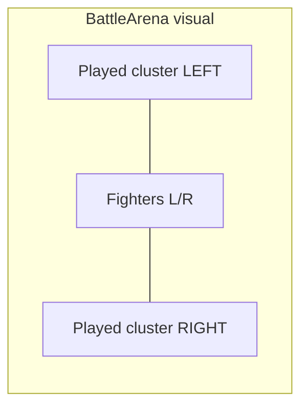

# WORLD ORDER — TZ v8.0: UI POLISH
## Коллекция · Deck Builder · Выбор персонажа · Магазин · Рука · Стек сыгранных
> Стандарт: MTG Arena / Hearthstone readability × Three.js card preview
> Движок: Next.js 15 + Three.js (R3F) + Framer Motion
> Режим Cursor: Multi-Agent Parallel + VISUAL Critic Loop (слепое A/B, порог **9.5+/10**)
>
> **Этот документ заменяет любой черновик / случайно отправленный промпт v8.**  
> Источник истины — **итоговый промпт ниже (§0.0)** + контракты в этом файле.
>
> **Связь с другими TZ:**
> - Deck builder: [`world-order-deck-builder-tz-v4.md`](./world-order-deck-builder-tz-v4.md)
> - Shop / daily / opening: [`world-order-tcg-shop-tz-v6.md`](./world-order-tcg-shop-tz-v6.md)
> - Battle UI / ThreeJS: [`world-order-ui-gameplay-tz-v2.md`](./world-order-ui-gameplay-tz-v2.md)
> - Neutrals: [`world-order-neutral-cards-tz-v7.md`](./world-order-neutral-cards-tz-v7.md)

---

## СОДЕРЖАНИЕ

- [ЧАСТЬ 0: Итоговый промпт и диагноз](#часть-0-итоговый-промпт-и-диагноз)
- [ЧАСТЬ 1: Мульти-агентная система v8](#часть-1-мульти-агентная-система)
- [ЧАСТЬ 2: Семь фич — контракты и DoD](#часть-2-семь-фич)
- [ЧАСТЬ 3: Инженерный гайд Cursor](#часть-3-гайд)
- [ЧАСТЬ 4: Cursor Prompts & Critic Loop](#часть-4-prompts)
- [ЧАСТЬ 5: Acceptance checklist](#часть-5-acceptance)

---

## ЧАСТЬ 0: ИТОГОВЫЙ ПРОМПТ И ДИАГНОЗ

### 0.0 Итоговый промпт (зафиксировано)

Гайд для Cursor по обновлению UI:

1. **В коллекции и в deck-builder** должно быть видно, сколько карт есть у игрока. Сейчас UI показывает, сколько игрок *может* положить в колоду; если у игрока только 1 копия при лимите 3, всё равно рисуются 3 кружка. Необходимо **визуально разделять** «владею» и «лимит колоды / в колоде».
2. **В deck-builder** при наведении показывается анимированное превью, но арт в **горизонтальном** формате, хотя карты портретные; вокруг много пустоты. Карта должна занимать почти всё место превью. **Скорость** — в правом верхнем углу (симметрично стоимости слева сверху).
3. **При выборе персонажа** миниатюры обрезают портреты. Заменить миниатюры на **флаги стран**.
4. **Подсвечивать Daily-бонус** в магазине, если он доступен.
5. **При покупке бустера и открытии карт** — увеличенное превью при hover.
6. **У карт в руке** (бой) в правом верхнем углу показывать **скорость** (сейчас только на укрупнённом превью). Укрупнённое превью — **книжное** соотношение сторон (как миниатюра), не альбомное.
7. **Стек сыгранных карт** отразить зеркально: сейчас карта игрока справа, соперника слева, хотя персонажи расположены наоборот. Выровнять стек со сторонами бойцов.

Мульти-агенты + жёсткий VISUAL-CRITIC + слепое A/B в режиме ThreeJS; цикл до `APPROVED — критик поражён` на каждом бите.

### 0.1 Диагноз (как сейчас в коде)

| # | Проблема | Симптом в коде | Приоритет |
|---|----------|----------------|-----------|
| 1 | CopyDots = лимит редкости, не ownership | [`CollectionGrid.tsx`](../components/deck-builder/CollectionGrid.tsx): `max={maxCopies}` из `DECK_RULES`; filled = `countInDeck`. Owned только как текст `×N` | 🔴 |
| 2 | Three.js plane landscape | [`CardPreviewPortal.tsx`](../components/deck-builder/CardPreviewPortal.tsx): `planeGeometry args={[2.4, 1.6]}`; art slot ~200px; speed текстом внизу | 🔴 |
| 3 | Thumbs = обрезанный портрет | [`character-select.tsx`](../components/game/character-select.tsx), [`character-carousel.tsx`](../components/lobby/character-carousel.tsx): `h-14 w-14` + `getCharacterPortraitUrl` | 🔴 |
| 4 | Daily без состояния | [`ShopHeader.tsx`](../components/shop/ShopHeader.tsx): статичная кнопка; store не знает `dailyAvailable` | 🟡 |
| 5 | Opening без hover | [`OpeningCardFan.tsx`](../components/shop/opening/OpeningCardFan.tsx): `pointerEvents: "none"` на корне | 🟡 |
| 6 | Hand без speed; popover wide | [`ability-card-view.tsx`](../components/game/ability-card-view.tsx) `HandCard` — только cost; [`card-preview-popover.tsx`](../components/game/card-preview-popover.tsx) art `h-[200px]` wide | 🔴 |
| 7 | Played stack не зеркалит стороны | [`played-cards-zone.tsx`](../components/game/played-cards-zone.tsx): один centered flex; арена: player left / opp right (`battle-arena.tsx`) | 🔴 |

### 0.2 Целевое состояние

```
До:  Кружки = max rarity; превью landscape; thumbs режут лица;
     Daily без пульса; opening без hover; hand без speed;
     стек сыгранных не совпадает со сторонами бойцов
После: Owned vs deck-slots разделены; портретное ThreeJS-превью на весь слот;
       флаги в селекте; Daily claimable glow; opening hover portrait preview;
       speed gem на hand; popover 2:3; стек: мои карты на моей стороне
```

---

## ЧАСТЬ 1: МУЛЬТИ-АГЕНТНАЯ СИСТЕМА

### 1.1 Агенты (один бит = один агент)

```
┌────────────────────────────────────────────────────────────────────────────┐
│                         CURSOR ORCHESTRATOR v8                             │
├────────┬────────┬────────┬────────┬────────┬────────┬──────────────────────┤
│ UI-1   │ UI-2   │ UI-3   │ UI-4   │ UI-5   │ UI-6   │ UI-7                 │
│ Owned  │ Preview│ Flags  │ Daily  │ Open   │ Hand   │ Played stack mirror  │
│ dots   │ 3D 2:3 │ select │ claim  │ hover  │ speed  │                      │
├────────┴────────┴────────┴────────┴────────┴────────┴──────────────────────┤
│  VISUAL-CRITIC (жёсткий) — слепое A/B per-bit, ThreeJS stills где уместно  │
│  Порог 9.5+/10. Минимум 3 цикла на бит. Без лимита REJECT.                 │
└────────────────────────────────────────────────────────────────────────────┘
```

| Agent | Зона | Ключевые файлы |
|-------|------|----------------|
| **UI-1** | Owned vs deck indicators | `CollectionGrid.tsx`, optionally collection shop views |
| **UI-2** | Deck-builder 3D preview | `CardPreviewPortal.tsx` |
| **UI-3** | Character select flags | `character-select.tsx`, `character-carousel.tsx`, `lib/game/art.ts`, `public/placeholders/flags/*` |
| **UI-4** | Daily highlight | `ShopHeader.tsx`, `shopStore.ts`, `api/shop/catalog` (+ optional daily status) |
| **UI-5** | Opening hover preview | `OpeningCardFan.tsx`, `BoosterOpeningOverlay.tsx`, reuse popover/portal |
| **UI-6** | Hand speed + portrait popover | `ability-card-view.tsx` HandCard, `card-preview-popover.tsx` |
| **UI-7** | Played stack mirror | `played-cards-zone.tsx`, `battle-arena.tsx` |
| **VISUAL-CRITIC** | Слепое A/B | `/tmp/nwo-ui-v8-ab/{bit}/{a,b}/` |

### 1.2 Правило ультракода

1. Агенты **не** правят чужие биты без Orchestrator.
2. Каждый бит: 2 содержательно разные реализации → слепой A/B → победитель база.
3. Минимум **3** VISUAL-цикла на бит, даже при первом 9.5+.
4. Orchestrator не закрывает v8, пока все 7 битов не имеют строки  
   `APPROVED — критик поражён качеством UI бита N`.

### 1.3 Слепое A/B (ThreeJS mode)

1. Артефакты: PNG/WebM stills (idle / hover / selected / claimed).
2. Critic получает **только пути**; метки A/B рандомизируются.
3. Для UI-2 и UI-6 обязателен ThreeJS/DOM preview still с замером aspect (должен ≈ 2:3).
4. Калибровка: третий «слабый» образец (старый UI) — должен быть последним.
5. Эталон: MTG Arena collection dots / HS hand gem / shop claim pulse — минимум 1 цикл на релевантный бит.

---

## ЧАСТЬ 2: СЕМЬ ФИЧ — КОНТРАКТЫ И DoD

### 2.1 UI-1 — Owned vs deck-slot indicators

**Файлы:** [`components/deck-builder/CollectionGrid.tsx`](../components/deck-builder/CollectionGrid.tsx), [`lib/game/deckHelpers.ts`](../components/deck-builder/../game/deckHelpers.ts)

**Контракт визуала:**

```
Слот индикаторов (под картой или на chrome):
  N = DECK_RULES.MAX_COPIES[rarity]     // сколько можно в колоду (правило)
  O = ownedCount                        // сколько есть у игрока
  D = countInDeck                       // сколько уже в колоде

Рисуем ровно N кружков:
  i < D              → FILLED (в колоде) — цвет rarity / gold
  D ≤ i < O          → OWNED_EMPTY (есть, но не в колоде) — полупрозрачный fill или кольцо accent
  O ≤ i < N          → LOCKED / UNOWNED — dim outline only, opacity ≤ 0.25

Пример: common max 3, owned 1, in deck 0 → ●○○ где только 1-й OWNED_EMPTY, 2–3 UNOWNED
Пример: owned 1, in deck 1 → ●○○ первый FILLED, остальные UNOWNED
```

**Запрещено:** показывать 3 «пустых активных» слота так, будто owned=3.

**Текст:** сохранить `×{ownedCount}` **или** заменить легендой; не дублировать шум. Рекомендация: короткий tooltip «В колоде D / Есть O / Лимит N».

**DoD:** скриншот owned=1 / max=3 однозначно читается за ≤1 сек без подсказки.

---

### 2.2 UI-2 — Deck-builder CardPreviewPortal (portrait fill + speed gem)

**Файл:** [`components/deck-builder/CardPreviewPortal.tsx`](../components/deck-builder/CardPreviewPortal.tsx)

**Контракт:**

| Элемент | Было | Стало |
|---------|------|-------|
| Three plane | `[2.4, 1.6]` (3:2 landscape) | **`[1.6, 2.4]`** или эквивалент **2:3** (portrait) |
| Art slot | ~200px с полями | ≥ **85%** площади превью-карточки; object-fit cover, без letterbox «пустоты» |
| Cost | — | **Левый верх** (gem / badge), как на hand/collection |
| Speed | Текст «Скорость: N» | **Правый верх**, зеркально cost (иконка Zap/Gauge + число) |
| Chrome | допустим | Имя / rarity / description ниже арта; арт доминирует |

Camera Three.js: подогнать `position.z` / FOV так, чтобы plane заполнял canvas без чёрных полей по бокам.

**DoD:** still preview aspect ≈ 2:3 (±5%); speed читается в TR без открытия текста.

---

### 2.3 UI-3 — Флаги вместо обрезанных портретов в миниатюрах

**Файлы:**
- [`components/game/character-select.tsx`](../components/game/character-select.tsx) — ряд миниатюр `h-14 w-14`
- [`components/lobby/character-carousel.tsx`](../components/lobby/character-carousel.tsx) — то же
- [`lib/game/art.ts`](../lib/game/art.ts) — добавить `getCountryFlagUrl(countryCode | characterId)`
- Ассеты: `public/placeholders/flags/{us,ru,cn,ua}.webp` (или SVG)

**Контракт:**

1. **Большой** hero-портрет (центр выбора) — **остаётся** портретом персонажа (не трогать).
2. **Только миниатюры** в ряду выбора → **флаг страны**:
   - `donald-rumpf` / `us` → USA stylized
   - `vladimir-pu` / `ru` → Russia stylized
   - `jin-shi` / `cn` → China stylized
   - `vlado-zelenko` / `ua` → Ukraine stylized
3. Флаг **не обрезает** ключевые полосы; `object-fit: cover` на квадрате с правильным aspect флага **или** rounded rect 3:2 внутри thumb.
4. Legal: **стилизованная / пародийная** графика (как в Style Bible), не фото реального флага с гербом, если это риск; достаточно узнаваемых цветов/паттернов.

**DoD:** на скрине селекта миниатюры = флаги; лица не режутся; selected ring сохранён.

---

### 2.4 UI-4 — Daily bonus highlight когда доступен

**Файлы:**
- [`components/shop/ShopHeader.tsx`](../components/shop/ShopHeader.tsx)
- [`lib/stores/shopStore.ts`](../lib/stores/shopStore.ts)
- [`app/api/shop/catalog/route.ts`](../app/api/shop/catalog/route.ts) — отдать `dailyAvailable: boolean`
- Опционально: отдельный `GET /api/shop/daily-status` — **не нужен**, если catalog уже грузится при входе в shop

**Контракт:**

```typescript
// catalog response (+):
dailyAvailable: boolean  // true если lastDailyGrantAt !== today (UTC или server day key)

// shopStore:
dailyAvailable: boolean
// loadCatalog sets it; claimDaily() on success → dailyAvailable=false
```

**Визуал когда `dailyAvailable === true`:**
- Пульсирующий gold glow / soft ring animation
- Badge «+50» или «Забрать» (число = `ECONOMY.DAILY_GRANT_CREDITS`)
- CTA заметнее WalletHud

**Когда `false`:**
- Dimmed / «Получено»; без pulse; клик по-прежнему показывает toast «Уже получено»

**DoD:** claimable и claimed состояния различаются без клика за ≤1 сек.

---

### 2.5 UI-5 — Hover preview при открытии бустера

**Файлы:**
- [`components/shop/opening/OpeningCardFan.tsx`](../components/shop/opening/OpeningCardFan.tsx)
- При необходимости overlay в [`BoosterOpeningOverlay.tsx`](../components/shop/opening/BoosterOpeningOverlay.tsx)

**Контракт:**

1. На **уже раскрытых** картах (`revealIndex` / phase reveal+) включить `pointerEvents: auto` на карточках (корень fan может оставаться none для drag-through — но сами карты кликабельны/hoverable).
2. Hover → увеличенное **портретное** превью (reuse `CardPreviewPopover` или облегчённый portal 2:3), delay ≤ 200ms.
3. Не ломать skip / tear / legendary interrupt timeline.
4. Prefers-reduced-motion: статичный enlarge без 3D ok.

**DoD:** на still opening-reveal hover виден крупный portrait preview; клик/skip не регрессируют.

---

### 2.6 UI-6 — Speed на hand + portrait enlarged preview

**Файлы:**
- [`components/game/ability-card-view.tsx`](../components/game/ability-card-view.tsx) — `HandCard`
- [`components/game/card-preview-popover.tsx`](../components/game/card-preview-popover.tsx)

**Контракт HandCard:**

| Угол | Элемент |
|------|---------|
| Top-left | Cost gem (как сейчас) |
| Top-right | **Speed gem** (`card.speed`) — заменить или сместить type-emoji; type можно оставить мелкой меткой иначе |
| Aspect | сохранить книжный ~2:3 (140×218 / 160×248) |

**Контракт CardPreviewPopover:**

- Outer frame **2:3** (напр. width 240–280, height = width × 1.5).
- Art panel заполняет верх ≥70% высоты; **не** wide `h-[200px]` crop.
- Cost TL, Speed TR — те же gem-паттерны, что hand.
- Description / flavor ниже.

**DoD:** в руке speed виден без hover; popover книжный, визуально «та же карта крупнее».

---

### 2.7 UI-7 — Зеркало стека сыгранных карт

**Файлы:**
- [`components/game/played-cards-zone.tsx`](../components/game/played-cards-zone.tsx)
- [`components/game/battle-arena.tsx`](../components/game/battle-arena.tsx)

**Эталон сторон** (уже в арене):

```typescript
// battle-arena.tsx
opponentSide = myPlayerNum === 1 ? "right" : "left"
playerSide   = myPlayerNum === 1 ? "left"  : "right"
```

**Контракт:**

1. `PlayedCardsZone` принимает `myPlayerNum: 1 | 2`.
2. Две колонки / два кластера:
   - **Визуально слева** = карты бойца на левой стороне
   - **Визуально справа** = карты бойца на правой стороне
3. Карты с `played.playerNum === myPlayerNum` → кластер на `playerSide`.
4. Карты оппонента → кластер на `opponentSide`.
5. Внутри кластера — порядок розыгрыша (старые → новые или наоборот — зафиксировать: **слева направо по времени** в каждом кластере).
6. Убрать вводящий в заблуждение единый centered stack, где «мои» оказываются справа при бойце слева.

**DoD:** скрин P1: мой стек слева (как мой боец), враг справа; для P2 — зеркально.



---

## ЧАСТЬ 3: ИНЖЕНЕРНЫЙ ГАЙД CURSOR

Выполнять по битам. После каждого бита — VISUAL-CRITIC.

### Шаг 1 — UI-1 Owned dots
1. Расширить `CopyDots` props: `owned`, `inDeck`, `max`.
2. Три визуальных состояния точки.
3. Проверить neutral chip не перекрывает индикаторы.

### Шаг 2 — UI-2 Preview portal
1. `planeGeometry` → 2:3; camera fit.
2. Cost / Speed absolute gems TL/TR на chrome поверх/рядом с canvas.
3. Уменьшить padding art-slot; canvas height ≥ 85% card body.

### Шаг 3 — UI-3 Flags
1. Сгенерировать / положить 4 flag assets.
2. `getCountryFlagUrl`.
3. Заменить только thumb `Image` в select + carousel; hero portrait не трогать.

### Шаг 4 — UI-4 Daily
1. Catalog API: `dailyAvailable` из `lastDailyGrantAt` vs today.
2. Store field + claim clears it.
3. ShopHeader conditional styles + pulse.

### Шаг 5 — UI-5 Opening hover
1. Enable pointer events on revealed cards.
2. Wire popover/portal portrait.
3. Regression: skip, legendary interrupt.

### Шаг 6 — UI-6 Hand + popover
1. Speed gem TR on HandCard.
2. Popover shell 2:3; art fill; gems TL/TR.

### Шаг 7 — UI-7 Played mirror
1. Pass `myPlayerNum` into `PlayedCardsZone`.
2. Split clusters by visual side matching arena.
3. Verify as P1 and as P2 (or simulated `myPlayerNum`).

### Шаг 8 — Smoke
- Deck builder: owned=1 card shows 1 owned + 2 unowned dots.
- Hover preview portrait fill + speed TR.
- Character select thumbs = flags.
- Shop daily glow when available; dim after claim.
- Open pack → hover enlarge.
- Hand shows speed; popover 2:3.
- Battle played stacks match fighter sides.

---

## ЧАСТЬ 4: CURSOR PROMPTS & CRITIC LOOP

### 4.1 Orchestrator

```
Ты — Orchestrator WORLD ORDER TZ v8 UI Polish.
Запусти UI-1…UI-7 строго по info/world-order-ui-polish-tz-v8.md §2.
После каждого бита — VISUAL-CRITIC со слепым A/B (мин. 3 цикла).
Не объявляй done без 7 строк APPROVED.
Не откатывай нейтралы v7 и shop v6 экономику — только UI.
```

### 4.2 Промпты агентов (кратко)

**UI-1:** Реализуй трёхсостоянийные CopyDots (inDeck / ownedEmpty / unowned). Не путай max rarity с owned.

**UI-2:** CardPreviewPortal plane 2:3, арт ≥85% слота, cost TL, speed TR gems.

**UI-3:** Миниатюры выбора персонажа → флаги; hero portrait оставить. Добавь getCountryFlagUrl + assets.

**UI-4:** dailyAvailable из catalog; pulse кнопки Daily когда true.

**UI-5:** OpeningCardFan — hover portrait preview на revealed; почини pointer-events.

**UI-6:** HandCard speed TR; CardPreviewPopover книжный 2:3 как hand.

**UI-7:** PlayedCardsZone split left/right по playerSide/opponentSide из battle-arena.

### 4.3 VISUAL-CRITIC (системный)

```
Ты — жёсткий AAA UI director. Эталон: MTG Arena + Hearthstone.

КРИТЕРИИ (1-10, только 9.5+):
  1. READABILITY — суть бита считывается ≤1с
  2. HIERARCHY — cost/speed/owned не конкурируют хаотично
  3. ASPECT — превью карт 2:3; нет landscape letterbox
  4. AFFORDANCE — daily claimable vs claimed очевидны
  5. SPATIAL MATCH — стек сыгранных = стороны бойцов
  6. NO CROP CRUELTY — флаги/портреты не режут смысл
  7. HOVER VALUE — opening/hand/builder preview полезен
  8. CONSISTENCY — gems TL/TR одинаковы во всех поверхностях
  9. PERF — hover/3D не роняют 60fps mid GPU
  10. BLIND PREFERENCE — выбираешь новый WO, не старый скрин

REJECT → конкретный кадр + патч. Без «чуть лучше».
APPROVED только: "APPROVED — критик поражён качеством UI бита N"
```

### 4.4 Финальный чеклист циклов

```
□ UI-1 ×3 A/B
□ UI-2 ×3 A/B (+ ThreeJS still)
□ UI-3 ×3 A/B
□ UI-4 ×3 A/B
□ UI-5 ×3 A/B
□ UI-6 ×3 A/B (+ hand vs popover aspect overlay)
□ UI-7 ×3 A/B (P1 и P2 stills)
□ 7× APPROVED
```

---

## ЧАСТЬ 5: ACCEPTANCE

- [ ] Owned=1 / max=3: виден 1 owned-слот, не 3 «доступных»
- [ ] Deck-builder preview: plane 2:3, арт заполняет слот, speed TR, cost TL
- [ ] Character select + lobby carousel: миниатюры = флаги; hero = портрет
- [ ] Shop Daily: glow/pulse если `dailyAvailable`; dim после claim
- [ ] Booster opening: hover enlarge portrait на revealed cards
- [ ] Hand: speed TR видим без hover; popover книжный 2:3
- [ ] Played stack: мои карты на стороне моего бойца (P1 left / P2 mirrored)
- [ ] `npm run typecheck` clean
- [ ] Все 7 VISUAL-CRITIC `APPROVED`

### Out of scope v8

- Новые карты / баланс / effect DSL
- Смена экономики daily credits
- Замена больших портретов на флаги
- Редизайн всего shop layout

---

*Принимать реализацию только после Critic Loop §4.4.*  
*Любой старый/обрезанный промпт v8 считать недействительным — действует только этот файл.*
